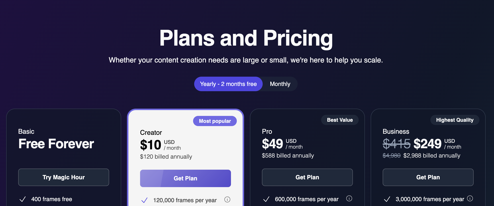
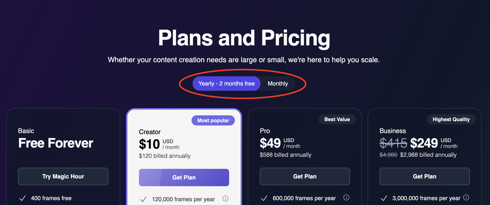
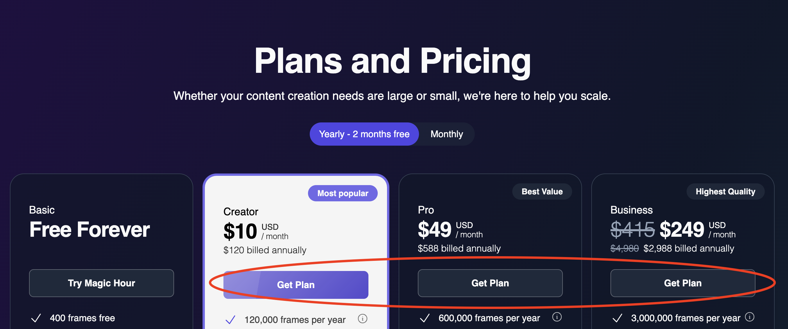
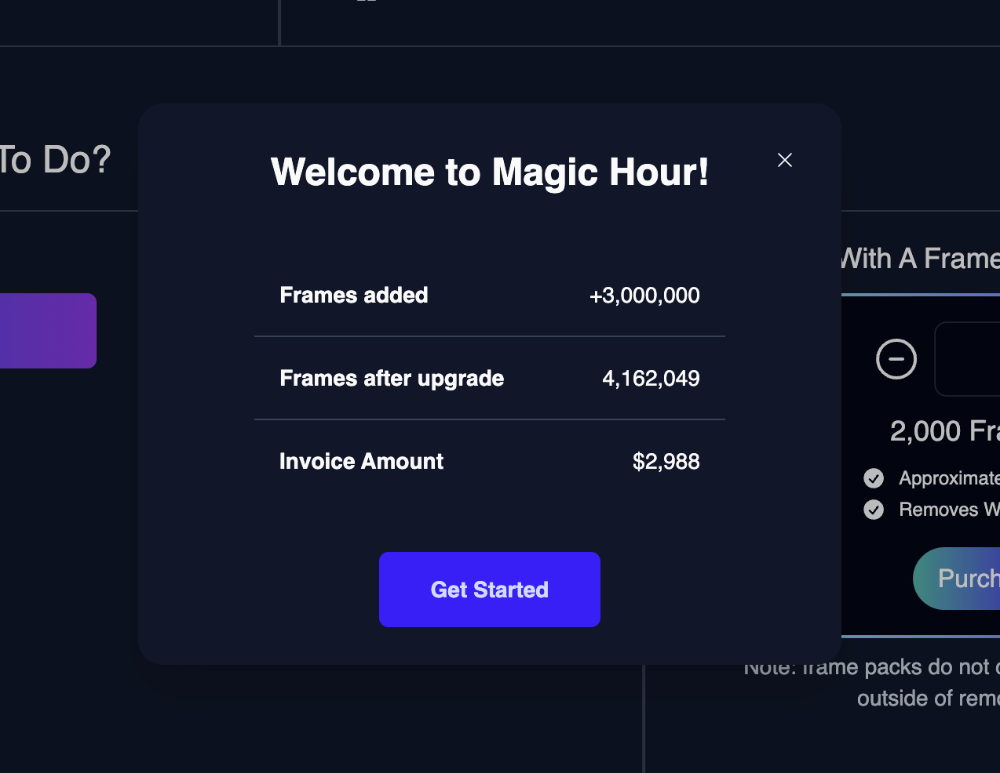
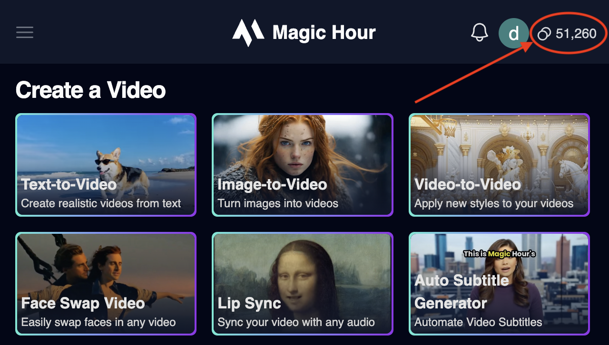

With prepaid subscriptions, you receive all of your frames upfront, and receive additional frames at the end of each billing period. You have the option to subscribe to a monthly or a yearly plan.

With yearly plan, you receive the entire yearly's frame upfront, and you get 2 month free as compared to the monthly subscription.

## Subscription Tiers and Benefits

import { PricingCard } from "/snippets/pricing-card.mdx";

<CardGroup cols={2}>

<PricingCard
  title="Free"
  prices={[{ amount: 0, label: "" }]}
  benefits={[
    "400 frames on signup plus 100 frames/day",
    "512x512 resolution",
    "Access to Animation, Face Swap, Lip Sync",
    "Access to all image modes",
  ]}
/>

<PricingCard
  title="Creator"
  prices={[
    { amount: 12, label: "/ month" },
    { amount: 120, label: "/ year" },
  ]}
  benefits={[
    "10,000 frames per month",
    "1024x1024 resolution",
    "Access to all video modes",
    "Access to all image modes",
  ]}
/>

<PricingCard
  title="Pro"
  prices={[
    { amount: 59, label: "/ month" },
    { amount: 588, label: "/ year" },
  ]}
  benefits={[
    "50,000 frames per month",
    "1472x1472 resolution",
    "Access to all video modes",
    "Access to all image modes",
  ]}
/>

<PricingCard
  title="Business"
  prices={[
    { amount: 249, label: "/ month" },
    { amount: 2988, label: "/ year" },
  ]}
  benefits={[
    "250,000 frames per month",
    "4096x4096 resolution for face swap and lip sync",
    "Access to all video modes",
    "Access to all image modes",
  ]}
/>
</CardGroup>

## Purchase additional frames

If your usage is higher than the amount of frames received within the billing period, you have the option to purchase frame packs.

Each frame pack grants 1000 frames, and cost $3 each.

## How to subscribe

<Steps>
<Step title="Visit Pricing Page">
  Visit the [Pricing Page](https://magichour.ai/pricing)
  
</Step>

<Step title="Pick between yearly and monthly">
  
</Step>

<Step title="Choosing the plan">

Select whether you want `Creator`, `Pro`, or `Business` plan.

And click `Get Plan`

</Step>

<Step title="Fill out payment info">

Using your preferred method of payment, complete the form and click `Subscribe`.

</Step>

<Step title="Receive frames in your account">

On successful payment, you will be redirected to [My Plan](https://magichour.ai/dashboard/my-plan), and once Stripe notify us of the payment, frames are added to your account.

</Step>

</Steps>

## Tracking Usage

You can see the available frames in your account by visiting any signed in page, for example, the [Create Page](https://magichour.ai/create).

<Warning>
  Generate API calls will be rejected if your account do not have enough frames
</Warning>
