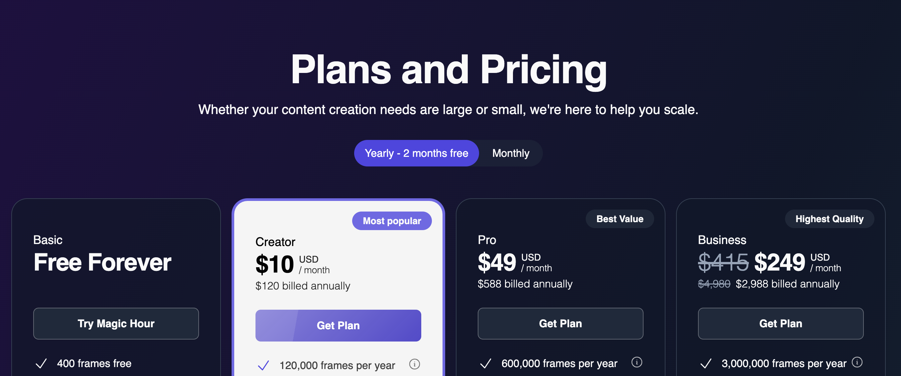
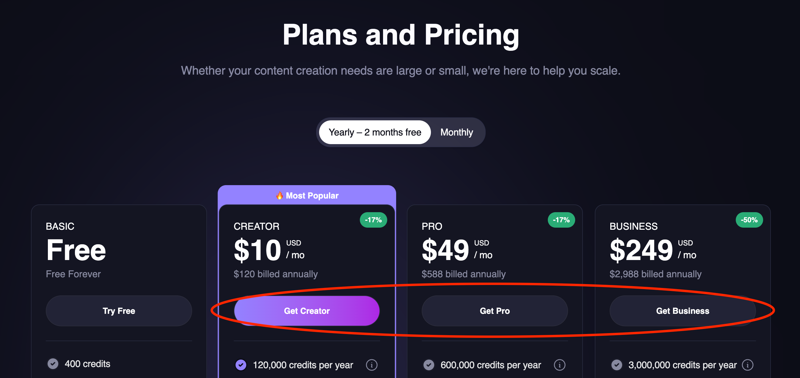
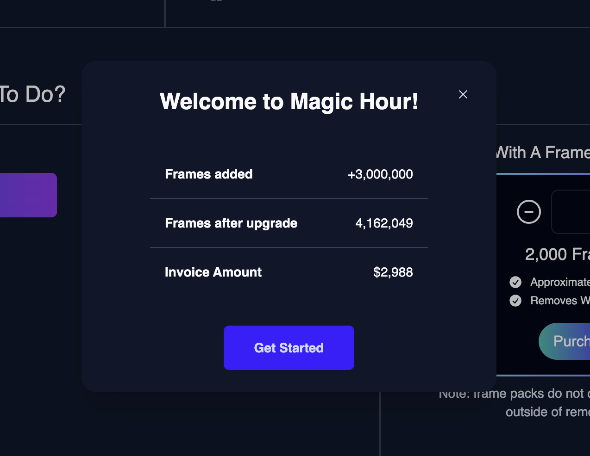
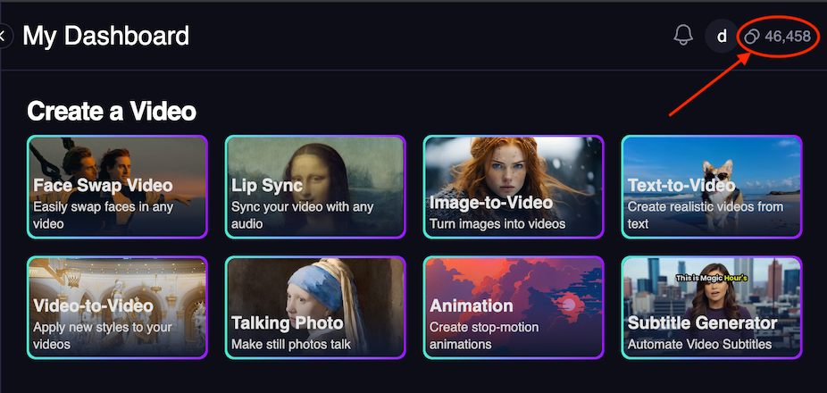

## How Subscription Pricing Works

**Simple concept:** Pay upfront for a set amount of credits that you can use throughout your subscription period. Perfect for predictable usage patterns.

### **The Basics**

1. **Choose your plan** based on resolution needs and monthly credit requirements
2. **Select billing frequency** - monthly or yearly (yearly saves 33%)
3. **Pay upfront** and receive all credits immediately
4. **Use credits anytime** - credits never expire, even after subscription ends
5. **Auto-renewal** ensures continuous access (can be cancelled anytime)

### **Key Benefits**

✅ **Predictable costs** - Know exactly what you'll pay each month/year  
✅ **Credits upfront** - Get all your credits immediately to use anytime  
✅ **Yearly savings** - Get 33% off with annual billing  
✅ **No usage tracking** - Use credits at your own pace  
✅ **Higher resolution** - Access to better quality based on your tier

### **How It Differs from Usage-Based**

| Subscription                  | Usage-Based               |
| :---------------------------- | :------------------------ |
| Pay upfront                   | Pay after you use         |
| Fixed monthly cost            | Variable monthly cost     |
| Credits never expire          | Credits consumed as used  |
| Immediate credit access       | Pay only for what you use |
| Perfect for predictable usage | Good for variable usage   |

## Choose Your Plan

Each plan offers different credit amounts and resolution limits. Higher plans unlock better resolution and more credits per month.

import { PricingCard } from "/snippets/pricing-card.mdx";

<CardGroup cols={2}>

<PricingCard
  title="Free"
  prices={[{ amount: 0, label: "" }]}
  benefits={[
    "400 credits on signup plus 100 credits/day",
    "576px resolution",
    "Access to all image modes",
    "Access to Animation, Face Swap, Lip Sync, Subtitle Generator, Talking Photo",
  ]}
/>

<PricingCard
  title="Creator"
  prices={[
    { amount: 15, label: "/ month" },
    { amount: 120, label: "/ year" },
  ]}
  benefits={[
    "10,000 credits per month (120,000/year)",
    "1024px resolution",
    "No watermarks",
    "Commercial use license",
  ]}
/>

<PricingCard
  title="Pro"
  prices={[
    { amount: 45, label: "/ month" },
    { amount: 360, label: "/ year" },
  ]}
  benefits={[
    "30,000 credits per month (360,000/year)",
    "1472px resolution",
    "5GB file uploads",
    "Priority support",
  ]}
/>

<PricingCard
  title="Business"
  prices={[
    { amount: 99, label: "/ month" },
    { amount: 792, label: "/ year" },
  ]}
  benefits={[
    "70,000 credits per month (840,000/year)",
    "4K resolution for select modes",
    "10GB file uploads",
    "Priority support",
  ]}
/>
</CardGroup>

## Need More Credits?

If you use more credits than your plan includes, you can purchase additional credit packs anytime.

### **Credit Packs**

- **1,000 credits per pack**
- **\$3.00 per pack** (\$0.003 per credit)
- **Instant delivery** - credits added immediately to your account
- **No expiration** - credits never expire, even after subscription ends

### **When to Buy Credit Packs**

- **Seasonal spikes** in usage
- **One-time projects** requiring extra credits
- **Testing higher usage** before upgrading plans
- **End-of-month** credit shortfall

<Note>
  **Tip:** If you consistently need credit packs, consider upgrading to the next plan tier for
  better value.
</Note>

## Practical Examples

### **Content Creator (5,000 credits/month)**

- **Free Plan**: 400 + (100 × 30 days) = 3,400 credits/month - **Not enough**
- **Creator Plan**: 10,000 credits/month from \$10/mo (billed annually) - **Perfect fit**

_Creator plan gives you 2x your needs with room to grow_

### **Marketing Agency (35,000 credits/month)**

- **Creator Plan**: 10,000 credits + 25 credit packs = \$10 + \$75 = **\$85/month**
- **Pro Plan**: 30,000 credits + 5 credit packs = \$30 + \$15 = **\$45/month** - **Better value**

_Pro plan saves \$40/month and provides buffer for growth_

### **Enterprise (200,000 credits/month)**

- **Pro Plan**: 30,000 + 170 credit packs = \$30 + \$510 = **\$540/month**
- **Business Plan**: 70,000 credits + 130 credit packs = \$66 + \$390 = **\$456/month** - **Much better value**

_Business plan saves \$84/month and includes 4K resolution_

### **Yearly vs Monthly Savings**

**Pro Plan Example:**

- **Monthly**: \$45 × 12 = **\$540/year**
- **Yearly**: **\$360/year** (33% off - equivalent to \$30/month)

## Getting Started

Ready to subscribe? Here's how to set up your subscription in minutes.

<Steps>
<Step title="Visit the Pricing Page">
  Go to [magichour.ai/pricing](https://magichour.ai/pricing) to see all available plans and current pricing.
  
  
</Step>

<Step title="Choose Billing Frequency">
  **Monthly**: Pay monthly, cancel anytime **Yearly**: Pay upfront, get 33% off 
</Step>

<Step title="Select Your Plan">
  Choose based on your monthly credit needs and resolution requirements:
  - **Creator**: 10,000 credits/month, 1024px resolution
  - **Pro**: 30,000 credits/month, 1472px resolution  
  - **Business**: 70,000 credits/month, 4096px resolution

Click **"Get Plan"** to proceed to checkout.

</Step>

<Step title="Complete Payment">
  Enter your payment information using any of these secure methods: - **Credit/Debit Cards**: Visa,
  Mastercard, American Express, Discover - **Digital Wallets**: Apple Pay, Google Pay - **Regional
  Options**: AliPay and other methods depending on your location All payments are processed securely
  through Stripe. Review your plan details and click **"Subscribe"**.
</Step>

<Step title="Access Your Credits">
  After successful payment:
  - You'll be redirected to [My Plan](https://magichour.ai/dashboard/my-plan)
  - Credits are added to your account within minutes
  - Start using the API immediately

</Step>

</Steps>

## Managing Your Subscription

### **Tracking Credit Usage**

Monitor your remaining credits in multiple ways:

1. **My Plan Dashboard**: Visit [My Plan](https://magichour.ai/dashboard/my-plan) to see your monthly credit allocation and next renewal date
2. **Any signed-in page**: Check credit balance in the top navigation

### **Subscription Management**

**Upgrade Options**:

- **Immediate upgrade**: New plan starts right away, billing cycle resets
- **End-of-cycle upgrade**: Change takes effect at next billing date

**Downgrade Process**:

- Cancel current subscription at [My Plan](https://magichour.ai/dashboard/my-plan)
- Downgrade takes effect at end of current billing cycle
- All unused credits carry over permanently

**Other Management**:

- **Cancel anytime**: Access continues until period ends
- **Billing frequency**: Switch between monthly/yearly anytime
- **Auto-renewal**: Automatically renews unless cancelled

### **What Happens When You Downgrade or Cancel**

When your subscription ends or you downgrade to Free:

**✅ You Keep:**

- **All unused credits** - they carry over permanently
- **API access** - continue making requests with remaining credits
- **Account history** - all your generated content remains accessible

**❌ You Lose (at end of billing cycle):**

- **Higher resolution limits** - revert to Free tier (576px max)
- **No watermark** - outputs will include watermarks again
- **Monthly credit allocation** - revert to Free tier (400 credits + 100/day)
- **Premium features** - lose priority support, larger uploads, etc.

**💡 Upgrade Anytime:**

- **Immediate upgrade**: New benefits start right away, billing resets
- **End-of-cycle upgrade**: Changes take effect at next billing date
- Your existing credits work at higher resolutions again

### **Important Notes**

<Warning>
  **Insufficient Credits**: API calls will be rejected if your account doesn't have enough credits
  for the requested operation.
</Warning>

<Info>
  **Credits Never Expire**: Your credits remain in your account permanently, even after your
  subscription ends. However, you'll lose access to subscription benefits like higher resolution
  limits and no watermarks.
</Info>

<Tip>
  **Usage Monitoring**: Set up alerts in your dashboard to get notified when credits are running
  low.
</Tip>
