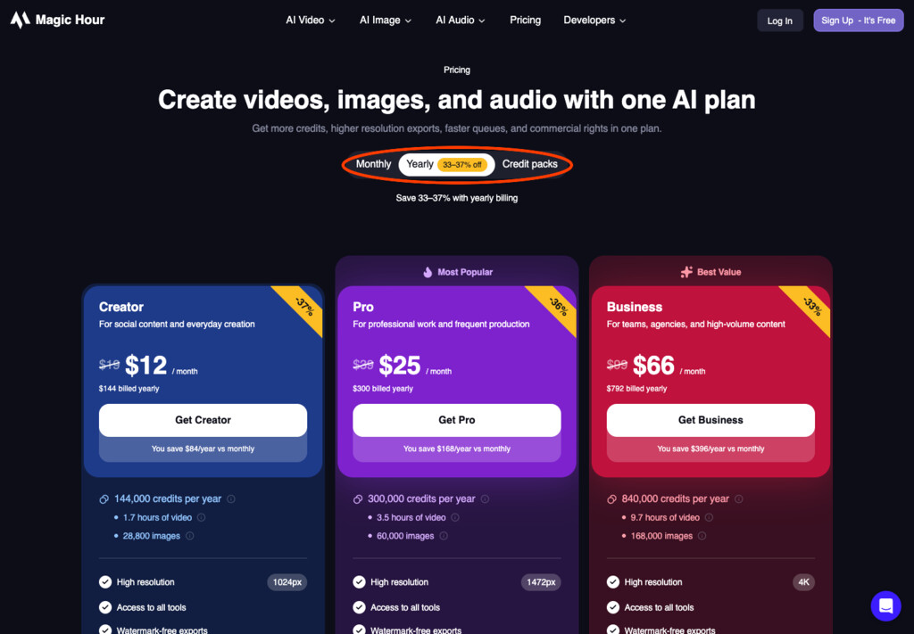
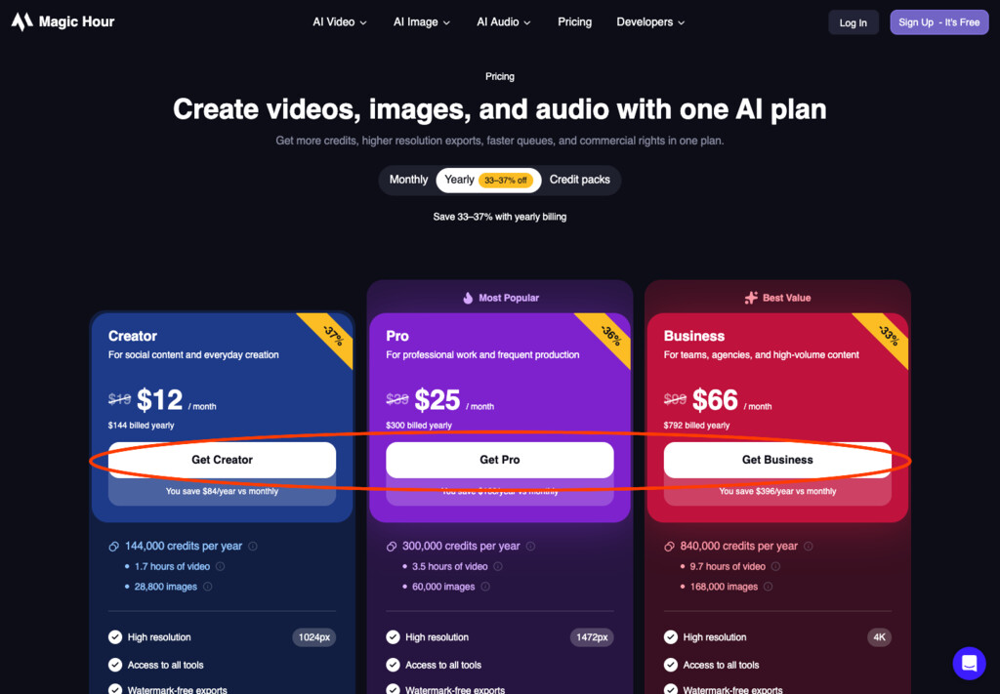
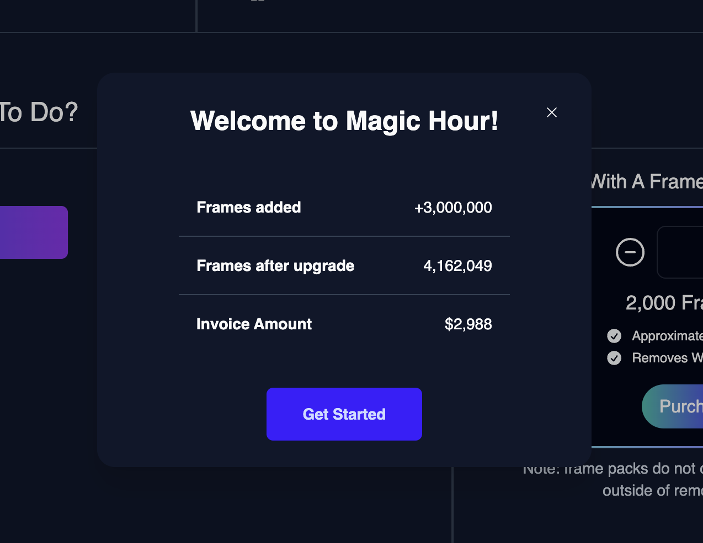
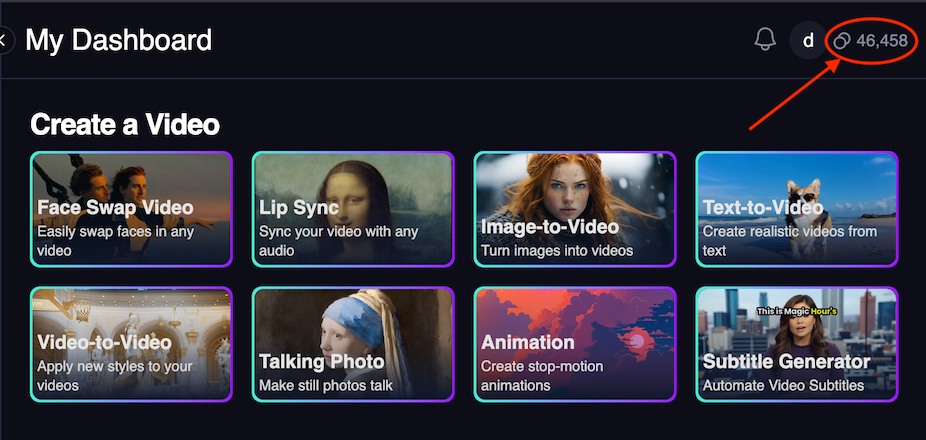

## How Subscription Pricing Works

**Simple concept:** Pay upfront for a set amount of credits that you can use throughout your subscription period. Perfect for predictable usage patterns.

### **The Basics**

1. **Choose your plan** based on monthly credit volume and which resolution options you need
2. **Select billing frequency** - monthly or yearly (annual billing is discounted)
3. **Pay upfront** and receive all credits immediately
4. **Use credits anytime** - credits never expire, even after subscription ends
5. **Auto-renewal** ensures continuous access (can be cancelled anytime)

### **Key Benefits**

✅ **Predictable costs** - Know exactly what you'll pay each month/year
✅ **Credits upfront** - Get all your credits immediately to use anytime
✅ **Yearly savings** - Annual billing is discounted
✅ **No usage tracking** - Use credits at your own pace
✅ **Higher resolution options** - Paid plans unlock higher-resolution choices on each tool

### **How It Differs from Usage-Based**

| Subscription                  | Usage-Based               |
| :---------------------------- | :------------------------ |
| Pay upfront                   | Pay after you use         |
| Fixed monthly cost            | Variable monthly cost     |
| Credits never expire          | Credits consumed as used  |
| Immediate credit access       | Pay only for what you use |
| Perfect for predictable usage | Good for variable usage   |

## Choose Your Plan

Higher plans include more credits each month, larger uploads, and more concurrent jobs. Resolution is
per tool: paid plans unlock higher-resolution options, and requesting those options costs more
credits. See [resolution](/billing/resolution-limits).

import { PricingCard } from "/snippets/pricing-card.mdx";

<CardGroup cols={2}>

<PricingCard
  title="Free"
  prices={[{ amount: 0, label: "/month" }]}
  benefits={[
    "Starter credits and account-specific rewards may be available; check your account for the current balance",
    "Lowest resolution option on each tool",
    "Access to all image modes",
    "Access to Animation, Face Swap, Lip Sync, Subtitle Generator, Talking Photo",
  ]}
/>

<PricingCard
  title="Creator"
  prices={[
    { amount: 19, label: "/month" },
    { amount: 12, label: "/month billed annually" },
  ]}
  benefits={[
    "12,000 credits per month",
    "No watermarks, commercial use",
    "2GB uploads, 3 concurrent generations",
  ]}
/>

<PricingCard
  title="Pro"
  prices={[
    { amount: 39, label: "/month" },
    { amount: 25, label: "/month billed annually" },
  ]}
  benefits={[
    "25,000 credits per month",
    "No watermarks, commercial use",
    "5GB uploads, 5 concurrent generations",
    "Priority support",
  ]}
/>

<PricingCard
  title="Business"
  prices={[
    { amount: 99, label: "/month" },
    { amount: 66, label: "/month billed annually" },
  ]}
  benefits={[
    "70,000 credits per month",
    "No watermarks, commercial use",
    "10GB uploads, unlimited concurrent generations",
    "Priority support",
  ]}
/>
</CardGroup>

Annual Creator is $144/year, Pro $300/year, Business $792/year. Credit totals above are the monthly
allotment; annual plans include twelve months of that allotment (144,000 / 300,000 / 840,000
credits per year).

Live checkout is on the [pricing page](https://magichour.ai/pricing?ref=docs-subscription-pricing).

## Need More Credits?

If you use more credits than your plan includes, you can purchase additional credit packs anytime.

### **Credit Packs**

| Pack     | Credits | Price | Discount | Credits per dollar |
| :------- | ------: | ----: | -------: | -----------------: |
| Starter  |   4,000 |   $10 |        - |                400 |
| Standard |  12,000 |   $27 |      10% |                444 |
| Large    |  32,000 |   $64 |      20% |                500 |
| Max      |  64,000 |  $120 |      25% |                533 |

Pack discounts are applied automatically at checkout. Credits are added immediately and never
expire. Packs do not include subscription benefits other than removing watermarks.

### **When to Buy Credit Packs**

- **Seasonal spikes** in usage
- **One-time projects** requiring extra credits
- **Testing higher usage** before upgrading plans
- **End-of-month** credit shortfall

<Note>
  **Tip:** If you consistently need credit packs, consider upgrading to the next plan tier for
  better value.
</Note>

## Choosing a Plan

Pick the plan whose monthly credits cover your expected volume, then check that it unlocks the
resolution options you need. Higher resolution on the same plan costs more credits, so a 1080p
workload burns through an allotment faster than 480p. If you regularly exhaust your allowance and
buy credit packs, the next tier up is usually cheaper than the packs.

For API workloads with variable volume, compare against
[usage-based pricing](/billing/usage-based-pricing), which bills after the fact and applies volume
discounts automatically.

## Getting Started

Ready to subscribe? Here's how to set up your subscription in minutes.

<Steps>
<Step title="Visit the Pricing Page">
  Go to [magichour.ai/pricing](https://magichour.ai/pricing?ref=docs-subscription-pricing) to see all available plans and current pricing.

</Step>

<Step title="Choose Billing Frequency">
  **Monthly**: Pay monthly, cancel anytime. **Yearly**: Pay upfront at the discount shown on the
  live pricing page.

</Step>

<Step title="Select Your Plan">
  Choose based on monthly credits and which resolution options you need:
  - **Creator**: $19/month ($12/month billed annually), 12,000 credits
  - **Pro**: $39/month ($25/month billed annually), 25,000 credits
  - **Business**: $99/month ($66/month billed annually), 70,000 credits

Click the button for your chosen plan to proceed to checkout.

</Step>

<Step title="Complete Payment">
  Enter your payment information using any of these secure methods: - **Credit/Debit Cards**: Visa,
  Mastercard, American Express, Discover - **Digital Wallets**: Apple Pay, Google Pay - **Regional
  Options**: AliPay and other methods depending on your location All payments are processed securely
  through Stripe. Review your plan details and click **"Subscribe"**.
</Step>

<Step title="Access Your Credits">
  After successful payment:
  - You'll be redirected to [Settings](https://magichour.ai/settings)
  - Credits are added to your account within minutes
  - Start using the API immediately

</Step>

</Steps>

## Managing Your Subscription

### **Tracking Credit Usage**

Monitor your remaining credits in multiple ways:

1. **Settings**: Visit [Settings](https://magichour.ai/settings) to see your monthly credit allocation and next renewal date
2. **Any signed-in page**: Check credit balance in the top navigation

### **Subscription Management**

**Upgrade Options**:

- **Immediate upgrade**: New plan starts right away, billing cycle resets
- **End-of-cycle upgrade**: Change takes effect at next billing date

**Downgrade Process**:

- Cancel current subscription in [Settings](https://magichour.ai/settings)
- Downgrade takes effect at end of current billing cycle
- All unused credits carry over permanently

**Other Management**:

- **Cancel anytime**: Access continues until period ends
- **Billing frequency**: Switch between monthly/yearly anytime
- **Auto-renewal**: Automatically renews unless cancelled

### **What Happens When You Downgrade or Cancel**

When your subscription ends or you downgrade to Free:

**✅ You Keep:**

- **All unused credits** - they carry over permanently
- **API access** - continue making requests with remaining credits
- **Account history** - all your generated content remains accessible

**❌ You Lose (at end of billing cycle):**

- **Higher resolution options** - revert to the Free option on each tool
- **Paid watermark removal** - free video/audio outputs may include watermarks; image outputs remain watermark-free
- **Monthly credit allocation** - starter credits and rewards vary by account; check your current balance
- **Premium features** - lose priority support, larger uploads, etc.

**💡 Upgrade Anytime:**

- **Immediate upgrade**: New benefits start right away, billing resets
- **End-of-cycle upgrade**: Changes take effect at next billing date
- Your existing credits work at higher resolutions again

### **Important Notes**

<Warning>
  **Insufficient Credits**: API calls will be rejected if your account doesn't have enough credits
  for the requested operation.
</Warning>

<Info>
  **Credits Never Expire**: Your credits remain in your account permanently, even after your
  subscription ends. However, you'll lose access to subscription benefits like higher resolution
  options and paid watermark removal for video/audio where applicable.
</Info>

<Tip>
  **Usage Monitoring**: Set up alerts in your dashboard to get notified when credits are running
  low.
</Tip>
