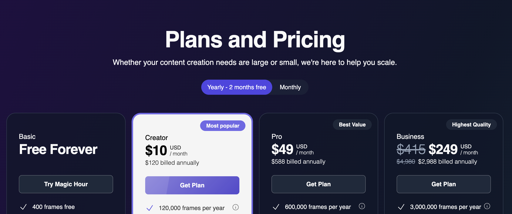
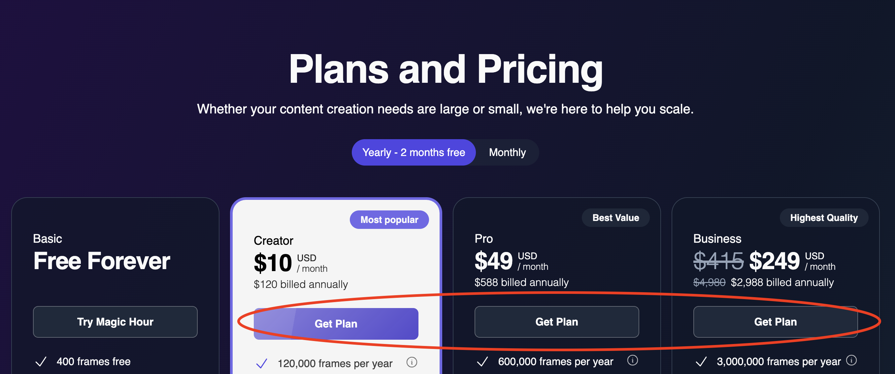

## How Subscription Pricing Works

**Simple concept:** Pay upfront for a set amount of credits that you can use throughout your subscription period. Perfect for predictable usage patterns.

### **The Basics**

1. **Choose your plan** based on resolution needs and monthly credit requirements
2. **Select billing frequency** - monthly or yearly (annual billing is discounted)
3. **Pay upfront** and receive all credits immediately
4. **Use credits anytime** - credits never expire, even after subscription ends
5. **Auto-renewal** ensures continuous access (can be cancelled anytime)

### **Key Benefits**

✅ **Predictable costs** - Know exactly what you'll pay each month/year  
✅ **Credits upfront** - Get all your credits immediately to use anytime  
✅ **Yearly savings** - Annual billing is discounted  
✅ **No usage tracking** - Use credits at your own pace  
✅ **Higher resolution** - Access to better quality based on your tier

### **How It Differs from Usage-Based**

| Subscription                  | Usage-Based               |
| :---------------------------- | :------------------------ |
| Pay upfront                   | Pay after you use         |
| Fixed monthly cost            | Variable monthly cost     |
| Credits never expire          | Credits consumed as used  |
| Immediate credit access       | Pay only for what you use |
| Perfect for predictable usage | Good for variable usage   |

## Choose Your Plan

Each plan offers different credit amounts and resolution limits. Higher plans unlock better resolution and more credits per month.

<Info>
  Prices and credit allowances live on the [pricing page](https://magichour.ai/pricing) so they're
  always current. This page covers how the plans behave.
</Info>

import { PricingCard } from "/snippets/pricing-card.mdx";

<CardGroup cols={2}>

<PricingCard
  title="Free"
  prices={[{ amount: 0, label: "" }]}
  benefits={[
    "400 credits on signup plus 100 credits/day",
    "576px resolution",
    "Access to all image modes",
    "Access to Animation, Face Swap, Lip Sync, Subtitle Generator, Talking Photo",
  ]}
/>

<PricingCard
  title="Creator"
  benefits={["1024px resolution", "No watermarks", "Commercial use license"]}
/>

<PricingCard title="Pro" benefits={["1472px resolution", "5GB file uploads", "Priority support"]} />

<PricingCard
  title="Business"
  benefits={["4K resolution for select modes", "10GB file uploads", "Priority support"]}
/>
</CardGroup>

<Card title="See plans and prices" icon="tag" href="https://magichour.ai/pricing" horizontal>
  Current monthly and annual pricing, credit allowances, and credit packs
</Card>

## Need More Credits?

If you use more credits than your plan includes, you can purchase additional credit packs anytime.

### **Credit Packs**

- **Fixed pack sizes** - see the [pricing page](https://magichour.ai/pricing) for current sizes and prices
- **Instant delivery** - credits added immediately to your account
- **No expiration** - credits never expire, even after subscription ends

### **When to Buy Credit Packs**

- **Seasonal spikes** in usage
- **One-time projects** requiring extra credits
- **Testing higher usage** before upgrading plans
- **End-of-month** credit shortfall

<Note>
  **Tip:** If you consistently need credit packs, consider upgrading to the next plan tier for
  better value.
</Note>

## Choosing a Plan

Pick the plan whose resolution ceiling matches your output requirements, then check that its credit
allowance covers your expected monthly volume. If you regularly exhaust your allowance and buy credit
packs, the next tier up is usually cheaper than the packs.

For API workloads with variable volume, compare against
[usage-based pricing](/billing/usage-based-pricing), which bills after the fact and applies volume
discounts automatically.

## Getting Started

Ready to subscribe? Here's how to set up your subscription in minutes.

<Steps>
<Step title="Visit the Pricing Page">
  Go to [magichour.ai/pricing](https://magichour.ai/pricing) to see all available plans and current pricing.
  
  
</Step>

<Step title="Choose Billing Frequency">
  **Monthly**: Pay monthly, cancel anytime **Yearly**: Pay upfront at a discount 
</Step>

<Step title="Select Your Plan">
  Choose based on your monthly credit needs and resolution requirements:
  - **Creator**: 1024px resolution
  - **Pro**: 1472px resolution
  - **Business**: 4096px resolution

Click **"Get Plan"** to proceed to checkout.

</Step>

<Step title="Complete Payment">
  Enter your payment information using any of these secure methods: - **Credit/Debit Cards**: Visa,
  Mastercard, American Express, Discover - **Digital Wallets**: Apple Pay, Google Pay - **Regional
  Options**: AliPay and other methods depending on your location All payments are processed securely
  through Stripe. Review your plan details and click **"Subscribe"**.
</Step>

<Step title="Access Your Credits">
  After successful payment:
  - You'll be redirected to [My Plan](https://magichour.ai/dashboard/my-plan)
  - Credits are added to your account within minutes
  - Start using the API immediately

</Step>

</Steps>

## Managing Your Subscription

### **Tracking Credit Usage**

Monitor your remaining credits in multiple ways:

1. **My Plan Dashboard**: Visit [My Plan](https://magichour.ai/dashboard/my-plan) to see your monthly credit allocation and next renewal date
2. **Any signed-in page**: Check credit balance in the top navigation

### **Subscription Management**

**Upgrade Options**:

- **Immediate upgrade**: New plan starts right away, billing cycle resets
- **End-of-cycle upgrade**: Change takes effect at next billing date

**Downgrade Process**:

- Cancel current subscription at [My Plan](https://magichour.ai/dashboard/my-plan)
- Downgrade takes effect at end of current billing cycle
- All unused credits carry over permanently

**Other Management**:

- **Cancel anytime**: Access continues until period ends
- **Billing frequency**: Switch between monthly/yearly anytime
- **Auto-renewal**: Automatically renews unless cancelled

### **What Happens When You Downgrade or Cancel**

When your subscription ends or you downgrade to Free:

**✅ You Keep:**

- **All unused credits** - they carry over permanently
- **API access** - continue making requests with remaining credits
- **Account history** - all your generated content remains accessible

**❌ You Lose (at end of billing cycle):**

- **Higher resolution limits** - revert to Free tier (576px max)
- **No watermark** - outputs will include watermarks again
- **Monthly credit allocation** - revert to Free tier (400 credits + 100/day)
- **Premium features** - lose priority support, larger uploads, etc.

**💡 Upgrade Anytime:**

- **Immediate upgrade**: New benefits start right away, billing resets
- **End-of-cycle upgrade**: Changes take effect at next billing date
- Your existing credits work at higher resolutions again

### **Important Notes**

<Warning>
  **Insufficient Credits**: API calls will be rejected if your account doesn't have enough credits
  for the requested operation.
</Warning>

<Info>
  **Credits Never Expire**: Your credits remain in your account permanently, even after your
  subscription ends. However, you'll lose access to subscription benefits like higher resolution
  limits and no watermarks.
</Info>

<Tip>
  **Usage Monitoring**: Set up alerts in your dashboard to get notified when credits are running
  low.
</Tip>
