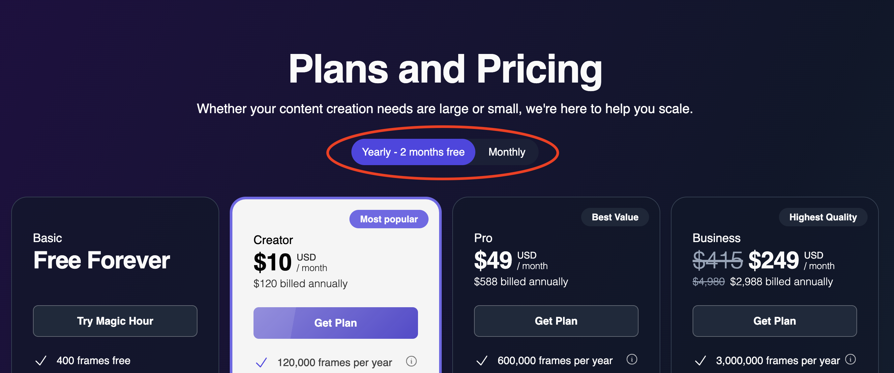

## How subscription pricing works

A subscription adds a fixed number of credits to your account. You pay monthly or yearly, and the
subscription renews until you cancel it.

### The basics

1. Choose a plan based on its credit allotment, upload limit, concurrent job limit, and resolution options.
2. Choose monthly or yearly billing. Yearly billing is discounted.
3. Pay upfront. Magic Hour adds the plan's credits to your account.
4. The subscription renews automatically until you cancel it.

### How it differs from usage-based billing

| Subscription                | Usage-based                     |
| :-------------------------- | :------------------------------ |
| Pay upfront                 | Pay after using the API         |
| Renews monthly or yearly    | Invoiced based on monthly usage |
| Fixed credit allotment      | Charges for credits consumed    |
| Credits added after payment | No prepaid credit allotment     |

## Choose a plan

Higher plans include more credits each month, larger uploads, and more concurrent jobs. Resolution is
per tool: paid plans unlock higher-resolution options, and requesting those options costs more
credits. See [resolution](/billing/resolution-limits).

import { PricingCard } from "/snippets/pricing-card.mdx";

<CardGroup cols={2}>

<PricingCard
  title="Free"
  prices={[{ amount: 0, label: "/month" }]}
  benefits={[
    "Starter credits and account-specific rewards may be available; check your account for the current balance",
    "Lowest resolution option on each tool",
    "Access to all image modes",
    "Access to Animation, Face Swap, Lip Sync, Subtitle Generator, Talking Photo",
  ]}
/>

<PricingCard
  title="Creator"
  prices={[
    { amount: 19, label: "/month" },
    { amount: 12, label: "/month billed annually" },
  ]}
  benefits={[
    "12,000 credits per month",
    "No watermarks, commercial use",
    "2GB uploads, 3 concurrent generations",
  ]}
/>

<PricingCard
  title="Pro"
  prices={[
    { amount: 39, label: "/month" },
    { amount: 25, label: "/month billed annually" },
  ]}
  benefits={[
    "25,000 credits per month",
    "No watermarks, commercial use",
    "5GB uploads, 5 concurrent generations",
    "Priority support",
  ]}
/>

<PricingCard
  title="Business"
  prices={[
    { amount: 99, label: "/month" },
    { amount: 66, label: "/month billed annually" },
  ]}
  benefits={[
    "70,000 credits per month",
    "No watermarks, commercial use",
    "10GB uploads, unlimited concurrent generations",
    "Priority support",
  ]}
/>
</CardGroup>

Annual Creator is $144/year, Pro $300/year, Business $792/year. Credit totals above are the monthly
allotment; annual plans include twelve months of that allotment (144,000 / 300,000 / 840,000
credits per year).

Live checkout is on the [pricing page](https://magichour.ai/pricing?ref=docs-subscription-pricing).

## Buy more credits

If you use more credits than your plan includes, you can purchase additional credit packs.

### Credit packs

| Pack     | Credits | Price | Discount | Credits per dollar |
| :------- | ------: | ----: | -------: | -----------------: |
| Starter  |   4,000 |   $10 |        - |                400 |
| Standard |  12,000 |   $27 |      10% |                444 |
| Large    |  32,000 |   $64 |      20% |                500 |
| Max      |  64,000 |  $120 |      25% |                533 |

Pack discounts apply at checkout. Magic Hour adds pack credits to your account immediately. They do
not expire. Packs do not include subscription benefits other than removing watermarks.

## Choose between a subscription and usage-based billing

Pick the plan whose monthly credits cover your expected volume, then check that it unlocks the
resolution options you need. Higher resolution on the same plan costs more credits, so a 1080p
workload burns through an allotment faster than 480p. If you regularly exhaust your allowance and
buy credit packs, compare the pack price with the next subscription tier.

For API workloads with variable volume, compare against
[usage-based pricing](/billing/usage-based-pricing), which bills after the fact and applies volume
discounts automatically.

## Subscribe

<Steps>
<Step title="Open the pricing page">
  Go to [magichour.ai/pricing](https://magichour.ai/pricing?ref=docs-subscription-pricing) to see the available plans and current prices.

</Step>

<Step title="Choose monthly or yearly billing">
  Monthly plans renew each month. Yearly plans charge for a year upfront at a lower monthly rate.

</Step>

<Step title="Select a plan">
  Choose a plan based on its credit allotment, upload limit, concurrent job limit, and resolution options.

Select the plan to continue to checkout.

</Step>

<Step title="Complete checkout">
  Review the plan, enter a supported payment method, and select **Subscribe**.
</Step>

<Step title="Check your balance">
  After payment, open [Settings](https://magichour.ai/settings) to confirm your plan and credit balance.

</Step>

</Steps>

## Manage your subscription

### Track credit usage

Check your remaining credits in either place:

1. Open [Settings](https://magichour.ai/settings) to see your credit allotment and renewal date.
2. Check the credit balance in the top navigation on any signed-in page.

### Change or cancel a subscription

Manage your plan in [Settings](https://magichour.ai/settings). Subscriptions renew automatically.
If you cancel, paid plan access continues through the current billing period.

### What happens when you downgrade or cancel

When your subscription ends or you downgrade to Free:

You keep:

- Unused credits
- API access while your account has enough credits for a request
- Generated content in your account history

At the end of the billing period, you lose:

- Higher resolution options. Each tool returns to its Free resolution option.
- Paid watermark removal. Free video and audio outputs may include watermarks. Image outputs remain watermark-free.
- The recurring credit allotment. Starter credits and rewards vary by account.
- Paid limits and support included with the plan

### Credit requirements

<Warning>
  API calls fail if your account doesn't have enough credits for the requested operation.
</Warning>
