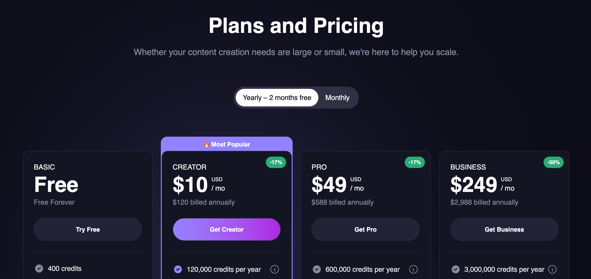

With subscriptions, you receive all of your credits upfront, and receive additional credits at the end of each billing period. You have the option to subscribe to a monthly or a yearly plan.

With yearly plan, you receive the entire yearly's credits upfront, and you get 2 month free as compared to the monthly subscription.

## Subscription tiers and benefits

import { PricingCard } from "/snippets/pricing-card.mdx";

<CardGroup cols={2}>

<PricingCard
  title="Free"
  prices={[{ amount: 0, label: "" }]}
  benefits={[
    "400 credits on signup plus 100 credits/day",
    "512x512 resolution",
    "Access to all image modes",
    "Access to Animation, Face Swap, Lip Sync, Subtitle Generator, Talking Photo",
  ]}
/>

<PricingCard
  title="Creator"
  prices={[
    { amount: 12, label: "/ month" },
    { amount: 120, label: "/ year" },
  ]}
  benefits={[
    "10,000 credits per month",
    "1024x1024 resolution",
    "Access to all image modes",
    "Access to all video modes",
  ]}
/>

<PricingCard
  title="Pro"
  prices={[
    { amount: 59, label: "/ month" },
    { amount: 588, label: "/ year" },
  ]}
  benefits={[
    "50,000 credits per month",
    "1472x1472 resolution",
    "Access to all image modes",
    "Access to all video modes",
  ]}
/>

<PricingCard
  title="Business"
  prices={[
    { amount: 249, label: "/ month" },
    { amount: 2988, label: "/ year" },
  ]}
  benefits={[
    "250,000 credits per month",
    "4096x4096 resolution for select modes",
    "Access to all image modes",
    "Access to all video modes",
  ]}
/>
</CardGroup>

## Purchase additional credits

If your usage is higher than the amount of credits received within the billing period, you have the option to purchase credit packs.

Each credit pack grants 1000 credits, and cost $3 each.

## How to subscribe

<Steps>
<Step title="Visit Pricing Page">
  Visit the [Pricing Page](https://magichour.ai/pricing)
  
</Step>

<Step title="Pick between yearly and monthly"></Step>

<Step title="Choosing the plan">

Select whether you want `Creator`, `Pro`, or `Business` plan.

And click `Get Plan`

</Step>

<Step title="Fill out payment info">

Using your preferred method of payment, complete the form and click `Subscribe`.

</Step>

<Step title="Receive credits in your account">

On successful payment, you will be redirected to [My Plan](https://magichour.ai/dashboard/my-plan), and once Stripe notify us of the payment, credits are added to your account.

</Step>

</Steps>

## Tracking usage

You can see the available credits in your account by visiting any signed in page, for example, the [Create Page](https://magichour.ai/create).

<Warning>
  API calls to generate image or video will be rejected if your account do not have enough credits
</Warning>
