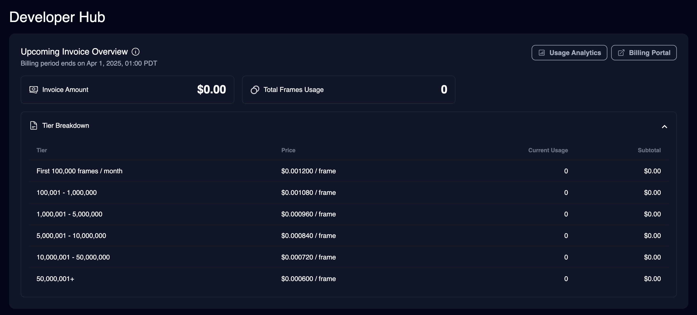
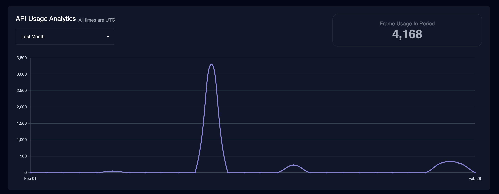

With usage based pricing, you pay based on how much you use, no monthly subscriptions and monthly minimums. As you scale, you get up to 50% discount on per frame cost.

## Subscription Tiers and Benefits

import { PricingCard } from "/snippets/pricing-card.mdx";

<CardGroup cols={2}>

<PricingCard
  title="Starter"
  prices={[{ amount: "0.90", label: "/ 1000 frames" }]}
  benefits={[
    "512x512 resolution",
    "Access to Animation, Face Swap, Lip Sync",
    "Access to all image modes",
  ]}
/>

<PricingCard
  title="Creator"
  prices={[{ amount: "1.20", label: "/ 1000 frames" }]}
  benefits={[
    "1024x1024 resolution",
    "Access to all video modes",
    "Access to all image modes",
  ]}
/>

<PricingCard
  title="Pro"
  prices={[{ amount: "1.95", label: "/ 1000 frames" }]}
  benefits={[
    "1472x1472 resolution",
    "Access to all video modes",
    "Access to all image modes",
  ]}
/>

<PricingCard
  title="Business"
   prices={[{ amount: "2.50", label: "/ 1000 frames" }]}
  benefits={[
    "4096x4096 resolution for face swap and lip sync",
    "Access to all video modes",
    "Access to all image modes",
  ]}
/>
</CardGroup>

## Volume Discounts

Based on how many frames you use per month, you get a discount on the frames on that range. See the table below for details on the per frame cost for each range.

<Tabs>
<Tab title="Starter">

| Frame Usage Per Month   | Discount on Frames in This Range | Cost per 1000 frames |
| ----------------------- | -------------------------------- | -------------------- |
| 0 - 100,000             | 0%                               | $0.900               |
| 100,001 - 1,000,000     | 10%                              | $0.810               |
| 1,000,001 - 5,000,000   | 20%                              | $0.720               |
| 5,000,001 - 10,000,000  | 30%                              | $0.630               |
| 10,000,001 - 50,000,000 | 40%                              | $0.540               |
| 50,000,000+             | 50%                              | $0.450               |

</Tab>
<Tab title="Creator">

| Frame Usage Per Month   | Discount on Frames in This Range | Cost per 1000 frames |
| ----------------------- | -------------------------------- | -------------------- |
| 0 - 100,000             | 0%                               | $1.200               |
| 100,001 - 1,000,000     | 10%                              | $1.080               |
| 1,000,001 - 5,000,000   | 20%                              | $0.960               |
| 5,000,001 - 10,000,000  | 30%                              | $0.840               |
| 10,000,001 - 50,000,000 | 40%                              | $0.720               |
| 50,000,000+             | 50%                              | $0.600               |

</Tab>
<Tab title="Pro">

| Frame Usage Per Month   | Discount on Frames in This Range | Cost per 1000 frames |
| ----------------------- | -------------------------------- | -------------------- |
| 0 - 100,000             | 0%                               | $1.950               |
| 100,001 - 1,000,000     | 10%                              | $1.755               |
| 1,000,001 - 5,000,000   | 20%                              | $1.560               |
| 5,000,001 - 10,000,000  | 30%                              | $1.365               |
| 10,000,001 - 50,000,000 | 40%                              | $1.170               |
| 50,000,000+             | 50%                              | $0.975               |

</Tab>
<Tab title="Business">

| Frame Usage Per Month   | Discount on Frames in This Range | Cost per 1000 frames |
| ----------------------- | -------------------------------- | -------------------- |
| 0 - 100,000             | 0%                               | $2.500               |
| 100,001 - 1,000,000     | 10%                              | $2.250               |
| 1,000,001 - 5,000,000   | 20%                              | $2.000               |
| 5,000,001 - 10,000,000  | 30%                              | $1.750               |
| 10,000,001 - 50,000,000 | 40%                              | $1.500               |
| 50,000,000+             | 50%                              | $1.250               |

</Tab>
</Tabs>

<Note>Usage resets at midnight on the first of each month PST time</Note>

You can use our [calculator](https://magichour.ai/api#api-cost-calculator) to estimate your total cost based on your estimated usage. Volume discount is factored into the calculation.

## How to subscribe

We are working on making usage based pricing signup self-serve.

In the meantime, you can reach out to our team to get setup:

- Email us at support@magichour.ai
- Send us a message using Intercom

## Tracking Usage

In the [Developer Hub](https://magichour.ai/developer), you can view your upcoming invoice amount and total frame usage.

You can also get more analytics by clicking `Usage Analytics`, and be able to see usage in specific time ranges.

