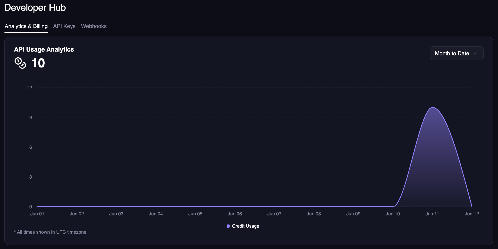
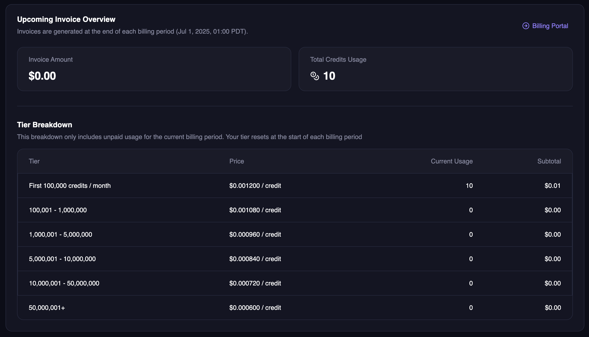

## How usage-based pricing works

Usage-based billing charges for credits consumed instead of adding a prepaid credit allotment.
It currently requires help from the Magic Hour team to set up.

### The basics

1. Contact the Magic Hour team to request usage-based billing.
2. Choose a tier and add a payment method with the team's help.
3. Use the API. Magic Hour tracks the credits each request consumes.
4. Receive invoices based on your usage.

### How it differs from subscriptions

| Usage-based                   | Subscription                   |
| :---------------------------- | :----------------------------- |
| Pay after using the API       | Pay upfront                    |
| Invoiced based on usage       | Renews monthly or yearly       |
| Charges for credits consumed  | Fixed prepaid credit allotment |
| Rates decrease in usage bands | Fixed plan price               |

## Choose a tier

Each tier has a different rate per credit. Paid tiers unlock the same higher-resolution options as
the matching subscription; requesting those options costs more credits, independent of which paid
tier you are on. See [resolution](/billing/resolution-limits).

import { PricingCard } from "/snippets/pricing-card.mdx";
import UsageRates from "/snippets/usage-based-rates.mdx";

<CardGroup cols={2}>

<PricingCard
  title="Creator"
  benefits={["$0.001200 per credit before volume discounts", "Access to all image and video modes"]}
/>

<PricingCard
  title="Pro"
  benefits={["$0.001950 per credit before volume discounts", "Access to all image and video modes"]}
/>

<PricingCard
  title="Business"
  benefits={[
    "$0.002500 per credit before volume discounts",
    "Access to all image and video modes",
  ]}
/>
</CardGroup>

## Rates and volume discounts

You are charged per credit consumed. The more credits you use in a month, the cheaper each
additional credit becomes. Discounts are **banded**: they apply to the credits falling inside each
range, not retroactively to your whole bill.

<UsageRates />

<Note>Usage toward discount bands resets at the start of each billing period.</Note>

## Estimate your bill

Two things set your monthly cost: the tier you're on, which fixes the base rate, and your monthly
credit volume, which determines how much of that volume falls into discounted bands.

**Example.** On Creator, 150,000 credits in a month bills the first 100,000 at \$0.001200 and the
next 50,000 at \$0.001080, for \$174.00. The effective rate falls gradually as you grow rather than
dropping all at once when you cross a threshold.

To turn generations into credits, see [models and credit costs](/api-reference/models), or model a
full month with the
[API cost calculator](https://magichour.ai/api?ref=docs-usage-based-pricing#api-cost-calculator).

## Set up usage-based billing

Usage-based billing is not self-serve. Email
[support@magichour.ai](mailto:support@magichour.ai) or use the Intercom chat widget on the Magic Hour
website. The team will help you choose a tier and add a payment method.

Invoices normally issue monthly. High-usage accounts may receive an earlier invoice after reaching
their billing threshold. Invoices show credit usage by tier and include the applicable volume
discounts.

## Tracking usage

In the [Developer Hub](https://magichour.ai/developer?ref=docs-usage-based-pricing), you can see your usage analytics for specific time ranges.

The Developer Hub also shows your upcoming invoice amount and credit usage by tier.

