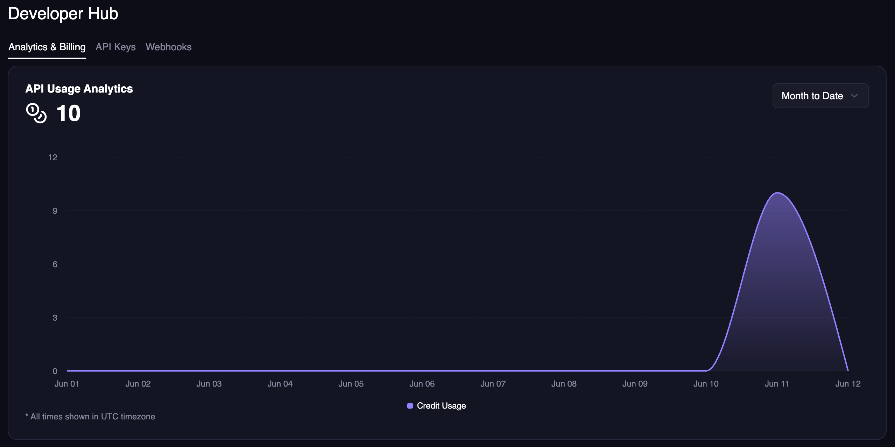

## How Usage-Based Pricing Works

**Simple concept:** You pay only for the credits you actually use each month. No upfront payments, no unused credits going to waste.

### **The Basics**

1. **Add a payment method** to your account
2. **Choose your tier** based on resolution needs and expected usage
3. **Use the API** - credits are consumed as you generate content
4. **Get billed monthly** based on your actual usage
5. **Automatic volume discounts** apply as you use more credits

### **Key Benefits**

✅ **No upfront costs** - Start using immediately without buying credits in advance  
✅ **Pay for actual usage** - Only pay for credits you actually consume  
✅ **Automatic billing** - Monthly invoices based on previous month's usage  
✅ **Volume discounts** - Up to 50% savings as you scale  
✅ **No waste** - Never lose unused credits

### **How It Differs from Subscriptions**

| Usage-Based                | Subscription               |
| :------------------------- | :------------------------- |
| Pay after you use          | Pay upfront                |
| Automatic monthly billing  | Manual credit purchases    |
| Volume discounts included  | Fixed credit amounts       |
| No unused credits          | Credits can expire unused  |
| Perfect for variable usage | Good for predictable usage |

## Choose Your Tier

Each tier offers different resolution limits and credit pricing. Higher tiers unlock better resolution but cost more per credit.

import { PricingCard } from "/snippets/pricing-card.mdx";

<CardGroup cols={2}>

<PricingCard
  title="Starter"
  prices={[{ amount: "0.90", label: "/ 1000 credits" }]}
  benefits={[
    "512x512 resolution",
    "Access to all image modes",
    "Access to Animation, Face Swap, Lip Sync, Subtitle Generator, Talking Photo",
  ]}
/>

<PricingCard
  title="Creator"
  prices={[{ amount: "1.20", label: "/ 1000 credits" }]}
  benefits={["1024x1024 resolution", "Access to all image modes", "Access to all video modes"]}
/>

<PricingCard
  title="Pro"
  prices={[{ amount: "1.95", label: "/ 1000 credits" }]}
  benefits={["1472x1472 resolution", "Access to all image modes", "Access to all video modes"]}
/>

<PricingCard
  title="Business"
   prices={[{ amount: "2.50", label: "/ 1000 credits" }]}
  benefits={[
    "4096x4096 resolution for select modes",
    "Access to all image modes",
    "Access to all video modes",
  ]}
/>
</CardGroup>

## Volume Discounts (Automatic)

The more credits you use each month, the cheaper each credit becomes. Discounts apply automatically to different usage ranges within the same month.

**Example:** If you use 150,000 credits on Starter tier:

- First 100,000 credits: \$0.90 per 1000 credits
- Next 50,000 credits: \$0.81 per 1000 credits (10% discount)
- **Total cost:** \$90 + \$40.50 = \$130.50

### **Discount Tiers by Plan**

<Tabs>
<Tab title="Starter">

| Credit usage per month  | Discount on credits in this range | Cost per 1000 credits |
| ----------------------- | --------------------------------- | --------------------- |
| 0 - 100,000             | 0%                                | $0.900                |
| 100,001 - 1,000,000     | 10%                               | $0.810                |
| 1,000,001 - 5,000,000   | 20%                               | $0.720                |
| 5,000,001 - 10,000,000  | 30%                               | $0.630                |
| 10,000,001 - 50,000,000 | 40%                               | $0.540                |
| 50,000,000+             | 50%                               | $0.450                |

</Tab>
<Tab title="Creator">

| Credit usage per month  | Discount on credits in this range | Cost per 1000 credits |
| ----------------------- | --------------------------------- | --------------------- |
| 0 - 100,000             | 0%                                | $1.200                |
| 100,001 - 1,000,000     | 10%                               | $1.080                |
| 1,000,001 - 5,000,000   | 20%                               | $0.960                |
| 5,000,001 - 10,000,000  | 30%                               | $0.840                |
| 10,000,001 - 50,000,000 | 40%                               | $0.720                |
| 50,000,000+             | 50%                               | $0.600                |

</Tab>
<Tab title="Pro">

| Credit usage per month  | Discount on credits in this range | Cost per 1000 credits |
| ----------------------- | --------------------------------- | --------------------- |
| 0 - 100,000             | 0%                                | $1.950                |
| 100,001 - 1,000,000     | 10%                               | $1.755                |
| 1,000,001 - 5,000,000   | 20%                               | $1.560                |
| 5,000,001 - 10,000,000  | 30%                               | $1.365                |
| 10,000,001 - 50,000,000 | 40%                               | $1.170                |
| 50,000,000+             | 50%                               | $0.975                |

</Tab>
<Tab title="Business">

| Credit usage per month  | Discount on credits in this range | Cost per 1000 credits |
| ----------------------- | --------------------------------- | --------------------- |
| 0 - 100,000             | 0%                                | $2.500                |
| 100,001 - 1,000,000     | 10%                               | $2.250                |
| 1,000,001 - 5,000,000   | 20%                               | $2.000                |
| 5,000,001 - 10,000,000  | 30%                               | $1.750                |
| 10,000,001 - 50,000,000 | 40%                               | $1.500                |
| 50,000,000+             | 50%                               | $1.250                |

</Tab>
</Tabs>

<Note>Usage resets at midnight on the first of each month PST time</Note>

## Practical Examples

### **Small Developer (5,000 credits/month)**

- **Starter Tier**: 5,000 × \$0.0009 = **\$4.50/month**
- **Creator Tier**: 5,000 × \$0.0012 = **\$6.00/month**

_Choose Starter for basic resolution, Creator for higher quality_

### **Growing Business (75,000 credits/month)**

- **Starter Tier**: \$67.50/month (all at base rate)
- **Creator Tier**: \$90/month (all at base rate)
- **Pro Tier**: \$146.25/month (all at base rate)

_Volume discounts kick in at 100,000+ credits_

### **High Volume (500,000 credits/month)**

**Starter Tier with volume discounts:**

- First 100,000: \$90 (base rate)
- Next 400,000: \$324 (10% discount)
- **Total: \$414/month** (vs \$450 without discounts)

**Use our [cost calculator](https://magichour.ai/api#api-cost-calculator) for precise estimates with volume discounts included.**

## Getting Started

<Warning>
  **Currently requires setup assistance** - Usage-based pricing is not yet self-serve. We're working
  on making this automatic.
</Warning>

**To get started:**

1. **Contact our team** to set up usage-based billing:
   - Email: [support@magichour.ai](mailto:support@magichour.ai)
   - Use the Intercom chat widget on our website

2. **Choose your tier** based on resolution needs and expected usage

3. **Add payment method** - We'll help you set this up securely

4. **Start using the API** - Credits are tracked automatically

### **Billing Process**

- **Monthly billing** on the same date each month
- **High usage accounts** may be billed earlier (e.g., at \$500 threshold)
- **Detailed invoices** show credit usage breakdown by tier
- **Volume discounts** applied automatically

## Tracking usage

In the [Developer Hub](https://magichour.ai/developer), you can see your usage analytics for specific time ranges.

Also, you can view your upcoming invoice amount and total credit usage broken down by tier.

