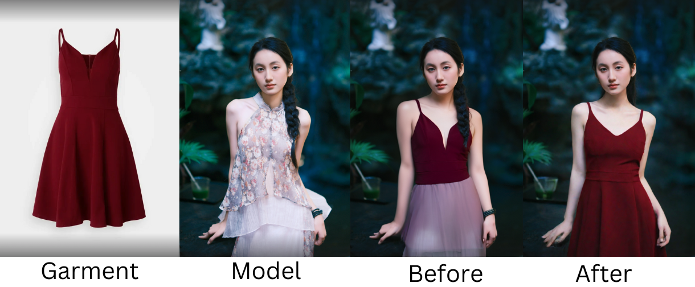
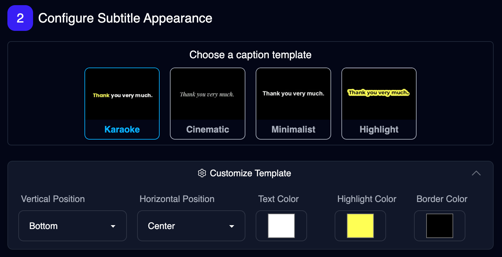
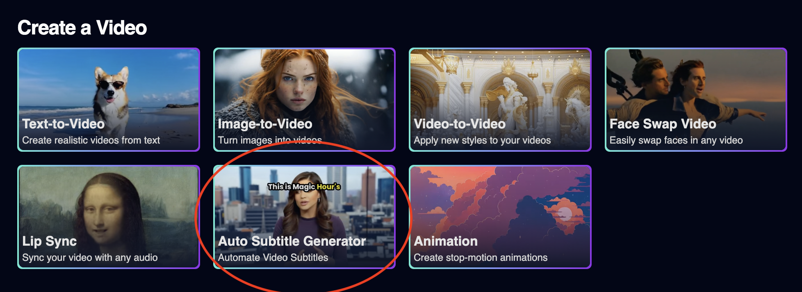
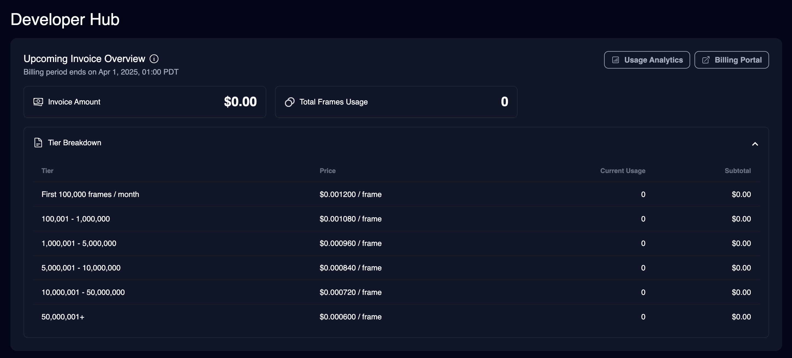
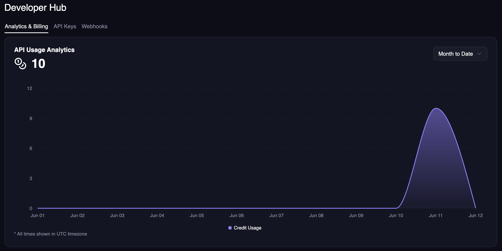
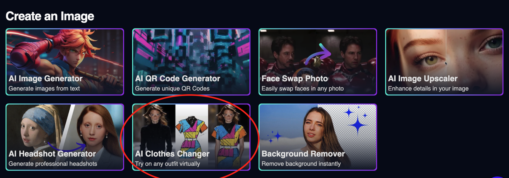
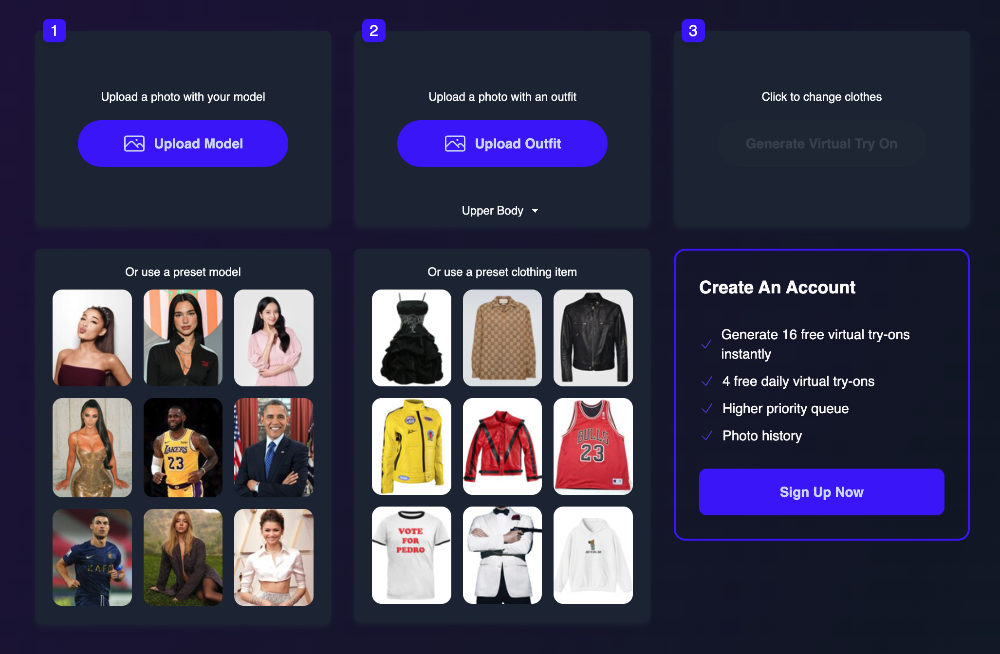
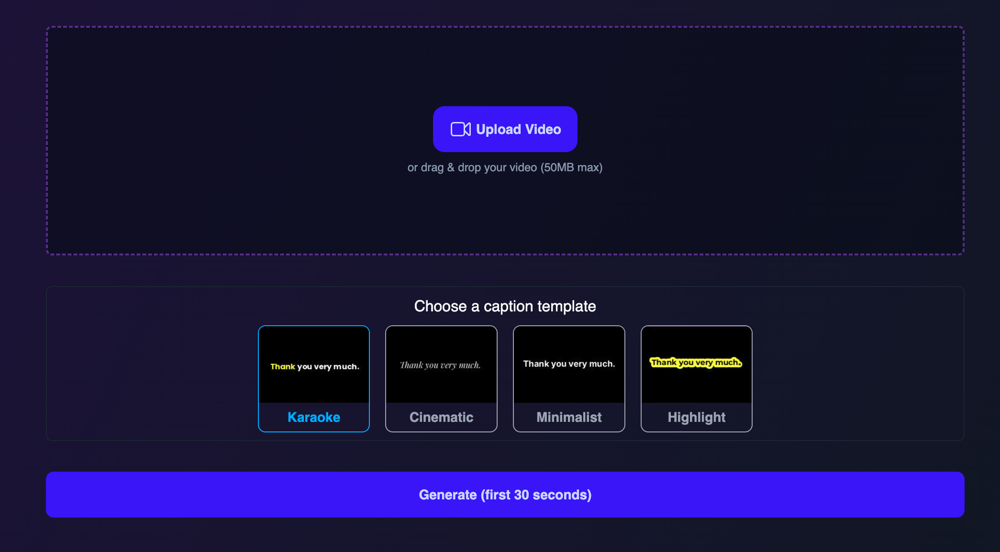

import { VideoPlayer } from "/snippets/video-player.mdx";

<Update label="2025-04-14">

## 🎉 Create Memes in Create Page

Now you can create memes in our create page, meaning your outputs will be saved and you have no daily limit! Each meme costs 10 frames.

<Frame></Frame>

</Update>

<Update label="2025-04-12">

## 🎉 New: Free AI Face Editor

Change expression in seconds, completely free! https://magichour.ai/products/ai-face-editor

<VideoPlayer src="https://videos.magichour.ai/api-assets/docs/changelog/2025/04/face-editor-free-tool.mp4" />

## Longer Talking Photo Videos

We made improvements to our Talking Photo mode. Now you can generate videos up to 30 seconds, up from 10s.

| Previous | New | Improvement |
| :------- | :-- | :---------- |
| 10s      | 30s | 3x          |

</Update>

<Update label="2025-04-10">

## 🎉 New: Free AI Meme Generator

Create hilarious memes in seconds using our curated templates. No signup needed—just pick a template and go! https://magichour.ai/products/ai-meme-generator

<Frame></Frame>

</Update>

<Update label="2025-04-02">

## 🐛 Fixed 500 Error in Video Projects API

We fixed an issue where `GET /v1/video-projects` would return a 500 error when requesting a video project with `type: TALKING_PHOTO`.

</Update>

<Update label="2025-04-01">

## 🎨 Improved Animation Output

We improved Animation mode to make results more artistic, creative, and fluid.

Previously, we used a fast LCM model that often produced a grainy, burnt-in look. Now, we've prioritized visual quality and switched to a higher quality model with minimal speed tradeoffs.

<VideoPlayer src="https://videos.magichour.ai/api-assets/docs/changelog/2025/03/improved-animation.mp4" />

Give it a try at https://magichour.ai/create/animation and let us know what you think.

## 🎙️ Launching AI Talking Photo API

Checkout the [AI Talking Photo API Reference](/api-reference/video-projects/ai-talking-photo)

For SDKs, please upgrade to `0.12.0` to create AI Talking Photo

- [Python SDK v0.12.0](https://github.com/magichourhq/magic-hour-python/releases/tag/v0.12.0)
- [Node SDK v0.12.0](https://github.com/magichourhq/magic-hour-node/releases/tag/v0.12.0)
- [Go SDK v0.12.0](https://github.com/magichourhq/magic-hour-go/releases/tag/v0.12.0)
- [Rust SDK v0.12.0](https://github.com/magichourhq/magic-hour-rust/releases/tag/v0.12.0)

</Update>

<Update label="2025-03-31">

## Launching 5 New Video-to-Video Art Styles

We added a few additional art styles for Video-to-Video.

<Frame></Frame>

Try them now: [Video-to-Video](https://magichour.ai/create/video-to-video)

## Improved Error Banner

We updated the error banner you see in the image/video details

<Frame></Frame>

The new banner includes additional info on why the render failed, and provided some quick actions to retry or contact us for assistance.

</Update>

<Update label="2025-03-30">

## AI Talking Photo Create Page Launch

We've launched AI Talking Photo in the [Create Page](https://magichour.ai/create)!

<Frame></Frame>

With this launch, you can:

- generate up to 10 seconds of video, vs 5 seconds in the free tool.
- utilize our text-to-speech feature as the basis for your audio

Try it now at [AI Talking Photo Create Page](https://magichour.ai/create/ai-talking-photo)

</Update>

<Update label="2023-03-27">

## Launching AI Talking Photo Free Tool

Now you can turn photo into a live video! Try it now for free at https://magichour.ai/products/ai-talking-photo

<Frame></Frame>

</Update>

<Update label="2025-03-21">

## Launching 36 AI Image Generator Art Styles

We launched **36** new AI image generator art styles so you can generate the image in your vision more easily. This feature is available to all users!

<Frame></Frame>

Try it for free: https://magichour.ai/products/ai-image-generator

<Frame></Frame>

Create an account to create more https://magichour.ai/create/ai-image-generator

</Update>

<Update label="2025-03-19">

## AI Clothes Changer Speed Improvement

We've upgraded our AI Clothes Changer to version 3, providing enhanced quality and performance for all your virtual wardrobe needs.

On [2025-03-07](/changelog#2025-03-07), we released an improved version of AI Clothes changer with higher quality to paid users only. This version improved the quality of the output; however, it was much slower than the previous version. In this latest update, we drastically improved generation time of the new version.

| Version | Time        | Improvement |
| :------ | :---------- | :---------- |
| 1.0     | ~18 seconds | --          |
| 2.0     | ~43 seconds | 2.4x slower |
| 3.0     | ~6 seconds  | 7.2x faster |

<Check>This release is available to all users!</Check>

## AI Headshot Generator Custom Prompt Feature

We've added prompt customization to our AI Headshot Generator, allowing you to better control the style and appearance of your professional headshots. This feature is available on the web app and API.

<Frame></Frame>

To try it out, head over to [AI Headshot Generator](https://magichour.ai/create/ai-headshot-generator).

To use custom prompt with Rest API, add the `prompt` param to your request.

```json
{
  "style": {
    "prompt": "professional passport photo"
  }
}
```

For SDKs, please upgrade to `0.10.0` to use custom prompt with AI Headshot Generator.

- [Python SDK v0.10.0](https://github.com/magichourhq/magic-hour-python/releases/tag/v0.10.0)
- [Node SDK v0.10.0](https://github.com/magichourhq/magic-hour-node/releases/tag/v0.10.0)
- [Go SDK v0.10.0](https://github.com/magichourhq/magic-hour-go/releases/tag/v0.10.0)
- [Rust SDK v0.10.0](https://github.com/magichourhq/magic-hour-rust/releases/tag/v0.10.0)

</Update>

<Update label="2025-03-12">

## Added Error Codes For Invalid File Path

We added 3 API error codes to identify invalid file path issues. You can get the error details using the `GET /v1/image-projects/:id` and `GET /v1/video-projects/:id` endpoints by accessing `.error.code` and `.error.message` fields.

| Error Code           | Error Message                                                                                                                                                                                                  |
| :------------------- | :------------------------------------------------------------------------------------------------------------------------------------------------------------------------------------------------------------- |
| `invalid_audio_path` | The audio_file_path value provided does not point to a valid audio file. This value should be a valid URL or file_path from the API https://docs.magichour.ai/api-reference/files/generate-asset-upload-urls.  |
| `invalid_image_path` | The image_file_path value provided does not point to a valid image file. This` value should be a valid URL or file_path from the API https://docs.magichour.ai/api-reference/files/generate-asset-upload-urls. |
| `invalid_video_path` | The video_file_path value provided does not point to a valid video file. This value should be a valid URL or file_path from the API https://docs.magichour.ai/api-reference/files/generate-asset-upload-urls.  |

## Improved Model / Garment Detection For Small Images

We make improvements to our model and garment detection to better find subjects in low resolution images.

Previously, you would get the error `Please use an image with a detectable model` or `Please use an image with a detectable outfit`.

</Update>

<Update label="2025-03-07">

## AI Clothes Changer Quality Upgrade

We released an improved version of AI Clothes changer with higher quality to paid users only. This version has better masking, less errors, and preserves elements more of the original image, like hair.

<Frame>



</Frame>

</Update>

<Update label="2025-03-05">

## Faster Rendering for AI Headshot and Face Swap Photo

We optimized our AI Headshot Generator and Face Swap Photo tools, cutting rendering times drastically.

| Tool                  | Previous Time | New Time   | Improvement |
| :-------------------- | :------------ | :--------- | :---------- |
| AI Headshot Generator | ~30 seconds   | ~7 seconds | 4.3x faster |
| Face Swap Photo       | ~16 seconds   | ~6 seconds | 2.5x faster |

</Update>

<Update label="2025-03-03">

## Improved face detection in Multi-Face Swap

We improved face detection accuracy in Multi-Face Swap for images with zoomed in faces.

</Update>

<Update label="2025-02-23">

## Multi Face Swap Just Got Better! 🚀

We've improved our Multi Face Swap mode — now with **2.5x** faster processing and higher quality!

<VideoPlayer src="https://videos.magichour.ai/api-assets/docs/improved-multi-face-swap.mp4" />

</Update>

<Update label="2025-02-19">

## Added `.m4v` File Support

All APIs and web UIs now allows files with `.m4v` extension. All SDKs are updated to reflect this change.

- [Python SDK v0.9.3](https://github.com/magichourhq/magic-hour-python/releases/tag/v0.9.3)
- [Node SDK v0.9.3](https://github.com/magichourhq/magic-hour-node/releases/tag/v0.9.3)
- [Go SDK v0.9.3](https://github.com/magichourhq/magic-hour-go/releases/tag/v0.9.3)
- [Rust SDK v0.9.3](https://github.com/magichourhq/magic-hour-rust/releases/tag/v0.9.3)

</Update>

<Update label="2025-02-17">

## Customizable Caption Templates! 🎉

We've added customization options to give you control over your subtitles appearance. You can now customize:

- Text color, text highlight color, and Text border color.
- Vertical and horizontal position.

<Frame>



</Frame>

Try it now: [Auto Subtitle Generator](https://magichour.ai/create/auto-subtitle-generator)

</Update>

<Update label="2025-02-16">

## Animation and Video-to-Video APIs Now Allow File URLs.

To make it easier to use input files, we have now updated final two endpoints to support file urls for input files:

- `POST /v1/animation`
- `POST /v1/video-to-video`

Now, you won't have to upload files to our storage first before calling these two APIs.

<Tabs>

<Tab title="POST /v1/video-to-video">

<CodeGroup>

```python Python SDK {4}
res = client.v1.video_to_video.create(
    assets={
        "video_source": "file",
        "video_file_path": "https://cdn.yourwebsite.com/files/video.mp4"
    }
)
```

```typescript Node SDK {4}
const res = await client.v1.videoToVideo.create({
  assets: {
    videoSource: "file",
    videoFilePath: "https://cdn.yourwebsite.com/files/video.mp4",
  },
});
```

```go Go SDK {4}
res, err := client.V1.VideoToVideo.Create(video_to_video.CreateRequest{
    Assets: types.PostV1VideoToVideoBodyAssets{
        VideoSource:   types.PostV1VideoToVideoBodyAssetsVideoSourceEnumFile,
        VideoFilePath: nullable.NewValue("https://cdn.yourwebsite.com/files/video.mp4"),
    },
})
```

```rust Rust SDK {4}
let res = client.v1().video_to_video().create(magic_hour::resources::v1::video_to_video::CreateRequest {
    assets: magic_hour::models::PostV1VideoToVideoBodyAssets {
        video_source: magic_hour::models::PostV1VideoToVideoBodyAssetsVideoSourceEnum::File,
        video_file_path: Some("https://cdn.yourwebsite.com/files/video.mp4".to_string()),
    },
);
```

</CodeGroup>

</Tab>

<Tab title="POST /v1/animation">

<CodeGroup>

```python Python SDK {4-5}
res = client.v1.animation.create(
    assets={
        "audio_source": "file",
        "audio_file_path": "https://cdn.yourwebsite.com/files/audio.mp3",
        "image_file_path": "https://cdn.yourwebsite.com/files/image.png",
    },
)
```

```typescript Node SDK {4-5}
const res = await client.v1.animation.create({
  assets: {
    audioSource: "file",
    audioFilePath: "https://cdn.yourwebsite.com/files/audio.mp3",
    imageFilePath: "https://cdn.yourwebsite.com/files/image.png",
  },
});
```

```go Go SDK {4-5}
res, err := client.V1.Animation.Create(animation.CreateRequest{
    Assets: types.PostV1AnimationBodyAssets{
        AudioSource:   types.PostV1AnimationBodyAssetsAudioSourceEnumFile,
        AudioFilePath: nullable.NewValue("https://cdn.yourwebsite.com/files/audio.mp3"),
        ImageFilePath: nullable.NewValue("https://cdn.yourwebsite.com/files/image.png"),
    },
})
```

```rust Rust SDK {4-5}
let res = client.v1().animation().create(magic_hour::resources::v1::animation::CreateRequest {
    assets: magic_hour::models::PostV1AnimationBodyAssets {
        audio_file_path: Some("https://cdn.yourwebsite.com/files/audio.mp3".to_string()),
        audio_source: magic_hour::models::PostV1AnimationBodyAssetsAudioSourceEnum::File,
        image_file_path: Some("https://cdn.yourwebsite.com/files/image.png".to_string()),
    },
);
```

</CodeGroup>

</Tab>
</Tabs>

<Check>All of our APIs now supports file URLs!</Check>

</Update>

<Update label="2025-02-14">

## Generate Subtitle for 3+ Minutes Videos

We added the `Auto Subtitle Generator` to our dashboard! The max duration of our [current tool](https://magichour.ai/products/auto-subtitle-generator) is 30 seconds. We have now expanded the max to 10,000 frames. This means you can generate videos of length:

- 6.9 minutes at 24fps
- 5.5 minutes at 30fps

<Frame>



</Frame>
Try it now: [Auto Subtitle Generator](https://magichour.ai/create/auto-subtitle-generator)

</Update>

<Update label="2025-02-12">

## Added `high_quality` Param to Image-to-Video API

We previously introduced a `High Quality` checkbox to the web app. Now, our API supports high quality generation as well. As a quick recap, "High Quality" is better at detail preservation, ideal for humans and complex images.

<VideoPlayer src="https://videos.magichour.ai/api-assets/docs/image-to-video-high-quality.mp4" />

To use high quality mode, simply add `.style.high_quality` param when calling the API.

```diff
{
    "style": {
+        "high_quality": true
    }
}
```

## File URL Support for 5 different APIs.

To make it easier to work with input files, we added support for file urls for the following APIs:

- POST /v1/ai-headshot-generator
- POST /v1/ai-image-upscaler
- POST /v1/image-background-remover
- POST /v1/image-to-video
- POST /v1/lip-sync

Now you don't have to upload the file to Magic Hour storage first before using the asset in the APIs. Simply use the url in the `file_path` inputs:

```json
{
  "audio_file_path": "https://cdn.yourwebsite.com/files/audio.mp3",
  "image_file_path": "https://cdn.yourwebsite.com/files/image.png",
  "video_file_path": "https://cdn.yourwebsite.com/files/video.mp4"
}
```

</Update>

<Update label="2025-02-09">

## Launching Usage-Based Pricing for API users

Benefits:

- ✅ Pay only for what you use
- ✅ Volume discounts—up to 50% off
- ✅ Never run out of frames

For example, 15,000 frames now costs just \$18 on our Creator tier instead of $27 with a subscription.

<Frame>
  
</Frame>

If you're interested in our new pricing, send us an email at support@magichour.ai.

</Update>

<Update label="2025-02-08">

## Detailed Usage Cost Breakdown + Usage Analytics

For users who has an active usage-based pricing subscription, we added detailed breakdown of cost based on each usage tier in your [Developer Hub](https://magichour.ai/developer)

<Frame></Frame>

Plus, get detailed analytics on your usage:

<Frame></Frame>

</Update>

<Update label="2025-02-05">

## Added More Error Codes For More Visibility

We added 4 more API error codes to help you identify why a particular render failed. You can get the error details using the `GET /v1/image-projects/:id` and `GET /v1/video-projects/:id` endpoints by accessing `.error.code` and `.error.message` fields.

| Error Code            | Error Message                                                                                                                       |
| :-------------------- | :---------------------------------------------------------------------------------------------------------------------------------- |
| `invalid_audio_file`  | The audio file contains invalid data. Please try a different file.                                                                  |
| `invalid_image_file`  | The image file contains invalid data. Please try a different file.                                                                  |
| `invalid_video_file`  | The video file contains invalid data. Please try a different file.                                                                  |
| `invalid_youtube_url` | The youtube video cannot be downloaded. The video may be private, age-restricted, or region-restricted. Please try a different url. |

</Update>

<Update label="2025-02-02">

## Added AI Clothes Changer API

AI Clothes Changer is now available via API! Get started with this new API using:

- [Python SDK](https://github.com/magichourhq/magic-hour-python/tree/main/magic_hour/resources/v1/ai_clothes_changer)
- [Node SDK](https://github.com/magichourhq/magic-hour-node/tree/main/src/resources/v1/ai-clothes-changer)
- [Go SDK](https://github.com/magichourhq/magic-hour-go/tree/main/resources/v1/ai_clothes_changer)
- [Rust SDK](https://github.com/magichourhq/magic-hour-rust/tree/main/src/resources/v1/ai_clothes_changer)
- [Rest API](/api-reference/image-projects/ai-clothes-changer)

</Update>

<Update label="2025-01-30">

## Officially Launching the Magic Hour API

Today we're excited to announce the Magic Hour API!

Developers can now integrate our AI image & video generation tools directly into their apps and products.

Free to get started for all users, with usage-based pricing available by request.

<VideoPlayer src="https://videos.magichour.ai/api-assets/docs/launching-magic-hour-api.mp4" />

Check it out at: https://magichour.ai/api.

<Tip>☝️ The API page also includes a calculator to help estimate cost</Tip>

</Update>

<Update label="2025-01-28">

## Launching AI Clothes Changer!

Head over to [AI Clothes Changer](https://magichour.ai/create/ai-clothes-changer) to create yours today!

<Frame>



</Frame>

We also launched a free tool to the [AI Clothes Changer Product Page](https://magichour.ai/products/ai-clothes-changer) so you can try out the new product for free!

<Frame>



</Frame>

</Update>

<Update label="2025-01-09">

## Launching Auto Subtitle Generator Free Tool

We launched a free tool to automate subtitle generation on your video. Head over to the [Auto Subtitle Generator Product Page](https://magichour.ai/products/auto-subtitle-generator) to try out the new product for free!

<Frame>



</Frame>

Each generation is limited to 30 seconds, and you can generate 3 videos free per day. That's 1.5 minutes of free usage every day!

</Update>
