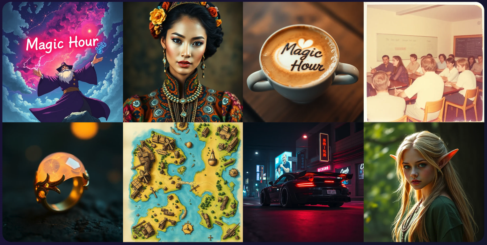

<Update label="2025-03-07">

## AI Clothes Changer Quality Upgrade

We released an improved version of AI Clothes changer with higher quality to paid users only. This version has better masking, less errors, and preserves elements more of the original image, like hair.

<Frame>


</Frame>

</Update>

<Update label="2025-03-05">

## Faster Rendering for AI Headshot and Face Swap Photo

We optimized our AI Headshot Generator and Face Swap Photo tools, cutting rendering times drastically.

| Tool                  | Previous Time | New Time   | Improvement |
| :-------------------- | :------------ | :--------- | :---------- |
| AI Headshot Generator | ~30 seconds   | ~7 seconds | 4.3x faster |
| Face Swap Photo       | ~16 seconds   | ~6 seconds | 2.5x faster |

</Update>

<Update label="2025-03-03">

## Improved face detection in Multi-Face Swap

We improved face detection accuracy in Multi-Face Swap for images with zoomed in faces.

</Update>

<Update label="2025-02-23">

## Multi Face Swap Just Got Better! 🚀

We've improved our Multi Face Swap mode — now with **2.5x** faster processing and higher quality!

<Frame>
  <video
    loop
    controls
    autoPlay
    muted
    playsInline
    className="w-full aspect-video"
    src="https://videos.magichour.ai/api-assets/docs/improved-multi-face-swap.webm"
  ></video>
</Frame>

</Update>

<Update label="2025-02-19">

## Added `.m4v` File Support

All APIs and web UIs now allows files with `.m4v` extension. All SDKs are updated to reflect this change.

- [Python SDK v0.9.3](https://github.com/magichourhq/magic-hour-python/releases/tag/v0.9.3)
- [Node SDK v0.9.3](https://github.com/magichourhq/magic-hour-node/releases/tag/v0.9.3)
- [Go SDK v0.9.3](https://github.com/magichourhq/magic-hour-go/releases/tag/v0.9.3)
- [Rust SDK v0.9.3](https://github.com/magichourhq/magic-hour-rust/releases/tag/v0.9.3)

</Update>

<Update label="2025-02-17">

## Customizable Caption Templates! 🎉

We've added customization options to give you control over your subtitles appearance. You can now customize:

- Text color, text highlight color, and Text border color.
- Vertical and horizontal position.

<Frame>


</Frame>

Try it now: [Auto Subtitle Generator](https://magichour.ai/create/auto-subtitle-generator)

</Update>

<Update label="2025-02-16">

## Animation and Video-to-Video APIs Now Allow File URLs.

To make it easier to use input files, we have now updated final two endpoints to support file urls for input files:

- `POST /v1/animation`
- `POST /v1/video-to-video`

Now, you won't have to upload files to our storage first before calling these two APIs.

<Tabs>

<Tab title="POST /v1/video-to-video">

<CodeGroup>

```python Python SDK {4}
res = client.v1.video_to_video.create(
    assets={
        "video_source": "file",
        "video_file_path": "https://cdn.yourwebsite.com/files/video.mp4"
    }
)
```

```typescript Node SDK {4}
const res = await client.v1.videoToVideo.create({
  assets: {
    videoSource: "file",
    videoFilePath: "https://cdn.yourwebsite.com/files/video.mp4",
  },
});
```

```go Go SDK {4}
res, err := client.V1.VideoToVideo.Create(video_to_video.CreateRequest{
    Assets: types.PostV1VideoToVideoBodyAssets{
        VideoSource:   types.PostV1VideoToVideoBodyAssetsVideoSourceEnumFile,
        VideoFilePath: nullable.NewValue("https://cdn.yourwebsite.com/files/video.mp4"),
    },
})
```

```rust Rust SDK {4}
let res = client.v1().video_to_video().create(magic_hour::resources::v1::video_to_video::CreateRequest {
    assets: magic_hour::models::PostV1VideoToVideoBodyAssets {
        video_source: magic_hour::models::PostV1VideoToVideoBodyAssetsVideoSourceEnum::File,
        video_file_path: Some("https://cdn.yourwebsite.com/files/video.mp4".to_string()),
    },
);
```

</CodeGroup>

</Tab>

<Tab title="POST /v1/animation">

<CodeGroup>

```python Python SDK {4-5}
res = client.v1.animation.create(
    assets={
        "audio_source": "file",
        "audio_file_path": "https://cdn.yourwebsite.com/files/audio.mp3",
        "image_file_path": "https://cdn.yourwebsite.com/files/image.png",
    },
)
```

```typescript Node SDK {4-5}
const res = await client.v1.animation.create({
  assets: {
    audioSource: "file",
    audioFilePath: "https://cdn.yourwebsite.com/files/audio.mp3",
    imageFilePath: "https://cdn.yourwebsite.com/files/image.png",
  },
});
```

```go Go SDK {4-5}
res, err := client.V1.Animation.Create(animation.CreateRequest{
    Assets: types.PostV1AnimationBodyAssets{
        AudioSource:   types.PostV1AnimationBodyAssetsAudioSourceEnumFile,
        AudioFilePath: nullable.NewValue("https://cdn.yourwebsite.com/files/audio.mp3"),
        ImageFilePath: nullable.NewValue("https://cdn.yourwebsite.com/files/image.png"),
    },
})
```

```rust Rust SDK {4-5}
let res = client.v1().animation().create(magic_hour::resources::v1::animation::CreateRequest {
    assets: magic_hour::models::PostV1AnimationBodyAssets {
        audio_file_path: Some("https://cdn.yourwebsite.com/files/audio.mp3".to_string()),
        audio_source: magic_hour::models::PostV1AnimationBodyAssetsAudioSourceEnum::File,
        image_file_path: Some("https://cdn.yourwebsite.com/files/image.png".to_string()),
    },
);
```

</CodeGroup>

</Tab>
</Tabs>

<Check>All of our APIs now supports file URLs!</Check>

</Update>

<Update label="2025-02-14">

## Generate Subtitle for 3+ Minutes Videos

We added the `Auto Subtitle Generator` to our dashboard! The max duration of our [current tool](https://magichour.ai/products/auto-subtitle-generator) is 30 seconds. We have now expanded the max to 10,000 frames. This means you can generate videos of length:

- 6.9 minutes at 24fps
- 5.5 minutes at 30fps

<Frame>


</Frame>
Try it now: [Auto Subtitle Generator](https://magichour.ai/create/auto-subtitle-generator)

</Update>

<Update label="2025-02-12">

## Added `high_quality` Param to Image-to-Video API

We previously introduced a `High Quality` checkbox to the web app. Now, our API supports high quality generation as well. As a quick recap, "High Quality" is better at detail preservation, ideal for humans and complex images.

<Frame>
  <video
    loop
    controls
    autoPlay
    muted
    playsInline
    className="w-full aspect-video"
    src="https://videos.magichour.ai/api-assets/docs/image-to-video-high-quality.webm"
  ></video>
</Frame>

To use high quality mode, simply add `.style.high_quality` param when calling the API.

```diff
{
    "style": {
+        "high_quality": true
    }
}
```

## File URL Support for 5 different APIs.

To make it easier to work with input files, we added support for file urls for the following APIs:

- POST /v1/ai-headshot-generator
- POST /v1/ai-image-upscaler
- POST /v1/image-background-remover
- POST /v1/image-to-video
- POST /v1/lip-sync

Now you don't have to upload the file to Magic Hour storage first before using the asset in the APIs. Simply use the url in the `file_path` inputs:

```json
{
  "audio_file_path": "https://cdn.yourwebsite.com/files/audio.mp3",
  "image_file_path": "https://cdn.yourwebsite.com/files/image.png",
  "video_file_path": "https://cdn.yourwebsite.com/files/video.mp4"
}
```

</Update>

<Update label="2025-02-09">

## Launching Usage-Based Pricing for API users

Benefits:

- ✅ Pay only for what you use
- ✅ Volume discounts—up to 50% off
- ✅ Never run out of frames

For example, 15,000 frames now costs just \$18 on our Creator tier instead of $27 with a subscription.

<Frame>
  
</Frame>

If you're interested in our new pricing, send us an email at support@magichour.ai.

</Update>

<Update label="2025-02-08">

## Detailed Usage Cost Breakdown + Usage Analytics

For users who has an active usage-based pricing subscription, we added detailed breakdown of cost based on each usage tier in your [Developer Hub](https://magichour.ai/developer)

<Frame></Frame>

Plus, get detailed analytics on your usage:

<Frame></Frame>

</Update>

<Update label="2025-02-05">

## Added More Error Codes For More Visibility

We added 4 more API error codes to help you identify why a particular render failed. You can get the error details using the `GET /v1/image-projects/:id` and `GET /v1/video-projects/:id` endpoints by accessing `.error.code` and `.error.message` fields.

| Error Code            | Error Message                                                                                                                       |
| :-------------------- | :---------------------------------------------------------------------------------------------------------------------------------- |
| `invalid_audio_file`  | The audio file contains invalid data. Please try a different file.                                                                  |
| `invalid_image_file`  | The image file contains invalid data. Please try a different file.                                                                  |
| `invalid_video_file`  | The video file contains invalid data. Please try a different file.                                                                  |
| `invalid_youtube_url` | The youtube video cannot be downloaded. The video may be private, age-restricted, or region-restricted. Please try a different url. |

</Update>

<Update label="2025-02-02">

## Added AI Clothes Changer API

AI Clothes Changer is now available via API! Get started with this new API using:

- [Python SDK](https://github.com/magichourhq/magic-hour-python/tree/main/magic_hour/resources/v1/ai_clothes_changer)
- [Node SDK](https://github.com/magichourhq/magic-hour-node/tree/main/src/resources/v1/ai-clothes-changer)
- [Go SDK](https://github.com/magichourhq/magic-hour-go/tree/main/resources/v1/ai_clothes_changer)
- [Rust SDK](https://github.com/magichourhq/magic-hour-rust/tree/main/src/resources/v1/ai_clothes_changer)
- [Rest API](/api-reference/image-projects/ai-clothes-changer)

</Update>

<Update label="2025-01-30">

## Officially Launching the Magic Hour API

Today we're excited to announce the Magic Hour API!

Developers can now integrate our AI image & video generation tools directly into their apps and products.

Free to get started for all users, with usage-based pricing available by request.

<Frame>
  <video
    loop
    controls
    autoPlay
    muted
    playsInline
    className="w-full aspect-video"
    src="https://videos.magichour.ai/api-assets/docs/launching-magic-hour-api.mp4"
  ></video>
</Frame>

Check it out at: https://magichour.ai/api.

<Tip>☝️ The API page also includes a calculator to help estimate cost</Tip>

</Update>

<Update label="2025-01-28">

## Launching AI Clothes Changer!

Head over to [AI Clothes Changer](https://magichour.ai/create/ai-clothes-changer) to create yours today!

<Frame>


</Frame>

We also launched a free tool to the [AI Clothes Changer Product Page](https://magichour.ai/products/ai-clothes-changer) so you can try out the new product for free!

<Frame>


</Frame>

</Update>

<Update label="2025-01-09">

## Launching Auto Subtitle Generator Free Tool

We launched a free tool to automate subtitle generation on your video. Head over to the [Auto Subtitle Generator Product Page](https://magichour.ai/products/auto-subtitle-generator) to try out the new product for free!

<Frame>


</Frame>

Each generation is limited to 30 seconds, and you can generate 3 videos free per day. That's 1.5 minutes of free usage every day!

</Update>

<Update label="2024-12-29">

## File URL Support for Face Swap Video and Photo APIs.

To make it easier to use input files, we now allow file URLs for `image_file_path` and `video_file_path` in the following APIs:

- POST /v1/face-swap
- POST /v1/face-swap-photo

Simply pass the url in the `file_path` inputs:

```json
{
  "image_file_path": "https://cdn.yourwebsite.com/files/image.png",
  "video_file_path": "https://cdn.yourwebsite.com/files/video.mp4"
}
```

</Update>

<Update label="2024-12-27">

## Increased Video Download URL Expiration

In the response of `GET /v1/video-projects/:id`, the expiration time is increased from **1 hour** to **24 hours**.

The `GET /v1/image-projects/:id` was already returning 24 hours expiration, so this change make both of these APIs have matching behavior.

</Update>

<Update label="2024-12-17">

## Added `.downloads` key to `GET /v1/video-projects/:id`

In the response of `GET /v1/video-projects/:id`, we added `.downloads` key to return a list of output urls. This make video and image project response have matching behavior so it's easier to work with both APIs.

<Note>The `.download` key is still part of the response to ensure backwards compatibility.</Note>

```diff
{
- "download": {
-     "url": "https://video.magichour.ai/id/output.mp4?auth-token=1234",
-     "expires_at": "2024-12-18T00:00:00.000Z"
- },
+ "downloads": [
+     {
+         "url": "https://video.magichour.ai/id/output.mp4?auth-token=1234",
+         "expires_at": "2024-12-18T00:00:00.000Z"
+     }
+ ],
}
```

</Update>

<Update label="2024-12-16">

## Added Image Background Remover API

Now you can remove background from your images via API. Get started with this new API using:

- [Python SDK](https://github.com/magichourhq/magic-hour-python/tree/main/magic_hour/resources/v1/image_background_remover)
- [Node SDK](https://github.com/magichourhq/magic-hour-node/tree/main/src/resources/v1/image-background-remover)
- [Go SDK](https://github.com/magichourhq/magic-hour-go/tree/main/resources/v1/image_background_remover)
- [Rust SDK](https://github.com/magichourhq/magic-hour-rust/tree/main/src/resources/v1/image_background_remover)
- [Rest API](/api-reference/image-projects/image-background-remover)

</Update>

<Update label="2024-12-14">

## Launching Image Background Remover!

Head over to [Image Background Remover](https://magichour.ai/create/image-background-remover) to create yours today!

<Frame>


</Frame>

We also launched a free tool to the [Image Background Remover Product Page](https://magichour.ai/products/image-background-remover) so you can try out the new product for free!

<Frame>


</Frame>

</Update>

<Update label="2024-12-06">

## Specify Height & Width Must be at Least 64px in `POST /v1/video-to-video`

This is an API validation update to ensure that `height` and `width` of the API call are both above 64.

Originally, this was not validated at the API level, and the video will fail to render. Now, you will get a validation error for invalid height/width in the request body.

For example, passing `height: 32` will return in the following 400 response:

```json
{
  "message": "Request validation failed",
  "pathParameterErrors": null,
  "headerErrors": null,
  "queryParameterErrors": null,
  "bodyErrors": {
    "issues": [
      {
        "code": "too_small",
        "minimum": 64,
        "type": "number",
        "inclusive": true,
        "exact": false,
        "message": "Number must be greater than or equal to 64",
        "path": ["height"]
      }
    ],
    "name": "ZodError"
  }
}
```

</Update>

<Update label="2024-12-04">

## Add Animation to API

Now you can create stop-motion animations via API. Get started with this new API using:

- [Python SDK](https://github.com/magichourhq/magic-hour-python/tree/main/magic_hour/resources/v1/animation)
- [Node SDK](https://github.com/magichourhq/magic-hour-node/tree/main/src/resources/v1/animation)
- [Go SDK](https://github.com/magichourhq/magic-hour-go/tree/main/resources/v1/animation)
- [Rust SDK](https://github.com/magichourhq/magic-hour-rust/tree/main/src/resources/v1/animation)
- [Rest API](/api-reference/image-projects/animation)

<Note>Fun Fact: Animation was the first mode we built on Magic Hour!</Note>

</Update>

<Update label="2024-12-03">

## Error Visibility on Errors

Previously, whenever an error occurred on generation, there's no additional details on why.

We now added an `error` key to the `GET /v1/image-projects/:id` and `GET /v1/video-projects/:id` APIs to give you deeper visibility into what happened.

```json
{
  "error": {
    "code": "<error code>",
    "message": "<explanation of error>"
  }
}
```

If you see `unknown_error` as the code, please reach out to our team at support@magichour.ai to debug further.

## Delete Image/Video Project APIs

After you downloaded the output, you now can delete the generated asset from our storage. This is a highly requested feature from our API users to improve privacy for the end user.

Now you can call

```
DELETE /v1/image-projects/:id
DELETE /v1/video-projects/:id
```

This change is also released to all SDKs.

- [Python SDK](https://github.com/magichourhq/magic-hour-python/tree/main/magic_hour/resources/v1/video_projects)
- [Node SDK](https://github.com/magichourhq/magic-hour-node/tree/main/src/resources/v1/video-projects)
- [Go SDK](https://github.com/magichourhq/magic-hour-go/tree/main/resources/v1/video_projects)
- [Rust SDK](https://github.com/magichourhq/magic-hour-rust/tree/main/src/resources/v1/video_projects)

</Update>

<Update label="2024-11-29">

## Improve Error Message When File Path is Invalid

If the `audio_file_path`, `image_file_path`, or `video_file_path` points to a file that does not exist in our storage, we previously returns the error

> Asset path api-assets/id/video.mp4 is invalid

This error is not very actionable. The new error is now:

> file path ' api-assets/id/video.mp4' does not exist. Please make sure that the value matches the 'items.[].file_path' from the /v1/files/upload-urls API and the files are uploaded by sending a PUT request to the upload url.

</Update>

<Update label="2024-11-25">

## Added `max_fps_limit` to `POST /v1/lip-sync`

This was a feature requested by one of our API users, who wanted reduce frame usage while using APIs. Allowing to set a `max_fps_limit` means you limit the maximum of cost of the video.

For example, if the original video has an FPS of 60 with a duration of 10 seconds, generation would previously cost **600** frames. Now, you can pass `"max_fps_limit": 24` and only be charged **240** frames.

If the video fps is lower than the `max_fps_limit` set, we will deduct frames based on the actual
FPS of the video

You can see more details in the [API Reference](/api-reference/video-projects/lip-sync#body-max-fps-limit)

</Update>

<Update label="2024-11-23">

## Longer Videos for Face Swap and Lip Sync

We updated the maximum frames for Face Swap Video and Lip Sync from 6,000 to 20,000 frames.

Now you can generate videos that are **3.3x** longer! 📈

The table summaries the length of video you can generate for a few common video FPS:

| FPS | Previous                                        | New                                              |
| :-- | :---------------------------------------------- | :----------------------------------------------- |
| 24  | {Math.floor(6000 / 24 / 60 / 0.1) / 10} minutes | {Math.floor(20000 / 24 / 60 / 0.1) / 10} minutes |
| 30  | {Math.floor(6000 / 30 / 60 / 0.1) / 10} minutes | {Math.floor(20000 / 30 / 60 / 0.1) / 10} minutes |
| 60  | {Math.floor(6000 / 60 / 60 / 0.1) / 10} minutes | {Math.floor(20000 / 60 / 60 / 0.1) / 10} minutes |

</Update>

<Update label="2024-11-21">

## See Your Email in Menu

Many of us have multiple emails, and sometimes it is hard to know what email you used. So we added your email to the profile menu.

<Frame>

</Frame>
</Update>

<Update label="2024-11-16">

## Select Events for Webhook

We added the ability to select specific events to send to your webhook event.

<Frame></Frame>

You can create your webhook by going to the [Developer Hub](https://magichour.ai/developer)

</Update>

<Update label="2024-11-15">
## Make `name` Actually Optional in APIs

Currently, the `name` field in APIs are `nullable`, when it should be `optional`. Before this change, even if you didn't want to add a name for a particular render, you still need to pass in the key with a `null` value.

```json
{
  "name": null
}
```

After this change, you can leave off `name` completely.

</Update>

<Update label="2024-11-13">

## New AI Image APIs

Added the following AI image tools to our API:

- [POST /v1/ai-headshot-generator](/api-reference/image-projects/ai-headshots)
- [POST /v1/ai-image-generator](/api-reference/image-projects/ai-images)
- [POST /v1/ai-image-upscaler](/api-reference/image-projects/ai-image-upscaler)
- [POST /v1/ai-qr-code-generator](/api-reference/image-projects/ai-qr-code)

All of our SDKs are updated with the new endpoints

- [Python SDK](https://github.com/magichourhq/magic-hour-python)
- [Node SDK](https://github.com/magichourhq/magic-hour-node)
- [Go SDK](https://github.com/magichourhq/magic-hour-go)
- [Rust SDK](https://github.com/magichourhq/magic-hour-rust)

</Update>

<Update label="2024-11-11">

## First AI Image APIs and Webhook Events

We have added our first set of APIs for image modes:

- [GET /v1/image-projects/:id](/api-reference/image-projects/get-image-details)
- [POST /v1/face-swap-photo](/api-reference/image-projects/face-swap-photo)

Also introduced 3 additional webhook events

- `image.started`
- `image.completed`
- `image.errored`

## Documentation Improvements

- We reorganized our API docs to combine all video and image modes under one tag.
- [Webhook Documentation](/webhook-reference) is split into its own documentation.

</Update>

<Update label="2024-11-10">

## Added `high_quality` Param to Image-to-Video API

Added `High Quality` mode to [Image-to-Video](https://magichour.ai/create/image-to-video). "High Quality" is better at detail preservation, ideal for humans and complex images.

<Frame>
  <video
    loop
    controls
    autoPlay
    muted
    playsInline
    className="w-full aspect-video"
    src="https://videos.magichour.ai/api-assets/docs/image-to-video-high-quality.webm"
  ></video>
</Frame>

To use high quality mode, simply check `High Quality` checkbox.

</Update>

<Update label="2024-11-08">

## Added Support for `.webm` Video

Now you can use `.webm` files in our web app without having to convert to a supported format.

</Update>

<Update label="2024-11-07">

## Added Support for `.gif` For Face Swap

Ever saw a funny gif and wanted to put yourself in the scene? Now you can! We added support to allow `.gif` files for face swap mode, both in the web UI and API

</Update>

<Update label="2024-11-03">

## Delete Generated Images on Account Deletion

When you request to delete your account, we remove all personal data, delete your information from Stripe, and erase all generated videos. We discovered that generated images were not included in this process. This has now been fixed—going forward, and we have reviewed and deleted any remaining images for previously deleted accounts.

</Update>

<Update label="2024-11-01">

## Allow Custom Prompt for AI Image Upscaler

Now you can have more control over the upscaled image. We enabled custom prompt for "Creative" style.

<Frame></Frame>

</Update>

<Update label="2024-10-28">

## AI Headshot Generator

We added the `AI Headshot Generator` to our dashboard!

Try it now: [AI Headshot Generator](https://magichour.ai/create/ai-headshot-generator)

## Parallel Image Rendering

For our image modes, you used to have to wait for the previous render to complete first before queueing your next image. We have now enabled parallel rendering for

- [AI Image Generator](https://magichour.ai/create/ai-image-generator)
- [AI QR Code](https://magichour.ai/create/ai-qr-code-generator)
- [Face Swap Photo](https://magichour.ai/create/face-swap-photo)

</Update>

<Update label="2024-10-27">

## Launching AI Image Upscaler

We shipped a new too: `AI Image Upscaler`!

Try it now: [AI Image Upscaler](https://magichour.ai/create/ai-headshot-generator)

</Update>

<Update label="2024-10-24">

## Allow Any Text in QR Code Generator

QR Code can represent any text, and we removed the `URL` limitation to our QR code generator. You can now use any text!

Try it now: [AI QR Code Upscaler](https://magichour.ai/create/ai-qr-code-generator)

</Update>

<Update label="2024-10-22">

## Launching Face Swap Photo in Dashboard

We added Face Swap Photo to our dashboard experience.

Try it now: [Face Swap Photo](https://magichour.ai/create/face-swap-photo)

</Update>

<Update label="2024-10-21">

## Launching AI QR Code Generator in Dashboard

We added AI QR Code Generator to our dashboard experience.

Try it now: [AI QR Code Generator](https://magichour.ai/create/face-swap-photo)

</Update>

<Update label="2024-10-19">

## Webhook Notification

You can now configure a webhook endpoint to be notified of status changes. We support `video.started`, `video.completed`, and `video.errored` events. This is a more efficient way to check whether a video ahs completed as compared to polling `GET /v1/video-projects/:id`.

Get more details in our [webhook overview](/integration/webhook/overview)

## Launching 4 Additional Video-to-Video Art Styles

<Frame></Frame>

Try them now: [Video-to-Video](https://magichour.ai/create/video-to-video)

</Update>

<Update label="2024-10-10">

## Launching Free Lip Sync Tool

Now you can try out our lip sync tool even without creating an account.

<Frame></Frame>

Try it now: [Free Lip Sync](https://magichour.ai/products/lip-sync)

</Update>

<Update label="2024-10-09">

## Multi-Face Swap

we just launched a highly requested feature: Multi-Face Swap!

Now, you can swap individual faces in a video with anyone you choose. Just head to https://magichour.ai/create/face-swap, upload your video, and select "Individual Faces" to get started

<Frame></Frame>

</Update>

<Update label="2024-10-08">

## New AI Image Generator

We launched a new AI image generator - it's now higher resolution, faster, more photorealistic, and has better prompt adherence.

You can try it at https://magichour.ai/create/ai-image-generator, available to all users.

<Frame></Frame>

</Update>

<Update label="2024-09-28">

## Launching 10 New Video-to-Video Art Styles

<Frame>
  
</Frame>

Try them now: [Video-to-Video](https://magichour.ai/create/video-to-video)

</Update>

<Update label="2024-09-27">

## Video-to-Video V2!

We launched a new version of Video-to-Video called **V2**.

It has a stylistic quality that is more consistent and less "noisy" than V1.

Some styles that work well with V2 are "The Void," "Android," and "Street Fighter," try them out yourself!

<Frame caption="Android Art Style">
  <video
    loop
    controls
    autoPlay
    muted
    playsInline
    className="w-full aspect-video"
    src="https://videos.magichour.ai/api-assets/docs/video-to-video-v2-android.webm"
  ></video>
</Frame>

Try them now: [Video-to-Video](https://magichour.ai/create/video-to-video)

</Update>

<Update label="2024-09-12">

## Added Text-to-Video API

Text-to-Video is now available via API! Get started with this new API using:

- [Python SDK](https://github.com/magichourhq/magic-hour-python/tree/main/magic_hour/resources/v1/text_to_video)
- [Node SDK](https://github.com/magichourhq/magic-hour-node/tree/main/src/resources/v1/text-to-video)
- [Go SDK](https://github.com/magichourhq/magic-hour-go/tree/main/resources/v1/text_to_video)
- [Rust SDK](https://github.com/magichourhq/magic-hour-rust/tree/main/src/resources/v1/text_to_video)
- [Rest API](/api-reference/video-projects/text-to-video)

</Update>

<Update label="2024-09-11">

## Added Image-to-Video API

Image-to-Video is now available via API! Get started with this new API using:

- [Python SDK](https://github.com/magichourhq/magic-hour-python/tree/main/magic_hour/resources/v1/image_to_video)
- [Node SDK](https://github.com/magichourhq/magic-hour-node/tree/main/src/resources/v1/image-to-video)
- [Go SDK](https://github.com/magichourhq/magic-hour-go/tree/main/resources/v1/image_to_video)
- [Rust SDK](https://github.com/magichourhq/magic-hour-rust/tree/main/src/resources/v1/image_to_video)
- [Rest API](/api-reference/video-projects/image-to-video)

</Update>

<Update label="2024-09-05">

## Improved Dashboard

Now that we support image generation, we now allow you toggle between videos and images in your dashboard.

<Frame>
  
</Frame>
</Update>

<Update label="2024-08-29">

## Launching Image-to-Video Mode

We launched a new image-to-video mode. It's higher quality, can generate **one minute** videos, and you can enter a prompt in addition to the image.

Some of our favorite use cases are animating paintings, historic photos, and memes.

<Tabs>
<Tab title="Great Wave Painting">
<Frame>
  <video
    loop
    controls
    autoPlay
    muted
    playsInline
    className="w-full aspect-video"
    src="https://videos.magichour.ai/api-assets/docs/image-to-video-the-great-wave-painting.webm"
  ></video>
</Frame>
</Tab>
<Tab title="Iwo Jima">
<Frame>
  <video
    loop
    controls
    autoPlay
    muted
    playsInline
    className="w-full aspect-video"
    src="https://videos.magichour.ai/api-assets/docs/image-to-video-iwo-jima.webm"
  ></video>
</Frame>
</Tab>

</Tabs>

You can try it out at https://magichour.ai/create/image-to-video

</Update>

<Update label="2024-08-25">

## Launching Text-to-Video Mode

We launched a new text-to-video mode. It's has high realism and consistency, and you can generate up to 60 second videos.

<Tabs>
<Tab title="Dog with sunglasses">
<Frame>
  <video
    loop
    controls
    autoPlay
    muted
    playsInline
    className="w-full aspect-video"
    src="https://videos.magichour.ai/api-assets/docs/text-to-video-dog-sunglasses.webm"
  ></video>
</Frame>
</Tab>
<Tab title="First Person Shooter Game">
<Frame>
  <video
    loop
    controls
    autoPlay
    muted
    playsInline
    className="w-full aspect-video"
    src="https://videos.magichour.ai/api-assets/docs/text-to-video-first-person.webm"
  ></video>
</Frame>
</Tab>

</Tabs>

You can try it out at https://magichour.ai/create/text-to-video

</Update>

<Update label="2024-08-19">

## Added Video-to-Video API

Video-to-Video is now available via API! Get started with this new API using:

- [Python SDK](https://github.com/magichourhq/magic-hour-python/tree/main/magic_hour/resources/v1/video_to_video)
- [Node SDK](https://github.com/magichourhq/magic-hour-node/tree/main/src/resources/v1/video-to-video)
- [Go SDK](https://github.com/magichourhq/magic-hour-go/tree/main/resources/v1/video_to_video)
- [Rust SDK](https://github.com/magichourhq/magic-hour-rust/tree/main/src/resources/v1/video_to_video)
- [Rest API](/api-reference/video-projects/video-to-video)

</Update>

<Update label="2024-07-19">

## Added Lip Sync API

Lip Sync is now available via API! Get started with this new API using:

- [Python SDK](https://github.com/magichourhq/magic-hour-python/tree/main/magic_hour/resources/v1/lip_sync)
- [Node SDK](https://github.com/magichourhq/magic-hour-node/tree/main/src/resources/v1/lip-sync)
- [Go SDK](https://github.com/magichourhq/magic-hour-go/tree/main/resources/v1/lip_sync)
- [Rust SDK](https://github.com/magichourhq/magic-hour-rust/tree/main/src/resources/v1/lip_sync)
- [Rest API](/api-reference/video-projects/lip-sync)

</Update>

<Update label="2024-07-11">

## AI Headshot Now 3x Faster

We made a major speed improvement that reduced AI Headshot generation time

> ~90s -> ~30s. 3x faster! 🚀

</Update>

<Update label="2024-07-09">

## Launching AI Headshot Generator

we launched a new free tool today: AI headshot generator. It takes one selfie and turns it into a professional photo.

<Frame></Frame>

Try it out at https://magichour.ai/products/ai-headshot-generator

</Update>

<Update label="2024-07-01">

## Launching Free AI Image Generator

we launched a free AI image generator. Generate any image using text!

<Frame></Frame>

Try it out at https://magichour.ai/products/ai-image-generator

## Launching Free Face Swap Video

we launched a free version of our face swap video tool.

<Frame></Frame>

Try it out at https://magichour.ai/products/face-swap?mode=video

</Update>

<Update label="2024-06-25">

## API Now Available to All Users

We want everyone to be able to try out our API, so removed any limitation based on subscription tier. Now you can create an API key and call the API!

Now, you no longer need an active `Pro` or `Business` subscription to access the API.

</Update>

<Update label="2024-06-23">

## New Sign In/Up Pages

We rebuild the Sign In and Sign Up Pages for a more optimize flow.

</Update>

<Update label="2024-06-20">

## API Now Available to Pro Users

We opened up our API to more users. Anyone with an active `Pro` or `Business` subscription to access the API.

</Update>

<Update label="2024-06-15">

## Launching the Magic Hour API

Magic Hour officially has an API offering! It is currently available to users with an active `Business` subscription. But we plan to open up the API to more users.

As part of the initial launch, you can upload assets to our storage and create face swap videos.

```sh
curl --request POST \
  --url https://api.magichour.ai/v1/face-swap \
  --header 'Authorization: Bearer <token>' \
  --header 'Content-Type: application/json' \
  --data '{
  "name": "Face Swap video",
  "height": 960,
  "width": 512,
  "start_seconds": 0,
  "end_seconds": 15,
  "assets": {
    "image_file_path": "image/id/1234.png",
    "video_source": "file",
    "video_file_path": "api-assets/id/1234.mp4"
  }
}'
```

The following APIs are available as part of the initial launch

- [POST /v1/face-swap](/api-reference/video-projects/face-swap-video)
- [GET /v1/video-projects/:id](/api-reference/video-projects/get-video-details)
- [POST /v1/files/upload-urls](/api-reference/files/generate-asset-upload-urls)

Get started by creating an [API key](https://magichour.ai/developer)

</Update>
