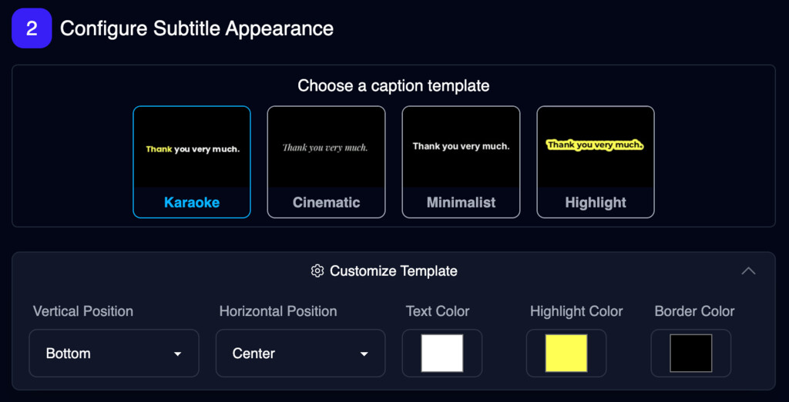

import { VideoPlayer } from "/snippets/video-player.mdx";

<Update label="2025-07-30">

## Added background replacement functionality to Image Background Remover API

We've added background replacement functionality to the Image Background Remover API. You can now replace the background of an image with a new background.

To take advantage of the this change, please upgrade your sdk version to `v0.33.0`.

- [Python SDK v0.33.0](https://github.com/magichourhq/magic-hour-python/releases/tag/v0.33.0)
- [Node SDK v0.33.0](https://github.com/magichourhq/magic-hour-node/releases/tag/v0.33.0)
- [Go SDK v0.33.0](https://github.com/magichourhq/magic-hour-go/releases/tag/v0.33.0)
- [Rust SDK v0.33.0](https://github.com/magichourhq/magic-hour-rust/releases/tag/v0.33.0)

</Update>

<Update label="2025-07-29">

## Added support for individual face swapping in Face Swap Video API

We've enhanced the Face Swap Video API to support selective face swapping. You can now specify which faces to swap in a video using the new `face_mappings` parameter. This gives you more precise control over face swapping operations.

To take advantage of the this change, please upgrade your sdk version to `v0.32.0`.

- [Python SDK v0.32.0](https://github.com/magichourhq/magic-hour-python/releases/tag/v0.32.0)
- [Node SDK v0.32.0](https://github.com/magichourhq/magic-hour-node/releases/tag/v0.32.0)
- [Go SDK v0.32.0](https://github.com/magichourhq/magic-hour-go/releases/tag/v0.32.0)
- [Rust SDK v0.32.0](https://github.com/magichourhq/magic-hour-rust/releases/tag/v0.31.1)

Note: `v0.31.0` had a bug where the `image_file_path` is still required even if you're using `face_swap_mode: individual-faces`. This has been fixed in `v0.31.1`.

## Fixed authentication issue on `GET /v1/face-detection/{id}` API

We noticed that the `GET /v1/face-detection/{id}` API was always returning 401 Unauthorized. We have since fixed the issue and the API should now be working as expected.

To take advantage of the this change, please upgrade your sdk version to `v0.30.1`.

- [Python SDK v0.30.1](https://github.com/magichourhq/magic-hour-python/releases/tag/v0.30.1)
- [Node SDK v0.30.1](https://github.com/magichourhq/magic-hour-node/releases/tag/v0.30.1)
- [Go SDK v0.30.1](https://github.com/magichourhq/magic-hour-go/releases/tag/v0.30.1)
- [Rust SDK v0.30.1](https://github.com/magichourhq/magic-hour-rust/releases/tag/v0.30.1)

</Update>

<Update label="2025-07-28">

## Added APIs for face detection and face swap

We added two new APIs for face detection and face swap:

[`POST /v1/face-detection`](/api-reference/files/face-detection)

- Detect faces in an image or video

[`GET /v1/face-detection/{id}`](/api-reference/files/get-face-detection-details)

- Get the result of a face detection job
- Detected faces are added to the response as `faces` as soon as any face is detected.

Example usage:

```python
res = client.v1.face_detection.create(
    assets={
        "target_file_path": "https://cdn.magichour.ai/target.jpg",
    },
    confidence_score='0.75',
)

task_id = res.id
status = "pending"

while status != 'complete':
  res = client.v1.face_detection.get(id=task_id)
  status = res.status
  time.sleep(1)

res = client.v1.face_swap_photo.create(
    assets={
        "face_swap_mode": 'individual-faces',
        "target_file_path": "https://cdn.magichour.ai/target.jpg",
        "face_mappings": [
            {
                "new_face": "https://cdn.magichour.ai/new_face.jpg",
                "original_face": res.faces[0].path
            }
        ]
    },
)
```

To take advantage of the this change, please upgrade your sdk version to `v0.30.0`.

- [Python SDK v0.30.0](https://github.com/magichourhq/magic-hour-python/releases/tag/v0.30.0)
- [Node SDK v0.30.0](https://github.com/magichourhq/magic-hour-node/releases/tag/v0.30.0)
- [Go SDK v0.30.0](https://github.com/magichourhq/magic-hour-go/releases/tag/v0.30.0)
- [Rust SDK v0.30.0](https://github.com/magichourhq/magic-hour-rust/releases/tag/v0.30.0)

</Update>

<Update label="2025-07-27">

## Added support for individual face swapping in Face Swap Photo API

We've enhanced the Face Swap Photo API to support selective face swapping. You can now specify which faces to swap in a photo using the new `face_mappings` parameter. This gives you more precise control over face swapping operations.

Example usage:

```python
res = client.v1.face_swap_photo.create(
    assets={
        "face_swap_mode": 'individual-faces',
        "target_file_path": "https://cdn.magichour.ai/target.jpg",
        "face_mappings": [
            {
                "new_face": "https://cdn.magichour.ai/new_face.jpg",
                "original_face": "api-assets/id/0-0.png"
            }
        ]
    },
)
```

To take advantage of the this change, please upgrade your sdk version to `v0.29.0`.

- [Python SDK v0.29.0](https://github.com/magichourhq/magic-hour-python/releases/tag/v0.29.0)
- [Node SDK v0.29.0](https://github.com/magichourhq/magic-hour-node/releases/tag/v0.29.0)
- [Go SDK v0.29.0](https://github.com/magichourhq/magic-hour-go/releases/tag/v0.29.0)
- [Rust SDK v0.29.0](https://github.com/magichourhq/magic-hour-rust/releases/tag/v0.29.0)

Note: the original face path is part of the response from the face detection API [Coming soon]

</Update>

<Update label="2025-07-24">

## Increased Talking Photo duration limit to 60 seconds

We've extended the maximum duration for Talking Photo generations from 30 seconds to 60 seconds. This allows for longer, more engaging animated content while maintaining the same high quality output.

This update applies to both the API and dashboard.

To take advantage of the this change, please upgrade your sdk version to `v0.28.0`.

- [Python SDK v0.28.0](https://github.com/magichourhq/magic-hour-python/releases/tag/v0.28.0)
- [Node SDK v0.28.0](https://github.com/magichourhq/magic-hour-node/releases/tag/v0.28.0)
- [Go SDK v0.28.0](https://github.com/magichourhq/magic-hour-go/releases/tag/v0.28.0)
- [Rust SDK v0.28.0](https://github.com/magichourhq/magic-hour-rust/releases/tag/v0.28.0)

</Update>

<Update label="2025-07-22">

## Added additional functions to the Image Details modal

<Frame></Frame>

We added additional functions to the Image Details modal, including:

- Upscale
- Edit
- Turn into video
- Remove background

</Update>

<Update label="2025-07-16">

## Added `POST /v1/auto-subtitle-generator` API

We added support for the `POST /v1/auto-subtitle-generator` API, which allows you to generate subtitles for your videos.

To take advantage of the this change, please upgrade your sdk version to `v0.27.0`.

- [Python SDK v0.27.0](https://github.com/magichourhq/magic-hour-python/releases/tag/v0.27.0)
- [Node SDK v0.27.0](https://github.com/magichourhq/magic-hour-node/releases/tag/v0.27.0)
- [Go SDK v0.27.0](https://github.com/magichourhq/magic-hour-go/releases/tag/v0.27.0)
- [Rust SDK v0.27.0](https://github.com/magichourhq/magic-hour-rust/releases/tag/v0.27.0)

## Fixing duration issue in 480p Image to Video and Text to Video

We found an issue where the duration of the output video is always 5s even if you specified 10s. We have since fixed the issue and the duration of the output video should now be correct. And we fully refunded all affected videos.

</Update>

<Update label="2025-07-14">

## Fixing webhook timeout issue

We were notified that webhook delivery was seeing delays. This was caused by a invalid webhook configuration where the delivery was not properly timing out in a reasonable amount of time. We have since fixed the issue and webhook delivery should be back to normal.

</Update>

<Update label="2025-07-13">

## Cheaper Image to Video and Text to Video

We introduced a new 480p resolution for Image to Video and Text to Video, which is 60% cheaper!

For a 5s video, 480p uses 120 credits, while 720p uses 300 credits.

Note that the 480p resolution only support 5s or 10s videos.

Check it out now:

- https://magichour.ai/create/image-to-video
- https://magichour.ai/create/text-to-video

To take advantage of the 480p resolution video in our SDKs, please upgrade your sdk version to `v0.26.0`.

- [Python SDK v0.26.0](https://github.com/magichourhq/magic-hour-python/releases/tag/v0.26.0)
- [Node SDK v0.26.0](https://github.com/magichourhq/magic-hour-node/releases/tag/v0.26.0)
- [Go SDK v0.26.0](https://github.com/magichourhq/magic-hour-go/releases/tag/v0.26.0)
- [Rust SDK v0.26.0](https://github.com/magichourhq/magic-hour-rust/releases/tag/v0.26.0)

</Update>

<Update label="2025-07-07">

## AI Image Editor Free Tool, Dashboard Tool, and API endpoint

We launched everything in one go for AI Image Editor:

- Free tool: https://magichour.ai/products/ai-image-editor
- Dashboard tool: https://magichour.ai/create/ai-image-editor
- API endpoint: https://docs.magichour.ai/api-reference/image-projects/ai-image-editor

<Frame></Frame>

To take advantage of the this change, please upgrade your sdk version to `v0.25.0`.

- [Python SDK v0.25.0](https://github.com/magichourhq/magic-hour-python/releases/tag/v0.25.0)
- [Node SDK v0.25.0](https://github.com/magichourhq/magic-hour-node/releases/tag/v0.25.0)
- [Go SDK v0.25.0](https://github.com/magichourhq/magic-hour-go/releases/tag/v0.25.0)
- [Rust SDK v0.25.0](https://github.com/magichourhq/magic-hour-rust/releases/tag/v0.25.0)

</Update>

<Update label="2025-07-05">

## Brand new my library page

We consolidated my video and my image pages into a single my library page. We believe this is a more intuitive way to manage your projects. Go check it out now: https://magichour.ai/my-library

</Update>

<Update label="2025-07-03">

## Image to Video Free Tool

As a fast follow, we launched a free tool for Image to Video.

<Frame></Frame>

Try it out now: https://magichour.ai/products/image-to-video

</Update>

<Update label="2025-07-02">

## Text to Video Free Tool

We launched a free tool that allows you to create videos from text. Try without signing up!

<Frame></Frame>

Try it out now: https://magichour.ai/products/text-to-video

</Update>

<Update label="2025-06-24">

## Simplify file upload

We updated the signature of the upload url from the `POST /v1/files/upload-urls` endpoint to not require `Content-Type` header. This should simplify the upload process a bit, you're welcome to pass in the content type of your file or leave it completely.

```diff
 with open(local_path, 'rb') as file:
     response = requests.put(
         response.items[0].upload_url,
         data=file,
-        headers={'Content-Type': 'application/octet-stream'}
    )
```

</Update>

<Update label="2025-06-18">

## Split up AI headshot and selfie modes

On our dashboard page, we split up AI headshot and AI selfie into separate modes, making it easier to find the correct mode you're interested in.

<Frame>
  
</Frame>

</Update>

<Update label="2025-06-13">
## Additional art styles for stylized selfies for one-shot model

We added additional styles specifically for our "One-Shot" model, which do not require training your own model so you can easily get started.

<Frame>
  
</Frame>

Look for styles with the following icon:

<svg
  xmlns="http://www.w3.org/2000/svg"
  width="16"
  height="16"
  viewBox="0 0 24 24"
  fill="none"
  stroke="#ff8b47"
  stroke-width="2"
  stroke-linecap="round"
  stroke-linejoin="round"
  class="lucide lucide-zap-icon lucide-zap"
>
  <path d="M4 14a1 1 0 0 1-.78-1.63l9.9-10.2a.5.5 0 0 1 .86.46l-1.92 6.02A1 1 0 0 0 13 10h7a1 1 0 0 1 .78 1.63l-9.9 10.2a.5.5 0 0 1-.86-.46l1.92-6.02A1 1 0 0 0 11 14z" />
</svg>

</Update>

<Update label="2025-06-12">

## Add support for tools for `POST /v1/ai-image-generator` endpoint

We added `.style.tool` to the API so you can pick a specific tool to use for the AI Image generator. We have over 30 tools available to help better customize the style of your output. See the list of tools available via: https://docs.magichour.ai/api-reference/image-projects/ai-images#body-style-tool

To take advantage of the this change, please upgrade your sdk version to `0.24.0`.

- [Python SDK v0.24.0](https://github.com/magichourhq/magic-hour-python/releases/tag/v0.24.0)
- [Node SDK v0.24.0](https://github.com/magichourhq/magic-hour-node/releases/tag/v0.24.0)
- [Go SDK v0.24.0](https://github.com/magichourhq/magic-hour-go/releases/tag/v0.24.0)
- [Rust SDK v0.24.0](https://github.com/magichourhq/magic-hour-rust/releases/tag/v0.24.0)

</Update>

<Update label="2025-06-11">

## Brand new developer page

We rebuild the Developer Hub to make it more informative and easier to navigate. Check it out and let me know what you think at https://magichour.ai/developer

<Frame></Frame>

- unified usage analytics with the rest of the developer hub, so you don't have to visit a different url to see your usage.
- split up the page into multiple tabs for `Analytics & Billing`, `API Keys`, and `Webhooks`.
- added an invoice history table to show all prior invoices, and also showing if any credit is applied.

</Update>

<Update label="2025-06-10">

## Stylized selfie free tool

We shipped a free tool so you can try out AI Selfie for free.

<Frame></Frame>

Try it out now: https://magichour.ai/products/ai-selfie-generator!

</Update>

<Update label="2025-06-06">

## Added image preview for professional headshot styles

To make it easier to pick the right style for your headshot, we added image previews to the style buttons

<Frame>
  
</Frame>

Try it out now: https://magichour.ai/create/ai-headshot-generator!

</Update>

<Update label="2025-06-03">

## Stylized Selfies

We created a new tool that allow you to stylized your selfies in a variety of styles. You have the ability to train a model using your photos or use one image as your base image.

<Frame></Frame>

Try it out now: https://magichour.ai/create/ai-selfie-generator!

</Update>

<Update label="2025-05-22">

## Improved AI Headshot Generator

We improved our AI Headshot Generator! Now you can create studio-quality headshots by training a model using your photos. It's more realistic, accurate, and consistent than our one-shot model.

Try it out at https://magichour.ai/create/ai-headshot-generator

<Frame></Frame>

(Note: each training costs 2,000 credits)

</Update>

<Update label="2025-05-17">

## Fixed: Unable to cancel subscription with scheduled plan change

We resolved an issue that prevented users from canceling their subscription if a plan change was scheduled. You can now cancel at any time, even with an upcoming plan update.

</Update>

<Update label="2025-05-15">

## Add generation mode and intensity param to talking photo API

We recently introduced `Expressive` mode to Talking Photo, and now it has been added to the API as well. We also added a `.style.intensity` param to help control amount of motion and expressiveness.

To take advantage of the this change, please upgrade your sdk version to `0.23.0`.

- [Python SDK v0.23.0](https://github.com/magichourhq/magic-hour-python/releases/tag/v0.23.0)
- [Node SDK v0.23.0](https://github.com/magichourhq/magic-hour-node/releases/tag/v0.23.0)
- [Go SDK v0.23.0](https://github.com/magichourhq/magic-hour-go/releases/tag/v0.23.0)
- [Rust SDK v0.23.0](https://github.com/magichourhq/magic-hour-rust/releases/tag/v0.23.0)

</Update>

<Update label="2025-05-14">

## 🚀 Brand new Pricing Page

We've redesigned our pricing page to make it easier to pick the right plan for you. The new page includes a clear breakdown of how many videos and images you can generate with each plan.

No more guesswork — just clear, upfront info so you can create with confidence.

<Tabs>
  <Tab title="New Pricing Page">
    <Frame></Frame>
  </Tab>
  <Tab title="Original Pricing Page">
    <Frame></Frame>
  </Tab>
</Tabs>

We also think it looks way, way better.

See for yourself https://magichour.ai/pricing

## Renamed `frames` to `credit` in the API.

We originally named our credit system `frame` because we started off only having video modes, but since we now include images as well, using frame as the name of our credit system can cause confusion, so we renamed it.

We introduced this change in sdk v0.22.0, and deprecated fields referencing `frames`

- added `credits_charged` field in the API response for get details API and success responses from create API calls.
- deprecated `total_frame_cost` from the `GET /v1/video-projects/:id` API.
- deprecated `estimated_frame_cost` from the success response in create video API.
- deprecated `total_frame_cost` from the `GET /v1/image-projects/:id` API.
- deprecated `frame_cost` from the success response in create image API.

To take advantage of the this change, please upgrade your sdk version to `0.22.0`.

- [Python SDK v0.22.0](https://github.com/magichourhq/magic-hour-python/releases/tag/v0.22.0)
- [Node SDK v0.22.0](https://github.com/magichourhq/magic-hour-node/releases/tag/v0.22.0)
- [Go SDK v0.22.0](https://github.com/magichourhq/magic-hour-go/releases/tag/v0.22.0)
- [Rust SDK v0.22.0](https://github.com/magichourhq/magic-hour-rust/releases/tag/v0.22.0)

</Update>

<Update label="2025-05-08">

## "No Art Style" Art Style for Video to Video

We launched No Art Style in Video-to-Video, allowing you to "choose-your-own-adventure" with any art style or character

<Frame></Frame>

## High Bitrate in Face Swap Video and Lip Sync

We launched High Bitrate in Face Swap Video and Lip Sync, which maintains output video quality.

This feature is currently available to users with a Pro or Business subscription.

</Update>

<Update label="2025-05-05">

## Launching Talking Photos called Expressive Mode

It features more facial expressions and better mouth movement accuracy.

The previous version of Talking Photos is still available as Stable Mode.

<VideoPlayer src="https://videos.magichour.ai/api-assets/docs/changelog/2025/05/expressive-mode-talking-photos.mp4" />

</Update>

<Update label="2025-04-25">

## Simplify Video-to-Video API by making `height`/`width` optional

We removed `height` and `width` as required params for the `POST /v1/video-to-video` API. We now will automatically figure out orientation of the output video based on the input video.

To take advantage of the this change, please upgrade your sdk version to `0.20.0`.

- [Python SDK v0.20.0](https://github.com/magichourhq/magic-hour-python/releases/tag/v0.20.0)
- [Node SDK v0.20.0](https://github.com/magichourhq/magic-hour-node/releases/tag/v0.20.0)
- [Go SDK v0.20.0](https://github.com/magichourhq/magic-hour-go/releases/tag/v0.20.0)
- [Rust SDK v0.20.0](https://github.com/magichourhq/magic-hour-rust/releases/tag/v0.20.0)

</Update>

<Update label="2025-04-22">

## Stable Mode in Lip Sync Video

We launched **Stable Mode** in Lip Sync Video, which reduces flickering in face swaps with beards, mustaches, piercings, and other items on the face. To use it, select "Stable Mode" under the setting Face Mask after uploading a video. The default setting, "Smart Mode," remains the same and is recommended for most videos.

## AI Gif Generator in Create Page + API

<Frame></Frame>

Try it now https://magichour.ai/create

The GIF Generator is also available via [API](/api-reference/image-projects/ai-gifs).

To take advantage of the this change, please upgrade your sdk version to `0.19.0`.

- [Python SDK v0.19.0](https://github.com/magichourhq/magic-hour-python/releases/tag/v0.19.0)
- [Node SDK v0.19.0](https://github.com/magichourhq/magic-hour-node/releases/tag/v0.19.0)
- [Go SDK v0.19.0](https://github.com/magichourhq/magic-hour-go/releases/tag/v0.19.0)
- [Rust SDK v0.19.0](https://github.com/magichourhq/magic-hour-rust/releases/tag/v0.19.0)

</Update>

<Update label="2025-04-21">

## 🎉 New: Free AI Gif Generator

You can create cool gif for free!

<Frame></Frame>

Try it out now https://magichour.ai/products/ai-gif-generator

## Simplify Image-to-Video API

We removed `height` and `width` as required params for the `POST /v1/image-to-video` API. We now will automatically figure out orientation of the output video based on the input image.

To take advantage of the this change, please upgrade your sdk version to `0.18.0`.

- [Python SDK v0.18.0](https://github.com/magichourhq/magic-hour-python/releases/tag/v0.18.0)
- [Node SDK v0.18.0](https://github.com/magichourhq/magic-hour-node/releases/tag/v0.18.0)
- [Go SDK v0.18.0](https://github.com/magichourhq/magic-hour-go/releases/tag/v0.18.0)
- [Rust SDK v0.18.0](https://github.com/magichourhq/magic-hour-rust/releases/tag/v0.18.0)

## Photo Colorizer in Create Page + API

<Frame></Frame>

If you have any old black/white photos, you can now colorizer it in the dashboard. Try it now https://magichour.ai/create

The colorizer is also available via [API](/api-reference/image-projects/photo-colorizer).

To take advantage of the this change, please upgrade your sdk version to `0.17.0`.

- [Python SDK v0.17.0](https://github.com/magichourhq/magic-hour-python/releases/tag/v0.17.0)
- [Node SDK v0.17.0](https://github.com/magichourhq/magic-hour-node/releases/tag/v0.17.0)
- [Go SDK v0.17.0](https://github.com/magichourhq/magic-hour-go/releases/tag/v0.17.0)
- [Rust SDK v0.17.0](https://github.com/magichourhq/magic-hour-rust/releases/tag/v0.17.0)

</Update>

<Update label="2025-04-20">

## Simplify Lip Sync API and New AI Face Editor API

We removed `height` and `width` as required params for the `POST /v1/lip-sync` API. We now will automatically figure out aspect ratio of the input video and resize based on your subscription's maximum resolution. This makes it easier to create the video as you no longer need to figure out the aspect ratio of your input video and compute the height/width.

We also released `POST /v1/ai-face-editor` API.

To take advantage of the this change, please upgrade your sdk version to `0.16.0`.

- [Python SDK v0.16.0](https://github.com/magichourhq/magic-hour-python/releases/tag/v0.16.0)
- [Node SDK v0.16.0](https://github.com/magichourhq/magic-hour-node/releases/tag/v0.16.0)
- [Go SDK v0.16.0](https://github.com/magichourhq/magic-hour-go/releases/tag/v0.16.0)
- [Rust SDK v0.16.0](https://github.com/magichourhq/magic-hour-rust/releases/tag/v0.16.0)

</Update>

<Update label="2025-04-19">

## Simplify Face Swap Video API

We removed `height` and `width` as required params for the `POST /v1/face-swap` API. We now will automatically figure out aspect ratio of the input video and resize based on your subscription's maximum resolution. This makes it easier to create the video as you no longer need to figure out the aspect ratio of your input video and compute the height/width.

To take advantage of the this change, please upgrade your sdk version to `0.15.0`.

- [Python SDK v0.15.0](https://github.com/magichourhq/magic-hour-python/releases/tag/v0.15.0)
- [Node SDK v0.15.0](https://github.com/magichourhq/magic-hour-node/releases/tag/v0.15.0)
- [Go SDK v0.15.0](https://github.com/magichourhq/magic-hour-go/releases/tag/v0.15.0)
- [Rust SDK v0.15.0](https://github.com/magichourhq/magic-hour-rust/releases/tag/v0.15.0)

</Update>

<Update label="2025-04-18">

## Stable Mode in Face Swap Video and Photo

We launched **Stable Mode** in Face Swap Video and Photo, which reduces flickering in face swaps with beards, mustaches, piercings, and other items on the face. To use it, select "Stable Mode" under the setting Face Mask after uploading a video. The default setting, "Smart Mode," remains the same and is recommended for most videos.

<VideoPlayer src="https://videos.magichour.ai/api-assets/docs/changelog/2025/04/face-swap-stable-mode.mp4" />

## Higher Quality Text-to-Video

We added higher quality mode to `Text-to-video`

<Frame></Frame>

This feature is available to all web and API users.

</Update>

<Update label="2025-04-17">

## 🎉 New: Free AI Face Editor in Create Page

Now you can edit photos in our create page, meaning your outputs will be saved and you have no daily limit! Each meme costs 1 frame.

<Frame></Frame>

## API Changes

To take advantage of the latest changes, please upgrade to `0.13.0`.

- [Python SDK v0.13.0](https://github.com/magichourhq/magic-hour-python/releases/tag/v0.13.0)
- [Node SDK v0.13.0](https://github.com/magichourhq/magic-hour-node/releases/tag/v0.13.0)
- [Go SDK v0.13.0](https://github.com/magichourhq/magic-hour-go/releases/tag/v0.13.0)
- [Rust SDK v0.13.0](https://github.com/magichourhq/magic-hour-rust/releases/tag/v0.13.0)

### 🎉 Create Memes via API

We added `POST /v1/ai-meme-generator` to our APIs and SDKs. Now you can create memes even faster!

Check out [API reference](/api-reference/image-projects/ai-meme-generator)

### ⚠️ Breaking changes in GET image/video project APIs

The `GET /v1/video-projects/:id` and `GET /v1/image-projects/:id` API type field is updated from enum to string field. This field is mainly used for internal filtering, and having the field being enum means any new mode we add becomes a breaking change. So we decided to introduce this breaking change once so we can more easily add new modes down the line.

## 🎉 Edit Face in Create Page

Now you can create memes in our create page, meaning your outputs will be saved and you have no daily limit! Each meme costs 10 frames.

<Frame></Frame>

## 🎉 New: Photo Colorizer Free Tool

Colorize your photo in seconds, completed free! https://staging.magichour.ai/products/photo-colorizer

</Update>

<Update label="2025-04-14">

## 🎉 Create Memes in Create Page

Now you can create memes in our create page, meaning your outputs will be saved and you have no daily limit! Each meme costs 10 frames.

<Frame></Frame>

</Update>

<Update label="2025-04-12">

## 🎉 New: Free AI Face Editor

Change expression in seconds, completely free! https://magichour.ai/products/ai-face-editor

<VideoPlayer src="https://videos.magichour.ai/api-assets/docs/changelog/2025/04/face-editor-free-tool.mp4" />

## Longer Talking Photo Videos

We made improvements to our Talking Photo mode. Now you can generate videos up to 30 seconds, up from 10s.

| Previous | New | Improvement |
| :------- | :-- | :---------- |
| 10s      | 30s | 3x          |

</Update>

<Update label="2025-04-10">

## 🎉 New: Free AI Meme Generator

Create hilarious memes in seconds using our curated templates. No signup needed—just pick a template and go! https://magichour.ai/products/ai-meme-generator

<Frame></Frame>

</Update>

<Update label="2025-04-02">

## 🐛 Fixed 500 Error in Video Projects API

We fixed an issue where `GET /v1/video-projects` would return a 500 error when requesting a video project with `type: TALKING_PHOTO`.

</Update>

<Update label="2025-04-01">

## 🎨 Improved Animation Output

We improved Animation mode to make results more artistic, creative, and fluid.

Previously, we used a fast LCM model that often produced a grainy, burnt-in look. Now, we've prioritized visual quality and switched to a higher quality model with minimal speed tradeoffs.

<VideoPlayer src="https://videos.magichour.ai/api-assets/docs/changelog/2025/03/improved-animation.mp4" />

Give it a try at https://magichour.ai/create/animation and let us know what you think.

## 🎙️ Launching AI Talking Photo API

Checkout the [AI Talking Photo API Reference](/api-reference/video-projects/ai-talking-photo)

For SDKs, please upgrade to `0.12.0` to create AI Talking Photo

- [Python SDK v0.12.0](https://github.com/magichourhq/magic-hour-python/releases/tag/v0.12.0)
- [Node SDK v0.12.0](https://github.com/magichourhq/magic-hour-node/releases/tag/v0.12.0)
- [Go SDK v0.12.0](https://github.com/magichourhq/magic-hour-go/releases/tag/v0.12.0)
- [Rust SDK v0.12.0](https://github.com/magichourhq/magic-hour-rust/releases/tag/v0.12.0)

</Update>

<Update label="2025-03-31">

## Launching 5 New Video-to-Video Art Styles

We added a few additional art styles for Video-to-Video.

<Frame></Frame>

Try them now: [Video-to-Video](https://magichour.ai/create/video-to-video)

## Improved Error Banner

We updated the error banner you see in the image/video details

<Frame></Frame>

The new banner includes additional info on why the render failed, and provided some quick actions to retry or contact us for assistance.

</Update>

<Update label="2025-03-30">

## AI Talking Photo Create Page Launch

We've launched AI Talking Photo in the [Create Page](https://magichour.ai/create)!

<Frame></Frame>

With this launch, you can:

- generate up to 10 seconds of video, vs 5 seconds in the free tool.
- utilize our text-to-speech feature as the basis for your audio

Try it now at [AI Talking Photo Create Page](https://magichour.ai/create/ai-talking-photo)

</Update>

<Update label="2023-03-27">

## Launching AI Talking Photo Free Tool

Now you can turn photo into a live video! Try it now for free at https://magichour.ai/products/ai-talking-photo

<Frame></Frame>

</Update>

<Update label="2025-03-21">

## Launching 36 AI Image Generator Art Styles

We launched **36** new AI image generator art styles so you can generate the image in your vision more easily. This feature is available to all users!

<Frame></Frame>

Try it for free: https://magichour.ai/products/ai-image-generator

<Frame></Frame>

Create an account to create more https://magichour.ai/create/ai-image-generator

</Update>

<Update label="2025-03-19">

## AI Clothes Changer Speed Improvement

We've upgraded our AI Clothes Changer to version 3, providing enhanced quality and performance for all your virtual wardrobe needs.

On [2025-03-07](/changelog#2025-03-07), we released an improved version of AI Clothes changer with higher quality to paid users only. This version improved the quality of the output; however, it was much slower than the previous version. In this latest update, we drastically improved generation time of the new version.

| Version | Time        | Improvement |
| :------ | :---------- | :---------- |
| 1.0     | ~18 seconds | --          |
| 2.0     | ~43 seconds | 2.4x slower |
| 3.0     | ~6 seconds  | 7.2x faster |

<Check>This release is available to all users!</Check>

## AI Headshot Generator Custom Prompt Feature

We've added prompt customization to our AI Headshot Generator, allowing you to better control the style and appearance of your professional headshots. This feature is available on the web app and API.

<Frame></Frame>

To try it out, head over to [AI Headshot Generator](https://magichour.ai/create/ai-headshot-generator).

To use custom prompt with Rest API, add the `prompt` param to your request.

```json
{
  "style": {
    "prompt": "professional passport photo"
  }
}
```

For SDKs, please upgrade to `0.10.0` to use custom prompt with AI Headshot Generator.

- [Python SDK v0.10.0](https://github.com/magichourhq/magic-hour-python/releases/tag/v0.10.0)
- [Node SDK v0.10.0](https://github.com/magichourhq/magic-hour-node/releases/tag/v0.10.0)
- [Go SDK v0.10.0](https://github.com/magichourhq/magic-hour-go/releases/tag/v0.10.0)
- [Rust SDK v0.10.0](https://github.com/magichourhq/magic-hour-rust/releases/tag/v0.10.0)

</Update>

<Update label="2025-03-12">

## Added Error Codes For Invalid File Path

We added 3 API error codes to identify invalid file path issues. You can get the error details using the `GET /v1/image-projects/:id` and `GET /v1/video-projects/:id` endpoints by accessing `.error.code` and `.error.message` fields.

| Error Code           | Error Message                                                                                                                                                                                                  |
| :------------------- | :------------------------------------------------------------------------------------------------------------------------------------------------------------------------------------------------------------- |
| `invalid_audio_path` | The audio_file_path value provided does not point to a valid audio file. This value should be a valid URL or file_path from the API https://docs.magichour.ai/api-reference/files/generate-asset-upload-urls.  |
| `invalid_image_path` | The image_file_path value provided does not point to a valid image file. This` value should be a valid URL or file_path from the API https://docs.magichour.ai/api-reference/files/generate-asset-upload-urls. |
| `invalid_video_path` | The video_file_path value provided does not point to a valid video file. This value should be a valid URL or file_path from the API https://docs.magichour.ai/api-reference/files/generate-asset-upload-urls.  |

## Improved Model / Garment Detection For Small Images

We make improvements to our model and garment detection to better find subjects in low resolution images.

Previously, you would get the error `Please use an image with a detectable model` or `Please use an image with a detectable outfit`.

</Update>

<Update label="2025-03-07">

## AI Clothes Changer Quality Upgrade

We released an improved version of AI Clothes changer with higher quality to paid users only. This version has better masking, less errors, and preserves elements more of the original image, like hair.

<Frame>


</Frame>

</Update>

<Update label="2025-03-05">

## Faster Rendering for AI Headshot and Face Swap Photo

We optimized our AI Headshot Generator and Face Swap Photo tools, cutting rendering times drastically.

| Tool                  | Previous Time | New Time   | Improvement |
| :-------------------- | :------------ | :--------- | :---------- |
| AI Headshot Generator | ~30 seconds   | ~7 seconds | 4.3x faster |
| Face Swap Photo       | ~16 seconds   | ~6 seconds | 2.5x faster |

</Update>

<Update label="2025-03-03">

## Improved face detection in Multi-Face Swap

We improved face detection accuracy in Multi-Face Swap for images with zoomed in faces.

</Update>

<Update label="2025-02-23">

## Multi Face Swap Just Got Better! 🚀

We've improved our Multi Face Swap mode — now with **2.5x** faster processing and higher quality!

<VideoPlayer src="https://videos.magichour.ai/api-assets/docs/improved-multi-face-swap.mp4" />

</Update>

<Update label="2025-02-19">

## Added `.m4v` File Support

All APIs and web UIs now allows files with `.m4v` extension. All SDKs are updated to reflect this change.

- [Python SDK v0.9.3](https://github.com/magichourhq/magic-hour-python/releases/tag/v0.9.3)
- [Node SDK v0.9.3](https://github.com/magichourhq/magic-hour-node/releases/tag/v0.9.3)
- [Go SDK v0.9.3](https://github.com/magichourhq/magic-hour-go/releases/tag/v0.9.3)
- [Rust SDK v0.9.3](https://github.com/magichourhq/magic-hour-rust/releases/tag/v0.9.3)

</Update>

<Update label="2025-02-17">

## Customizable Caption Templates! 🎉

We've added customization options to give you control over your subtitles appearance. You can now customize:

- Text color, text highlight color, and Text border color.
- Vertical and horizontal position.

<Frame>



</Frame>

Try it now: [Auto Subtitle Generator](https://magichour.ai/create/auto-subtitle-generator)

</Update>

<Update label="2025-02-16">

## Animation and Video-to-Video APIs Now Allow File URLs.

To make it easier to use input files, we have now updated final two endpoints to support file urls for input files:

- `POST /v1/animation`
- `POST /v1/video-to-video`

Now, you won't have to upload files to our storage first before calling these two APIs.

<Tabs>

<Tab title="POST /v1/video-to-video">

<CodeGroup>

```python Python SDK {4}
res = client.v1.video_to_video.create(
    assets={
        "video_source": "file",
        "video_file_path": "https://cdn.yourwebsite.com/files/video.mp4"
    }
)
```

```typescript Node SDK {4}
const res = await client.v1.videoToVideo.create({
  assets: {
    videoSource: "file",
    videoFilePath: "https://cdn.yourwebsite.com/files/video.mp4",
  },
});
```

```go Go SDK {4}
res, err := client.V1.VideoToVideo.Create(video_to_video.CreateRequest{
    Assets: types.PostV1VideoToVideoBodyAssets{
        VideoSource:   types.PostV1VideoToVideoBodyAssetsVideoSourceEnumFile,
        VideoFilePath: nullable.NewValue("https://cdn.yourwebsite.com/files/video.mp4"),
    },
})
```

```rust Rust SDK {4}
let res = client.v1().video_to_video().create(magic_hour::resources::v1::video_to_video::CreateRequest {
    assets: magic_hour::models::PostV1VideoToVideoBodyAssets {
        video_source: magic_hour::models::PostV1VideoToVideoBodyAssetsVideoSourceEnum::File,
        video_file_path: Some("https://cdn.yourwebsite.com/files/video.mp4".to_string()),
    },
);
```

</CodeGroup>

</Tab>

<Tab title="POST /v1/animation">

<CodeGroup>

```python Python SDK {4-5}
res = client.v1.animation.create(
    assets={
        "audio_source": "file",
        "audio_file_path": "https://cdn.yourwebsite.com/files/audio.mp3",
        "image_file_path": "https://cdn.yourwebsite.com/files/image.png",
    },
)
```

```typescript Node SDK {4-5}
const res = await client.v1.animation.create({
  assets: {
    audioSource: "file",
    audioFilePath: "https://cdn.yourwebsite.com/files/audio.mp3",
    imageFilePath: "https://cdn.yourwebsite.com/files/image.png",
  },
});
```

```go Go SDK {4-5}
res, err := client.V1.Animation.Create(animation.CreateRequest{
    Assets: types.PostV1AnimationBodyAssets{
        AudioSource:   types.PostV1AnimationBodyAssetsAudioSourceEnumFile,
        AudioFilePath: nullable.NewValue("https://cdn.yourwebsite.com/files/audio.mp3"),
        ImageFilePath: nullable.NewValue("https://cdn.yourwebsite.com/files/image.png"),
    },
})
```

```rust Rust SDK {4-5}
let res = client.v1().animation().create(magic_hour::resources::v1::animation::CreateRequest {
    assets: magic_hour::models::PostV1AnimationBodyAssets {
        audio_file_path: Some("https://cdn.yourwebsite.com/files/audio.mp3".to_string()),
        audio_source: magic_hour::models::PostV1AnimationBodyAssetsAudioSourceEnum::File,
        image_file_path: Some("https://cdn.yourwebsite.com/files/image.png".to_string()),
    },
);
```

</CodeGroup>

</Tab>
</Tabs>

<Check>All of our APIs now supports file URLs!</Check>

</Update>

<Update label="2025-02-14">

## Generate Subtitle for 3+ Minutes Videos

We added the `Auto Subtitle Generator` to our dashboard! The max duration of our [current tool](https://magichour.ai/products/auto-subtitle-generator) is 30 seconds. We have now expanded the max to 10,000 frames. This means you can generate videos of length:

- 6.9 minutes at 24fps
- 5.5 minutes at 30fps

<Frame>


</Frame>
Try it now: [Auto Subtitle Generator](https://magichour.ai/create/auto-subtitle-generator)

</Update>

<Update label="2025-02-12">

## Added `high_quality` Param to Image-to-Video API

We previously introduced a `High Quality` checkbox to the web app. Now, our API supports high quality generation as well. As a quick recap, "High Quality" is better at detail preservation, ideal for humans and complex images.

<VideoPlayer src="https://videos.magichour.ai/api-assets/docs/image-to-video-high-quality.mp4" />

To use high quality mode, simply add `.style.high_quality` param when calling the API.

```diff
{
    "style": {
+        "high_quality": true
    }
}
```

## File URL Support for 5 different APIs.

To make it easier to work with input files, we added support for file urls for the following APIs:

- POST /v1/ai-headshot-generator
- POST /v1/ai-image-upscaler
- POST /v1/image-background-remover
- POST /v1/image-to-video
- POST /v1/lip-sync

Now you don't have to upload the file to Magic Hour storage first before using the asset in the APIs. Simply use the url in the `file_path` inputs:

```json
{
  "audio_file_path": "https://cdn.yourwebsite.com/files/audio.mp3",
  "image_file_path": "https://cdn.yourwebsite.com/files/image.png",
  "video_file_path": "https://cdn.yourwebsite.com/files/video.mp4"
}
```

</Update>

<Update label="2025-02-09">

## Launching Usage-Based Pricing for API users

Benefits:

- ✅ Pay only for what you use
- ✅ Volume discounts—up to 50% off
- ✅ Never run out of frames

For example, 15,000 frames now costs just \$18 on our Creator tier instead of $27 with a subscription.

<Frame>
  
</Frame>

If you're interested in our new pricing, send us an email at support@magichour.ai.

</Update>

<Update label="2025-02-08">

## Detailed Usage Cost Breakdown + Usage Analytics

For users who has an active usage-based pricing subscription, we added detailed breakdown of cost based on each usage tier in your [Developer Hub](https://magichour.ai/developer)

<Frame></Frame>

Plus, get detailed analytics on your usage:

<Frame></Frame>

</Update>

<Update label="2025-02-05">

## Added More Error Codes For More Visibility

We added 4 more API error codes to help you identify why a particular render failed. You can get the error details using the `GET /v1/image-projects/:id` and `GET /v1/video-projects/:id` endpoints by accessing `.error.code` and `.error.message` fields.

| Error Code            | Error Message                                                                                                                       |
| :-------------------- | :---------------------------------------------------------------------------------------------------------------------------------- |
| `invalid_audio_file`  | The audio file contains invalid data. Please try a different file.                                                                  |
| `invalid_image_file`  | The image file contains invalid data. Please try a different file.                                                                  |
| `invalid_video_file`  | The video file contains invalid data. Please try a different file.                                                                  |
| `invalid_youtube_url` | The youtube video cannot be downloaded. The video may be private, age-restricted, or region-restricted. Please try a different url. |

</Update>

<Update label="2025-02-02">

## Added AI Clothes Changer API

AI Clothes Changer is now available via API! Get started with this new API using:

- [Python SDK](https://github.com/magichourhq/magic-hour-python/tree/main/magic_hour/resources/v1/ai_clothes_changer)
- [Node SDK](https://github.com/magichourhq/magic-hour-node/tree/main/src/resources/v1/ai-clothes-changer)
- [Go SDK](https://github.com/magichourhq/magic-hour-go/tree/main/resources/v1/ai_clothes_changer)
- [Rust SDK](https://github.com/magichourhq/magic-hour-rust/tree/main/src/resources/v1/ai_clothes_changer)
- [Rest API](/api-reference/image-projects/ai-clothes-changer)

</Update>

<Update label="2025-01-30">

## Officially Launching the Magic Hour API

Today we're excited to announce the Magic Hour API!

Developers can now integrate our AI image & video generation tools directly into their apps and products.

Free to get started for all users, with usage-based pricing available by request.

<VideoPlayer src="https://videos.magichour.ai/api-assets/docs/launching-magic-hour-api.mp4" />

Check it out at: https://magichour.ai/api.

<Tip>☝️ The API page also includes a calculator to help estimate cost</Tip>

</Update>

<Update label="2025-01-28">

## Launching AI Clothes Changer!

Head over to [AI Clothes Changer](https://magichour.ai/create/ai-clothes-changer) to create yours today!

<Frame>


</Frame>

We also launched a free tool to the [AI Clothes Changer Product Page](https://magichour.ai/products/ai-clothes-changer) so you can try out the new product for free!

<Frame>


</Frame>

</Update>

<Update label="2025-01-09">

## Launching Auto Subtitle Generator Free Tool

We launched a free tool to automate subtitle generation on your video. Head over to the [Auto Subtitle Generator Product Page](https://magichour.ai/products/auto-subtitle-generator) to try out the new product for free!

<Frame>


</Frame>

Each generation is limited to 30 seconds, and you can generate 3 videos free per day. That's 1.5 minutes of free usage every day!

</Update>
