import { VideoPlayer } from "/snippets/video-player.mdx";

<Update label="2023-12-20">

## More Frames for Sign Up!

We increased sign up frames from **300** -> **400**! Now you can try out more of the product!

## Limited Time Access To Video-to-Video for All Users

For a limited time only, everyone has access to our premium Video-to-Video mode.

Try it out now: https://magichour.ai/create/video-to-video

</Update>

<Update label="2023-12-19">

## Currency Support for Subscriptions

Now, if you visit https://magichour.ai/pricing, the subscription pricing will be converted to your local currency, making it easier than ever to sign up for a subscription.

<Frame></Frame>

</Update>

<Update label="2023-12-15">

## Currency Support for Frame Packs

Now, if you visit https://magichour.ai/pricing, the frame pack pricing will be converted to your local currency!

<Frame></Frame>

</Update>

<Update label="2023-12-14">

## Animation Previews and Cancels, Plus Faster Rendering

Image previews and cancels are now available for [Animation](https://magichour.ai/create/animation), and render speeds is now 60% faster.

</Update>

<Update label="2023-12-09">

## 8 New Art Styles for Video-to-Video

<Frame></Frame>

Try it out now https://magichour.ai/create/video-to-video

</Update>

<Update label="2023-12-08">

## Video-to-Video Previews and Cancels

In Video-to-Video mode, you can now preview frames as they render and cancel the render to receive all frames back, regardless of progress. No more wasted renders. 🔥

<Frame></Frame>

Try it out now https://magichour.ai/create/video-to-video

</Update>

<Update label="2023-12-04">

## More Frames for Sign Up!

We increased sign up frames from **200** -> **300**!

</Update>

<Update label="2023-11-28">

## Share Your Own and Watch Other User's Videos

We added the ability to share your videos publicly from the video details page.

<Frame></Frame>

And a feed to watch other user's videos: https://magichour.ai/feed

</Update>

<Update label="2023-11-19">

## Delete Video

You can now delete generated videos to keep your dashboard clean. You can delete from

- Project details page
- Dashboard project tile menu

</Update>

<Update label="2023-11-15">

## Higher Resolution for Pro Subscribers

We increased maximum video resolution fro pro users from **1280** to **1344**!

</Update>

<Update label="2023-11-11">

## Improved Quality for Video-to-Video

We made improvements to the quality of the outputs. Go check it out now https://magichour.ai/create/video-to-video

</Update>

<Update label="2023-11-04">

## Reserve Your Magic Hour Username

_Pst_: reserve your username at https://magichour.ai/settings

We're launching some social features soon and this will allow you to get the name you want.

<Frame></Frame>
</Update>

<Update label="2023-11-01">

## Launching Magic Hour Blog

🌟 Have you heard about our blog? We've launched a treasure trove of articles aimed at helping you become a pro at AI video generation. Dive into the insights and tips at https://blog.magichour.ai/

One of the most frequently asked questions we receive is, "What should I input for my prompt?" Well, today's your lucky day! We just dropped a brand new article packed with invaluable advice on how to supercharge your prompts. Don't miss it! [Check it out](https://magichour.ai/blog/how-to-prompt-ai-videos-a-simple-guide) 💡

</Update>

<Update label="2023-10-29">

## 6 New Art Styles for Video-to-Video

Launching 6 new art styles for Video-to-Video, including characters like Sub-Zero from Mortal Kombat and Ghost from Call of Duty

<Frame>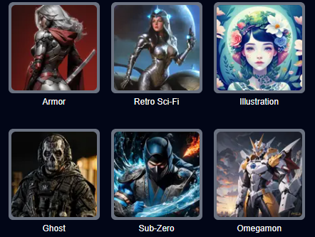</Frame>
</Update>

<Update label="2023-10-26">

## Create Video From Template in Explore Page

In the Explore page, you can now click "Create Video Using Template" to start a project with the same settings!

</Update>

<Update label="2023-10-25">

## Launching Explore Page

Introducing the Explore page, which highlights videos made using Magic Hour. Gain insight into the prompts and settings used so you can recreate styles that you like.

In the future, we'll enable you to start projects based on these videos, and allow you to share your own creations.

<Frame>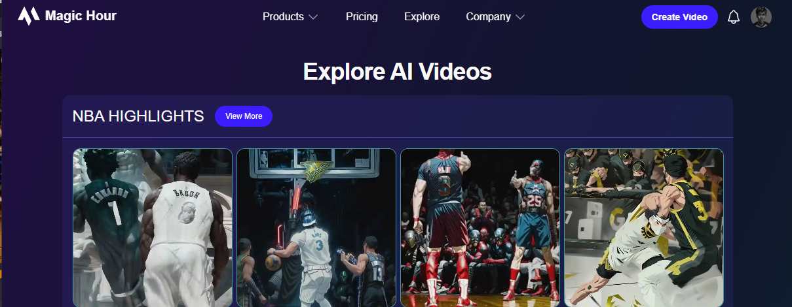</Frame>

</Update>

<Update label="2023-10-12">

## Higher File Size Upload Limit for Paid users

We increased file size for paid users from **200mb** to **500mb**!

</Update>

<Update label="2023-10-05">

## Improved Video-to-Video Quality

Hey everyone, we just rolled out a substantial update to Video-to-Video, resulting in a significant improvement in video quality.

<VideoPlayer src="https://videos.magichour.ai/api-assets/docs/changelog/2023/10/v2v-before-after.mp4" />

</Update>

<Update label="2023-10-01">

## New feature alert: Text-to-Video 📢

We're excited to announce a new mode we've been working on called **Text-to-Video**.

Think of it like Animation but with more realism and consistency.

It comes with your favorite features from Animation like initial images, art styles, Use Lyrics as Prompt, and Have AI Choose Prompts.

<VideoPlayer src="https://videos.magichour.ai/api-assets/docs/changelog/2023/10/text-to-video.mp4" />

Get started at https://magichour.ai/create/text-to-video today, currently available to Creator and Pro users only.

</Update>

<Update label="2023-09-20">

## Adjust FPS of Output in Video-to-Video

In Video-to-Video mode, you can now adjust the FPS of your final video. The two options are full FPS (same FPS as original video) and half FPS (half the FPS of the original video). The default is half FPS, as there's usually not a significant difference between half and full FPS, but full FPS may be good for professional use cases or videos that you want to appear more "full." Note that full FPS costs twice the frames of half FPS.

<Frame>
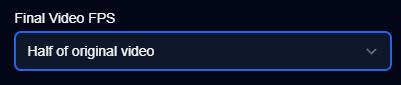

</Frame>
</Update>

<Update label="2023-09-14">

## Longer Videos for Face Swap and Animation

We updated the maximum frames for Face Swap Video and Animation

- Animation: 5,000 -> 10,000
- Face Swap: 2,000 -> 4,000

Now you can generate videos that are **2x** longer! 📈

</Update>

<Update label="2023-08-29">
## Launching Notifications Center!

When a video has finished rendering or ran into an error, you'll now get an in-app notification and email. You can see the in-app notifications by clicking the bell icon in your dashboard.

To turn either notification off, simply go to the Settings tab in your dashboard and toggle them off.

No more watching your generations and refreshing the page. You can now grab a coffee and get a ping as soon as they're done!

<Frame>
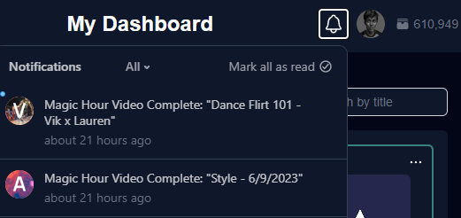
</Frame>
</Update>

<Update label="2023-08-27">

## Launching 4 New Art Styles for Video-to-Video

We just dropped 4 new art styles: 3D Render, Neon Dreams, Oil Painting, and Pixel.

Below is a quick preview using the prompt "Flash the superhero."

<VideoPlayer src="https://videos.magichour.ai/api-assets/docs/changelog/2023/08/new-v2v-art-styles-comparison.mp4" />

Check it out at https://magichour.ai/create/video-to-video

</Update>

<Update label="2023-08-25">

## Use Lyrics in Animation

You can now click the "Use Lyrics as Prompt" button to use the lyrics of your audio as the prompts. In addition, it splits your video into scenes to give it that montage look.

Also, did you know if you click the "Have AI Choose Prompts" button, it feeds the lyrics into ChatGPT and asks it to direct a music video for you? This creates videos that tell interesting stories - try it out sometime and share your results!

<Frame>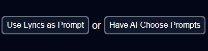</Frame>

</Update>

<Update label="2023-08-07">

## Launching Frame Packs

You can now purchase Frame Packs at https://magichour.ai/pricing if you run out of frames before your next top up. Frames come in increments of 1K for $3. Note: you'll still get the same features as your plan, with the exception of watermarks, which will be removed if you purchase a Frame Pack. Enjoy!

<Frame>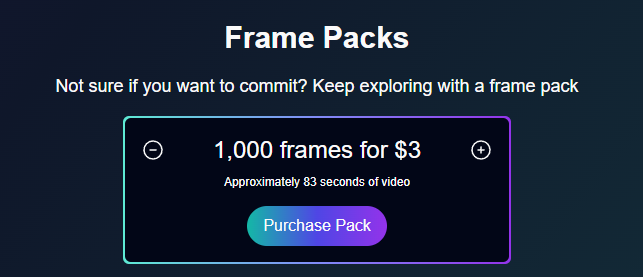</Frame>

</Update>

<Update label="2023-07-31">

## Launching Face Swap for All Users

Face Swap is now available for all users!

Try it out today https://magichour.ai/create/face-swap

</Update>

<Update label="2023-07-29">

## Launching Face Swap

Create realistic face swaps (or deep fakes) today, available to Creator and Pro users.

<VideoPlayer src="https://videos.magichour.ai/api-assets/docs/changelog/2023/07/face-swap.mp4" />

Try it out today https://magichour.ai/create/face-swap

</Update>

<Update label="2023-07-24">

## Improved Video-to-Video Consistency

We heard from some of you that you wanted more change in your video-to-video renders. By default, we have frame-to-frame consistency on, but now you can turn it off in your renders if you'd like. Here's a before and after of what the feature does.

<VideoPlayer src="https://videos.magichour.ai/api-assets/docs/changelog/2023/07/video-to-video-consistency.mp4" />

Try it out today https://magichour.ai/create/video-to-video

</Update>

<Update label="2023-07-19">

## Launching 4 Art Styles for Video-to-Video

We're thrilled to announce the launch of four brand-new art style templates in Video-to-Video: Mech, Van Gogh, Watercolor, and Comic! 🎨🖌️

<Frame>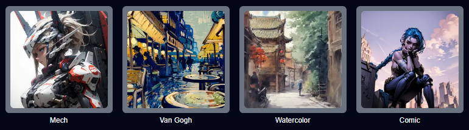</Frame>

Try it out today https://magichour.ai/create/video-to-video

</Update>

<Update label="2023-07-18">

## Upload Your Own Audio and Video

We just launched the functionality to allow you to upload your own audio and video to use!

Discover this feature in the first page of the Animated Music Video and Video-to-Video project flows.

</Update>

<Update label="2023-07-15">

## Launching Video-to-Video 📢

Video-to-Video allows you to take an existing video and apply any style. You can use it to:

- Bring animations like Spirited Away to life with breathtaking realism
- Witness a mesmerizing marble statue duel instead of a regular UFC fight
- Turn your favorite meme into any character your heart desires

<Frame>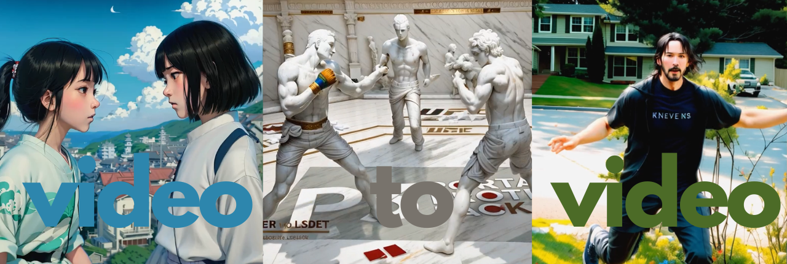</Frame>

Try it out today https://magichour.ai/create/video-to-video

</Update>

<Update label="2023-06-30">

## Sample Audio For Animation

To make it easier to create your next video, we added a few sample audio files 🎵 for Animation.

<Frame>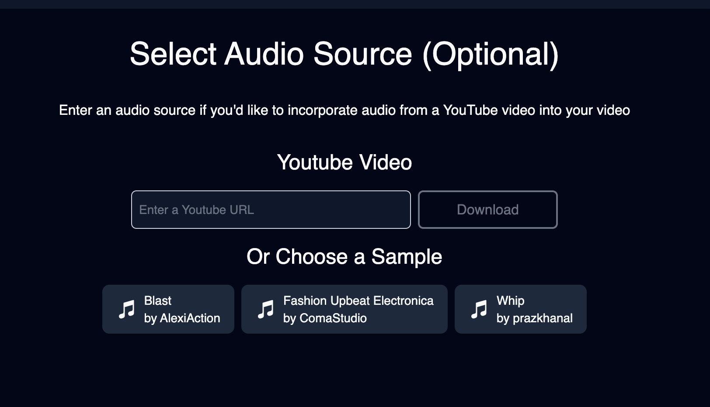</Frame>

</Update>

<Update label="2023-06-28">
## New Dashboard UI

Each video card now has a preview image that is clickable and takes you into the video page, and yes, T Swift was my inspiration. 🖼️🎵👀

<Frame>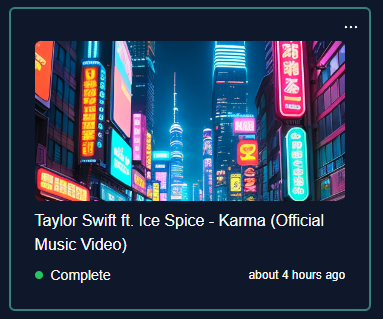</Frame>
</Update>

<Update label="2023-06-27">

## Launching Initial Image for Animation

Now you can upload an initial image for your video 🔥

<Frame>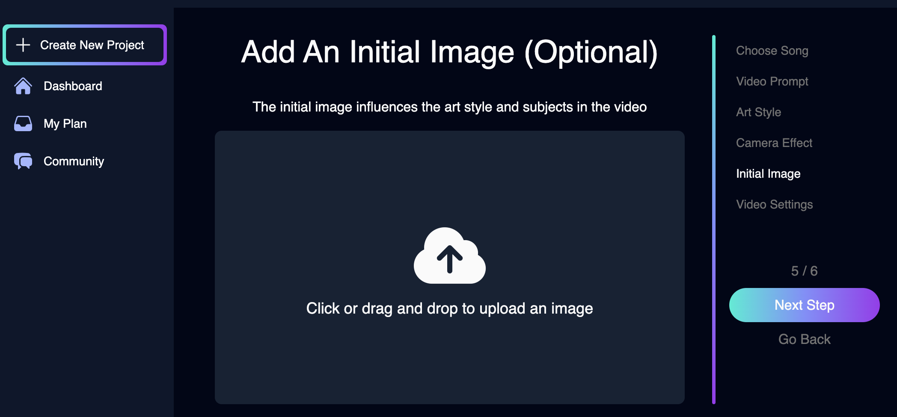</Frame>

</Update>

<Update label="2023-06-21">

## Launching Magic Hour Publicly!

We are officially live! We have been in private beta for days. Now when you log in, you are able to start creating animations!

<Frame>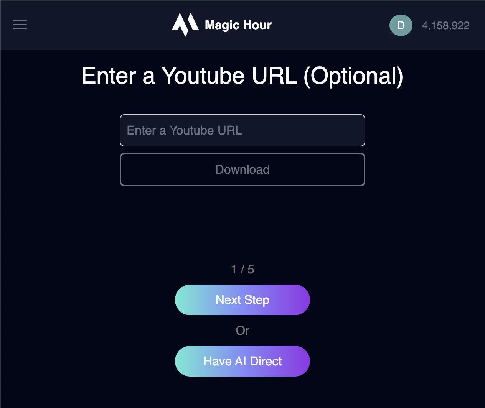</Frame>

</Update>

<Update label="2023-06-07">

## Magic Hour Private Beta

Now you can sign up for an account. You will be added to our waitlist page and we will slowly grant access from our list of users.

<Frame></Frame>

Sign up Today: https://magichour.ai

</Update>

<Update label="2023-01-22">

## Magic Hour Landing Page

Our landing page is live. Sign up with your email and we will let you know once the app is live!

<Frame></Frame>

Sign up Today: https://magichour.ai

</Update>
