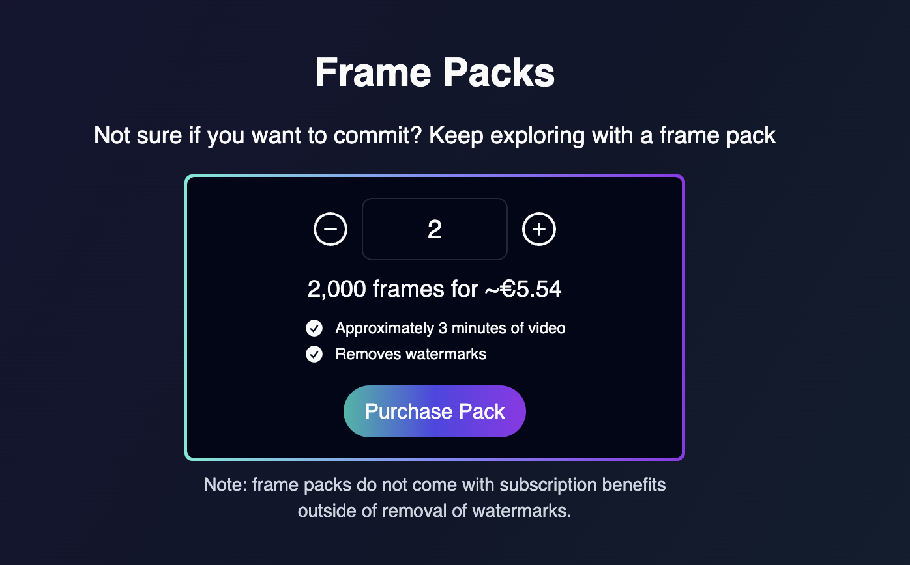
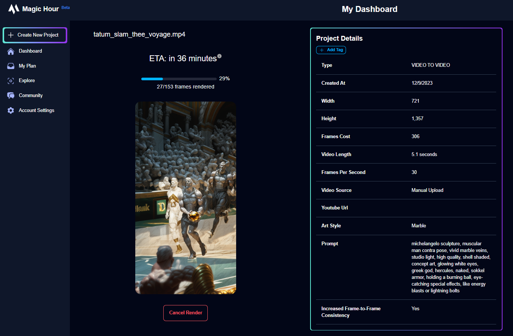

import { VideoPlayer } from "/snippets/video-player.mdx";

<Update label="2023-12-20">

## More Frames for Sign Up!

We increased sign up frames from **300** -> **400**! Now you can try out more of the product!

## Limited Time Access To Video-to-Video for All Users

For a limited time only, everyone has access to our premium Video-to-Video mode.

Try it out now: https://magichour.ai/create/video-to-video

</Update>

<Update label="2023-12-19">

## Currency Support for Subscriptions

Now, if you visit https://magichour.ai/pricing, the subscription pricing will be converted to your local currency, making it easier than ever to sign up for a subscription.

<Frame></Frame>

</Update>

<Update label="2023-12-15">

## Currency Support for Frame Packs

Now, if you visit https://magichour.ai/pricing, the frame pack pricing will be converted to your local currency!

<Frame></Frame>

</Update>

<Update label="2023-12-14">

## Animation Previews and Cancels, Plus Faster Rendering

Image previews and cancels are now available for [Animation](https://magichour.ai/create/animation), and render speeds is now 60% faster.

</Update>

<Update label="2023-12-09">

## 8 New Art Styles for Video-to-Video

<Frame></Frame>

Try it out now https://magichour.ai/create/video-to-video

</Update>

<Update label="2023-12-08">

## Video-to-Video Previews and Cancels

In Video-to-Video mode, you can now preview frames as they render and cancel the render to receive all frames back, regardless of progress. No more wasted renders. 🔥

<Frame></Frame>

Try it out now https://magichour.ai/create/video-to-video

</Update>

<Update label="2023-12-04">

## More Frames for Sign Up!

We increased sign up frames from **200** -> **300**!

</Update>
