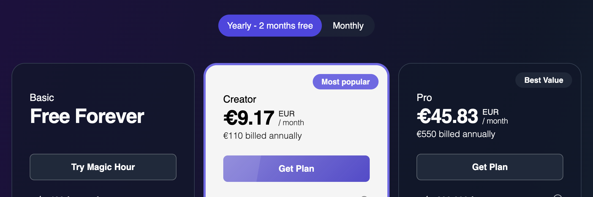
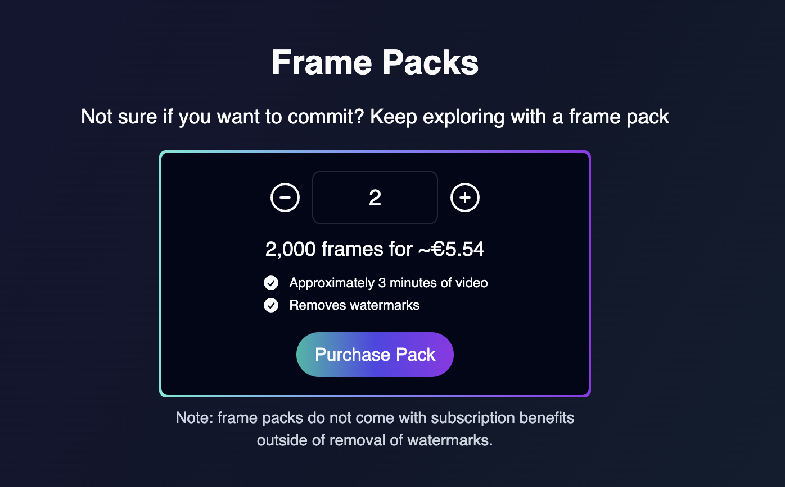
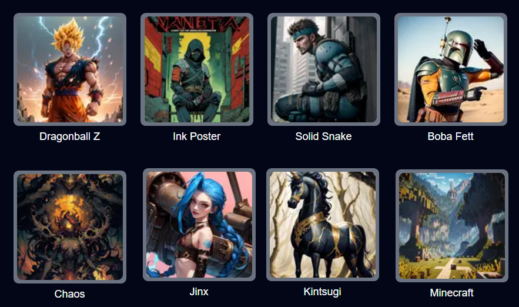
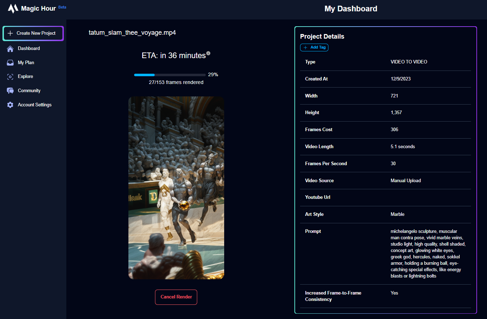
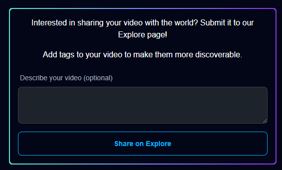
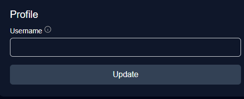

import { VideoPlayer } from "/snippets/video-player.mdx";

<Update label="2023-12-20">

## More Frames for Sign Up!

We increased sign up frames from **300** -> **400**! Now you can try out more of the product!

## Limited Time Access To Video-to-Video for All Users

For a limited time only, everyone has access to our premium Video-to-Video mode.

Try it out now: https://magichour.ai/create/video-to-video

</Update>

<Update label="2023-12-19">

## Currency Support for Subscriptions

Now, if you visit https://magichour.ai/pricing, the subscription pricing will be converted to your local currency, making it easier than ever to sign up for a subscription.

<Frame></Frame>

</Update>

<Update label="2023-12-15">

## Currency Support for Frame Packs

Now, if you visit https://magichour.ai/pricing, the frame pack pricing will be converted to your local currency!

<Frame></Frame>

</Update>

<Update label="2023-12-14">

## Animation Previews and Cancels, Plus Faster Rendering

Image previews and cancels are now available for [Animation](https://magichour.ai/create/animation), and render speeds is now 60% faster.

</Update>

<Update label="2023-12-09">

## 8 New Art Styles for Video-to-Video

<Frame></Frame>

Try it out now https://magichour.ai/create/video-to-video

</Update>

<Update label="2023-12-08">

## Video-to-Video Previews and Cancels

In Video-to-Video mode, you can now preview frames as they render and cancel the render to receive all frames back, regardless of progress. No more wasted renders. 🔥

<Frame></Frame>

Try it out now https://magichour.ai/create/video-to-video

</Update>

<Update label="2023-12-04">

## More Frames for Sign Up!

We increased sign up frames from **200** -> **300**!

</Update>

<Update label="2023-11-28">

## Share Your Own and Watch Other User's Videos

We added the ability to share your videos publicly from the video details page.

<Frame></Frame>

And a feed to watch other user's videos: https://magichour.ai/feed

</Update>

<Update label="2023-11-19">

## Delete Video

You can now delete generated videos to keep your dashboard clean. You can delete from

- Project details page
- Dashboard project tile menu

</Update>

<Update label="2023-11-15">

## Higher Resolution for Pro Subscribers

We increased maximum video resolution fro pro users from **1280** to **1344**!

</Update>

<Update label="2023-11-11">

## Improved Quality for Video-to-Video

We made improvements to the quality of the outputs. Go check it out now https://magichour.ai/create/video-to-video

</Update>

<Update label="2023-11-04">

## Reserve Your Magic Hour Username

_Pst_: reserve your username at https://magichour.ai/settings

We're launching some social features soon and this will allow you to get the name you want.

<Frame></Frame>
</Update>

<Update label="2023-11-01">

## Launching Magic Hour Blog

🌟 Have you heard about our blog? We've launched a treasure trove of articles aimed at helping you become a pro at AI video generation. Dive into the insights and tips at https://blog.magichour.ai/

One of the most frequently asked questions we receive is, "What should I input for my prompt?" Well, today's your lucky day! We just dropped a brand new article packed with invaluable advice on how to supercharge your prompts. Don't miss it! [Check it out](https://magichour.ai/blog/how-to-prompt-ai-videos-a-simple-guide) 💡

</Update>
