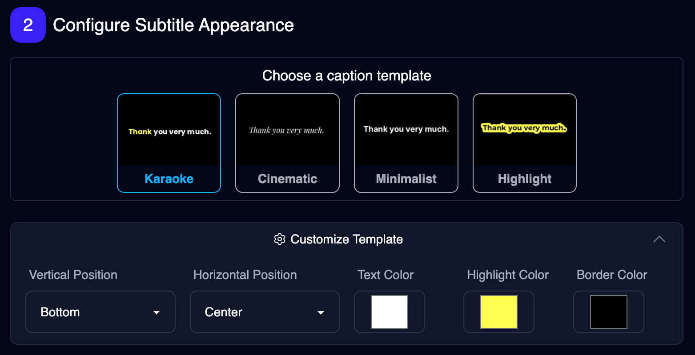
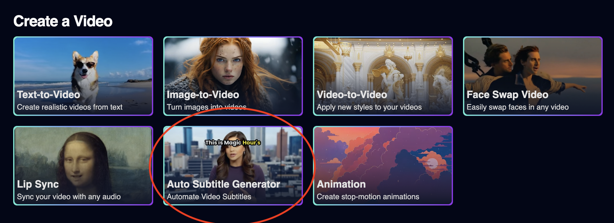

<Update label="2025-03-07">

## AI Clothes Changer Quality Upgrade

We released an improved version of AI Clothes changer with higher quality to paid users only. This version has better masking, less errors, and preserves elements more of the original image, like hair.

<Frame>


</Frame>

</Update>

<Update label="2025-03-05">

## Faster Rendering for AI Headshot and Face Swap Photo

We optimized our AI Headshot Generator and Face Swap Photo tools, cutting rendering times drastically.

| Tool                  | Previous Time | New Time   | Improvement |
| :-------------------- | :------------ | :--------- | :---------- |
| AI Headshot Generator | ~30 seconds   | ~7 seconds | 4.3x faster |
| Face Swap Photo       | ~16 seconds   | ~6 seconds | 2.5x faster |

</Update>

<Update label="2025-03-03">

## Improved face detection in Multi-Face Swap

We improved face detection accuracy in Multi-Face Swap for images with zoomed in faces.

</Update>

<Update label="2025-02-23">

## Multi Face Swap Just Got Better! 🚀

We've improved our Multi Face Swap mode — now with **2.5x** faster processing and higher quality!

<Frame>
  <video
    loop
    controls
    autoPlay
    muted
    playsInline
    className="w-full aspect-video"
    src="https://videos.magichour.ai/api-assets/docs/improved-multi-face-swap.webm"
  ></video>
</Frame>

</Update>

<Update label="2025-02-19">

## Added `.m4v` File Support

All APIs and web UIs now allows files with `.m4v` extension. All SDKs are updated to reflect this change.

- [Python SDK v0.9.3](https://github.com/magichourhq/magic-hour-python/releases/tag/v0.9.3)
- [Node SDK v0.9.3](https://github.com/magichourhq/magic-hour-node/releases/tag/v0.9.3)
- [Go SDK v0.9.3](https://github.com/magichourhq/magic-hour-go/releases/tag/v0.9.3)
- [Rust SDK v0.9.3](https://github.com/magichourhq/magic-hour-rust/releases/tag/v0.9.3)

</Update>

<Update label="2025-02-17">

## Customizable Caption Templates! 🎉

We've added customization options to give you control over your subtitles appearance. You can now customize:

- Text color, text highlight color, and Text border color.
- Vertical and horizontal position.

<Frame>



</Frame>

Try it now: [Auto Subtitle Generator](https://magichour.ai/create/auto-subtitle-generator)

</Update>

<Update label="2025-02-16">

## Animation and Video-to-Video APIs Now Allow File URLs.

To make it easier to use input files, we have now updated final two endpoints to support file urls for input files:

- `POST /v1/animation`
- `POST /v1/video-to-video`

Now, you won't have to upload files to our storage first before calling these two APIs.

<Tabs>

<Tab title="POST /v1/video-to-video">

<CodeGroup>

```python Python SDK {4}
res = client.v1.video_to_video.create(
    assets={
        "video_source": "file",
        "video_file_path": "https://cdn.yourwebsite.com/files/video.mp4"
    }
)
```

```typescript Node SDK {4}
const res = await client.v1.videoToVideo.create({
  assets: {
    videoSource: "file",
    videoFilePath: "https://cdn.yourwebsite.com/files/video.mp4",
  },
});
```

```go Go SDK {4}
res, err := client.V1.VideoToVideo.Create(video_to_video.CreateRequest{
    Assets: types.PostV1VideoToVideoBodyAssets{
        VideoSource:   types.PostV1VideoToVideoBodyAssetsVideoSourceEnumFile,
        VideoFilePath: nullable.NewValue("https://cdn.yourwebsite.com/files/video.mp4"),
    },
})
```

```rust Rust SDK {4}
let res = client.v1().video_to_video().create(magic_hour::resources::v1::video_to_video::CreateRequest {
    assets: magic_hour::models::PostV1VideoToVideoBodyAssets {
        video_source: magic_hour::models::PostV1VideoToVideoBodyAssetsVideoSourceEnum::File,
        video_file_path: Some("https://cdn.yourwebsite.com/files/video.mp4".to_string()),
    },
);
```

</CodeGroup>

</Tab>

<Tab title="POST /v1/animation">

<CodeGroup>

```python Python SDK {4-5}
res = client.v1.animation.create(
    assets={
        "audio_source": "file",
        "audio_file_path": "https://cdn.yourwebsite.com/files/audio.mp3",
        "image_file_path": "https://cdn.yourwebsite.com/files/image.png",
    },
)
```

```typescript Node SDK {4-5}
const res = await client.v1.animation.create({
  assets: {
    audioSource: "file",
    audioFilePath: "https://cdn.yourwebsite.com/files/audio.mp3",
    imageFilePath: "https://cdn.yourwebsite.com/files/image.png",
  },
});
```

```go Go SDK {4-5}
res, err := client.V1.Animation.Create(animation.CreateRequest{
    Assets: types.PostV1AnimationBodyAssets{
        AudioSource:   types.PostV1AnimationBodyAssetsAudioSourceEnumFile,
        AudioFilePath: nullable.NewValue("https://cdn.yourwebsite.com/files/audio.mp3"),
        ImageFilePath: nullable.NewValue("https://cdn.yourwebsite.com/files/image.png"),
    },
})
```

```rust Rust SDK {4-5}
let res = client.v1().animation().create(magic_hour::resources::v1::animation::CreateRequest {
    assets: magic_hour::models::PostV1AnimationBodyAssets {
        audio_file_path: Some("https://cdn.yourwebsite.com/files/audio.mp3".to_string()),
        audio_source: magic_hour::models::PostV1AnimationBodyAssetsAudioSourceEnum::File,
        image_file_path: Some("https://cdn.yourwebsite.com/files/image.png".to_string()),
    },
);
```

</CodeGroup>

</Tab>
</Tabs>

</Update>

<Update label="2025-02-14">

## Generate Subtitle for 3+ Minutes Videos

We added the `Auto Subtitle Generator` to our dashboard! The max duration of our [current tool](https://magichour.ai/products/auto-subtitle-generator) is 30 seconds. We have now expanded the max to 10,000 frames. This means you can generate videos of length:

- 6.9 minutes at 24fps
- 5.5 minutes at 30fps

<Frame>



</Frame>
Try it now: [Auto Subtitle Generator](https://magichour.ai/create/auto-subtitle-generator)

</Update >
