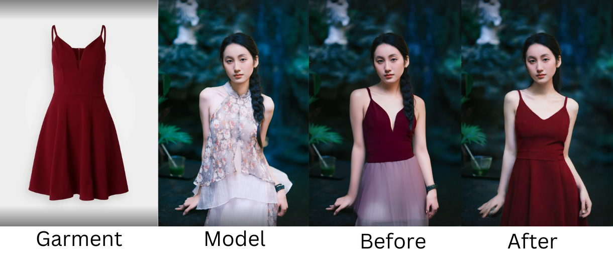

<Update label="2025-03-07">

## AI Clothes Changer Quality Upgrade

We released an improved version of AI Clothes changer with higher quality to paid users only. This version has better masking, less errors, and preserves elements more of the original image, like hair.

</Update>

<Update label="2025-03-05">

## Faster Rendering for AI Headshot and Face Swap Photo

We optimized our AI Headshot Generator and Face Swap Photo tools, cutting rendering times drastically.

| Tool                  | Previous Time | New Time   | Improvement |
| :-------------------- | :------------ | :--------- | :---------- |
| AI Headshot Generator | ~30 seconds   | ~7 seconds | 4.3x faster |
| Face Swap Photo       | ~16 seconds   | ~6 seconds | 2.5x faster |

</Update>

<Update label="2025-03-03">

## Improved face detection in Multi-Face Swap

We improved face detection accuracy in Multi-Face Swap for images with zoomed in faces.

</Update>
