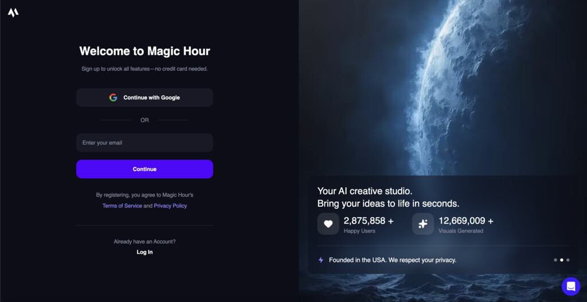
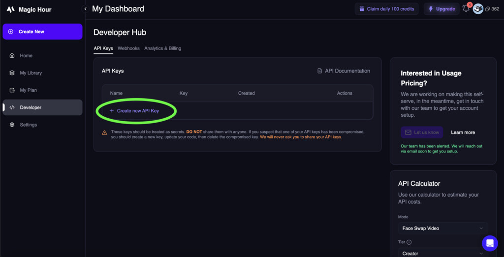
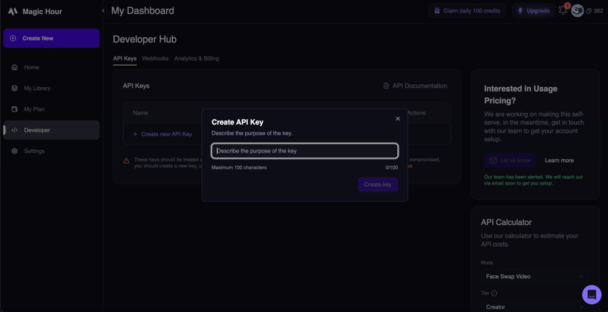
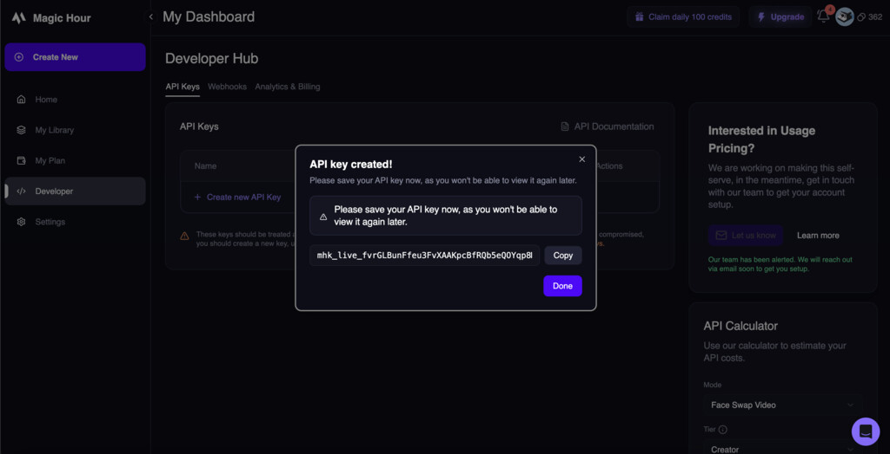

## Overview

Magic Hour uses API keys to authenticate requests. Your API keys carry many privileges, so be sure to keep them secure! Do not share your secret API keys in publicly accessible areas such as GitHub, client-side code, and so forth.

All API requests must be authenticated by including your API key in the `Authorization` header:

```bash
Authorization: Bearer your_api_key_here
```

## Creating Your First API Key

<Steps>
<Step title="Sign in to Magic Hour">
Visit [magichour.ai](https://magichour.ai/sign-up) and sign in to your account. If you don't have an account yet, you can create one for free.


</Step>

<Step title="Navigate to Developer Hub">
Once signed in, go to the [Developer Hub](https://magichour.ai/developer) from your dashboard or account menu. The API Keys section will be displayed by default.


</Step>

<Step title="Create New API Key">
Click the **"Create API Key"** button to generate a new key.


</Step>

<Step title="Configure Your API Key">
Give your API key a descriptive name to help you identify its purpose later:

- **Name**: Choose a clear name (e.g., "Production App", "Development Testing", "Mobile App")
- **Permissions**: Select the appropriate permissions for your use case



Click **"Create Key"** to generate your new API key.
</Step>

<Step title="Copy and Store Your API Key">
**Important**: Your API key will only be shown once. Copy it immediately and store it securely.



<Warning>
**Save your API key now!** You won't be able to see the full key again after closing this dialog. If you lose it, you'll need to create a new one.
</Warning>
</Step>
</Steps>


## Managing Your API Keys

### Viewing API Keys

In the Developer Hub, you can see all your API keys with:
- **Name**: The descriptive name you gave the key
- **Last 4 Characters**: The last 4 characters of the key
- **Created**: When the key was created


### Revoking API Keys

To revoke an API key:

1. Find the key in your API Keys list
2. Click the **Delete (Trash Icon)** button next to the key
3. Click "Delete key" to confirm the revocation


<Warning>
**Immediate Effect**: Revoked keys stop working immediately. Any applications using the revoked key will start receiving authentication errors.
</Warning>

### Rotating API Keys

For security best practices, regularly rotate your API keys:

1. **Create a new API key** with the same permissions
2. **Update your applications** to use the new key
3. **Test thoroughly** to ensure everything works
4. **Revoke the old key** once you're confident the new key is working

## Using API Keys

### In Code

<CodeGroup>

```python Python SDK
import magic_hour

# Initialize client with your API key
client = magic_hour.Client(api_key="your_api_key_here")

# Or use environment variable
import os
client = magic_hour.Client(api_key=os.getenv("MAGIC_HOUR_API_KEY"))
```

```javascript Node.js SDK
import MagicHour from 'magic-hour';

// Initialize client with your API key
const client = new MagicHour({
  apiKey: 'your_api_key_here'
});

// Or use environment variable
const client = new MagicHour({
  apiKey: process.env.MAGIC_HOUR_API_KEY
});
```

```bash cURL
curl -X POST "https://api.magichour.ai/v1/ai-image-generator" \
  -H "Authorization: Bearer your_api_key_here" \
  -H "Content-Type: application/json" \
  -d '{
    "prompt": "A beautiful sunset over mountains",
    "width": 1024,
    "height": 1024
  }'
```

</CodeGroup>

### Environment Variables

Store your API key as an environment variable for security:

<CodeGroup>

```bash .env file
MAGIC_HOUR_API_KEY=your_api_key_here
```

```bash Shell Export
export MAGIC_HOUR_API_KEY=your_api_key_here
```

```bash Windows
set MAGIC_HOUR_API_KEY=your_api_key_here
```

</CodeGroup>

## Security Best Practices

### ✅ Do

- **Store keys securely** in environment variables or secure key management systems
- **Use different keys** for different environments (development, staging, production)
- **Rotate keys regularly** (every 90 days recommended)
- **Revoke unused keys** immediately
- **Monitor key usage** in the Developer Hub
- **Use separate keys** for different environments (development, staging, production)
- **Implement proper error handling** for authentication failures

### ❌ Don't

- **Never commit keys** to version control (Git, SVN, etc.)
- **Don't expose keys** in client-side code (JavaScript, mobile apps)
- **Don't share keys** via email, chat, or other insecure channels
- **Don't use production keys** in development environments
- **Don't ignore security warnings** about exposed keys

### Key Storage Solutions

**For Development:**
- Environment variables (`.env` files)
- Local configuration files (excluded from version control)

**For Production:**
- AWS Secrets Manager
- Azure Key Vault
- Google Secret Manager
- HashiCorp Vault
- Kubernetes Secrets

## Authentication Errors

Common authentication errors and how to resolve them:

### `401 Unauthorized`
**Cause**: Invalid or missing API key
**Solutions**:
- Check that your API key is correct
- Ensure the `Authorization` header is properly formatted
- Verify the key hasn't been revoked

## Monitoring Usage

<Note>
**Usage-Based Pricing Only**: Analytics & Billing monitoring is only available for users on a usage-based pricing plan. Subscription users can view basic key information in the API Keys section.
</Note>

For usage-based pricing users, track your API key usage in the Developer Hub:

- **Credit Usage**: Credits consumed by your requests

This helps you:
- Detect unusual activity that might indicate a compromised key
- Plan for capacity and billing

## Next Steps

<CardGroup cols={2}>

<Card title="Quick Start Guide" icon="rocket" href="/get-started/quick-start">
  Make your first API call with your new API key
</Card>

<Card title="Google Colab Cookbook" icon="code" href="https://colab.research.google.com/drive/1NTHL_lr_s-qBJ-mSecSXPzRLi9_V5JiU?usp=sharing" openInNewTab>
  Try all 22 APIs with sample code. Just add your API key.
</Card>

<Card title="SDKs" icon="code" href="/integration/adding-api-to-your-app">
  Use official SDKs for easier integration
</Card>

<Card title="Pricing" icon="credit-card" href="/billing/overview">
  Understand how API usage affects billing
</Card>

<Card title="Webhooks" icon="webhook" href="/integration/webhook/overview">
  Set up webhooks for real-time notifications
</Card>

</CardGroup>

## Need Help?

If you're having trouble with authentication:

- Check our [troubleshooting guide](/get-started/quick-start#troubleshooting)
- Contact support at [support@magichour.ai](mailto:support@magichour.ai)
- Join our community on [Discord](https://discord.gg/QNsVxKYz)

<Info>
**Security Concern?** If you believe your API key has been compromised, revoke it immediately in the Developer Hub and create a new one.
</Info>
