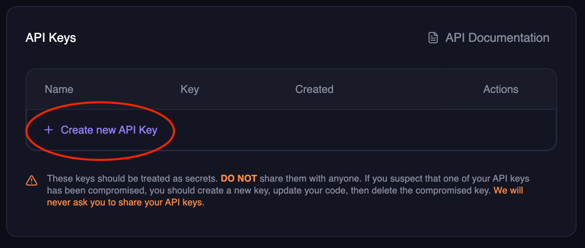

## Create your account

1. Visit the [Magic Hour Developer Hub](https://magichour.ai/developer?tab=api-keys) (create an account if you don't have one).
1. Click `Create API Key`.
   
1. Add a descriptive name. Then click `Create key`.
   
1. Copy the API key and save it.
   

<Warning>The API key can only be viewed on creation.</Warning>

{/* TODO: add a env setup step???? */}

## Install SDK (Optional)

<Note>Skip to the next step if you're not planning on using our SDKs.</Note>

import SdkInstallation from "/snippets/code-groups/sdk-installation.mdx";

<SdkInstallation />

## Generate an image or a video

<Tip>
  You can install this documentation as an MCP server to get contextual help while integrating Magic
  Hour APIs into your application. [Learn more](./model-context-protocol)
</Tip>

<Tabs>

<Tab title="AI image">

<CodeGroup>

```python Python SDK
from magic_hour import Client
import time
import os
import urllib.request

client = Client(token="YOUR_API_KEY") # change to your API key

create_res = client.v1.ai_image_generator.create(
    image_count=1,
    orientation="landscape",
    style={
        "prompt": "Epic anime art of wizard casting a cosmic spell in the sky that says 'Magic Hour'"
    },
)

print(f"queued image with id {create_res.id}, spent {create_res.credits_charged} credits")

output_file = "output.png"
while True:
    res = client.v1.image_projects.get(id=create_res.id)
    if res.status == "complete":
        print("render complete!")
        with (
            urllib.request.urlopen(res.downloads[0].url) as response,
            open(output_file, "wb") as out_file,
        ):
            out_file.write(response.read())
        print(f"file downloaded successfully to {output_file}")
        break
    elif res.status == "error":
        print("render failed")
        break
    else:
        print(f"render in progress: {res.status}")
        time.sleep(1)

```

```typescript Node SDK
import { writeFileSync } from "fs";
import Client from "magic-hour";

const client = new Client({ token: "YOUR_API_KEY" }); // change to your API key

async function main() {
  const createRes = await client.v1.aiImageGenerator.create({
    imageCount: 1,
    orientation: "landscape",
    style: {
      prompt: "Epic anime art of wizard casting a cosmic spell in the sky that says 'Magic Hour'",
    },
  });

  while (true) {
    const res = await client.v1.imageProjects.get({ id: createRes.id });
    if (res.status === "complete") {
      console.log("render complete!");
      const outputFile = "output.png";
      await fetch(res.downloads[0].url)
        .then((res) => res.arrayBuffer())
        .then((buffer) => writeFileSync(outputFile, Buffer.from(buffer)));
      console.log(`file downloaded successfully to ${outputFile}`);
      break;
    } else if (res.status === "error") {
      console.log("render failed");
    } else {
      console.log(`render in progress: ${res.status}`);
      await new Promise((resolve) => setTimeout(resolve, 3000));
    }
  }
}

main();
```

```go Go SDK
package main

import (
	"fmt"
	"io"
	"net/http"
	"os"
	"time"

	sdk "github.com/magichourhq/magic-hour-go/client"
	"github.com/magichourhq/magic-hour-go/resources/v1/ai_image_generator"
	"github.com/magichourhq/magic-hour-go/resources/v1/image_projects"
	"github.com/magichourhq/magic-hour-go/types"
)

func main() {
	client := sdk.NewClient(sdk.WithBearerAuth("YOUR_API_KEY")) // change to your API key
	createRes, err := client.V1.AiImageGenerator.Create(ai_image_generator.CreateRequest{
		ImageCount:  1,
		Orientation: types.PostV1AiImageGeneratorBodyOrientationEnumLandscape,
		Style: types.PostV1AiImageGeneratorBodyStyle{
			Prompt: "Epic anime art of wizard casting a cosmic spell in the sky that says 'Magic Hour'",
		},
	})

	if err != nil {
		fmt.Println(err)
		return
	}

	fmt.Printf("queued image with id %s, spent %d credits\n", createRes.Id, createRes.CreditsCharged)

	for {
		res, err := client.V1.ImageProjects.Get(image_projects.GetRequest{Id: createRes.Id})
		if err != nil {
			fmt.Println(err)
			return
		}
		if res.Status == "complete" {
			println("render complete!")
			url := res.Downloads[0].Url
			outputFile := "output.png"

			resp, err := http.Get(url)
			if err != nil {
				fmt.Println(err)
				return
			}
			defer resp.Body.Close()

			out, err := os.Create(outputFile)
			if err != nil {
				fmt.Println(err)
				return
			}
			defer out.Close()

			_, err = io.Copy(out, resp.Body)
			if err != nil {
				fmt.Println(err)
				return
			}
			fmt.Printf("file downloaded successfully to %s\n", outputFile)
			break
		} else if res.Status == "error" {
			println("render failed")
			break
		} else {
			fmt.Printf("render in progress: %s\n", res.Status)
			time.Sleep(1 * time.Second)
		}
	}
}
```

```rust Rust SDK
use magic_hour;
use reqwest;
use std::io::Read;

#[tokio::main]
async fn main() {
    let mut client = magic_hour::Client::default().with_bearer_auth(
        "YOUR_API_KEY", // change to your API key
    );

    let create_res = client
        .v1()
        .ai_image_generator()
        .create(magic_hour::resources::v1::ai_image_generator::CreateRequest {
            image_count: 1,
            orientation: magic_hour::models::PostV1AiImageGeneratorBodyOrientationEnum::Landscape,
            style: magic_hour::models::PostV1AiImageGeneratorBodyStyle {
                prompt: "Epic anime art of wizard casting a cosmic spell in the sky that says 'Magic Hour'".to_string(),
            },
            ..Default::default()
        })
        .await
        .unwrap();
    let project_id = create_res.id;
    let credits_charged = create_res.credits_charged;
    println!("queued image with id {project_id}, spent {credits_charged} credits");
    loop {
        let res = client
            .v1()
            .image_projects()
            .get(magic_hour::resources::v1::image_projects::GetRequest {
                id: project_id.clone(),
            })
            .await
            .unwrap();
        match res.status {
            magic_hour::models::GetV1ImageProjectsIdResponseStatusEnum::Complete => {
                println!("render complete!");
                let url = res.downloads[0].url.clone();

                tokio::task::block_in_place(move || {
                    let response = reqwest::blocking::get(url).unwrap();
                    let output_path = "output.png";
                    if response.status().is_success() {
                        let mut output_file = std::fs::File::create(output_path).unwrap();
                        std::io::copy(&mut response.take(1_000_000), &mut output_file).unwrap();
                        println!("file downloaded successfully to {}", output_path);
                    } else {
                        println!("failed to download file: {}", response.status());
                    }
                });

                return;
            }
            magic_hour::models::GetV1ImageProjectsIdResponseStatusEnum::Error => {
                println!("render failed");
                return;
            }
            _ => {
                println!("render in progress: {}", res.status);
                std::thread::sleep(std::time::Duration::from_secs(1));
            }
        }
    }
}
```

```sh cURL
#!/bin/bash
set -e

URL="https://api.magichour.ai/v1/ai-image-generator"
STATUS_URL="https://api.magichour.ai/v1/image-projects"
API_KEY="YOUR_API_KEY" # change to your API key
OUTPUT_PATH="output.png"

create_response=$(curl -s $URL \
  --request POST \
  --header "Content-Type: application/json" \
  --header "Authorization: Bearer $API_KEY" \
  --data '{
    "image_count": 1,
    "orientation": "landscape",
    "style": {
      "prompt": "Epic anime art of wizard casting a cosmic spell in the sky that says \"Magic Hour\""
    }
  }')

project_id=$(echo $create_response | jq -r '.id')
credits_charged=$(echo $create_response | jq -r '.credits_charged')

echo "queued image with id $project_id, spent $credits_charged credits"
while true; do
    status_response=$(curl -s $STATUS_URL/$project_id --header "Authorization: Bearer $API_KEY")

    status=$(echo $status_response | jq -r '.status')

    if [ "$status" == "complete" ]; then
        echo "render complete!"
        download_url=$(echo $status_response | jq -r '.downloads[0].url')

        echo "downloading image from $download_url..."
        curl -s $download_url -o $OUTPUT_PATH

        echo "file downloaded successfully to $OUTPUT_PATH"
        break
    elif [ "$status" == "error" ]; then
        echo "render failed"
        break
    else
        echo "render in progress"
        sleep 1
    fi
done
```

</CodeGroup>

</Tab>

<Tab title="Face swap video">

<CodeGroup>

```python Python SDK
from magic_hour import Client
import time
import os
import urllib.request

client = Client(token="YOUR_API_KEY") # change to your API key

create_res = client.v1.face_swap.create(
    name="Swap Tom Cruise into Iron Man scene",
    assets={
        "image_file_path": "https://videos.magichour.ai/api-assets/sample/tom-cruise.png",
        "video_file_path": "https://videos.magichour.ai/api-assets/sample/iron-man.mp4",
        "video_source": "file",
    },
    start_seconds=2.3,
    end_seconds=8.5,
    height=288,
    width=512,
)

print(
    f"queued face swap video with id {create_res.id}, spent {create_res.credits_charged} credits based on 30fps. This value be updated after render completes if fps is different."
)

output_file = "output.mp4"
while True:
    res = client.v1.video_projects.get(id=create_res.id)
    if res.status == "complete":
        print(f"render complete! Final credit charged is {res.credits_charged}, actual fps is {res.fps}.")
        with (
            urllib.request.urlopen(res.downloads[0].url) as response,
            open(output_file, "wb") as out_file,
        ):
            out_file.write(response.read())
        print(f"file downloaded successfully to {output_file}")
        break
    elif res.status == "error":
        print("render failed")
        break
    else:
        print(f"render in progress: {res.status}")
        time.sleep(3)

```

```typescript Node SDK
import { writeFileSync } from "fs";
import Client from "magic-hour";

const client = new Client({ token: "YOUR_API_KEY" }); // change to your API key

async function main() {
  const createRes = await client.v1.faceSwap.create({
    name: "Swap Tom Cruise into Iron Man scene",
    assets: {
      imageFilePath: "https://videos.magichour.ai/api-assets/sample/tom-cruise.png",
      videoFilePath: "https://videos.magichour.ai/api-assets/sample/iron-man.mp4",
      videoSource: "file",
    },
    startSeconds: 2.3,
    endSeconds: 8.5,
    height: 288,
    width: 512,
  });

  console.log(
    `queued face swap video with id ${createRes.id}, spent ${createRes.creditsCharged} credits based on 30fps. This value be updated after render completes if fps is different.`
  );

  while (true) {
    const res = await client.v1.videoProjects.get({ id: createRes.id });
    if (res.status === "complete") {
      console.log(
        `render complete! Final credit charged is ${res.creditsCharged}, actual fps is ${res.fps}.`
      );
      const outputFile = "output.mp4";
      await fetch(res.downloads[0].url)
        .then((res) => res.arrayBuffer())
        .then((buffer) => writeFileSync(outputFile, Buffer.from(buffer)));
      console.log(`file downloaded successfully to ${outputFile}`);
      break;
    } else if (res.status === "error") {
      console.log("render failed");
    } else {
      console.log(`render in progress: ${res.status}`);
      await new Promise((resolve) => setTimeout(resolve, 3000));
    }
  }
}

main();
```

```go Go SDK
package main

import (
	"fmt"
	"io"
	"net/http"
	"os"
	"time"

	sdk "github.com/magichourhq/magic-hour-go/client"
	nullable "github.com/magichourhq/magic-hour-go/nullable"
	"github.com/magichourhq/magic-hour-go/resources/v1/face_swap"
	"github.com/magichourhq/magic-hour-go/resources/v1/video_projects"
	"github.com/magichourhq/magic-hour-go/types"
)

func main() {
	client := sdk.NewClient("YOUR_API_KEY") // change to your API key
	createRes, err := client.V1.FaceSwap.Create(face_swap.CreateRequest{
		Name: nullable.NewValue("Swap Tom Cruise into Iron Man scene"),
		Assets: types.PostV1FaceSwapBodyAssets{
			ImageFilePath: "https://videos.magichour.ai/api-assets/sample/tom-cruise.png",
			VideoFilePath: nullable.NewValue("https://videos.magichour.ai/api-assets/sample/iron-man.mp4"),
			VideoSource:   types.PostV1FaceSwapBodyAssetsVideoSourceEnumFile,
		},
		StartSeconds: 2.3,
		EndSeconds:   8.5,
		Height:       288,
		Width:        512,
	})
	if err != nil {
		fmt.Println(err)
		return
	}

	fmt.Printf("queued video with id %s, spent %d credits based on 30fps. This value be adjusted after render completes if fps is different.\n", createRes.Id, createRes.CreditsCharged)

	for {
		res, err := client.V1.VideoProjects.Get(video_projects.GetRequest{Id: createRes.Id})
		if err != nil {
			fmt.Println(err)
			return
		}
		if res.Status == "complete" {
			fmt.Printf("render complete! Final credits charged is %d, actual fps is %f.\n", res.CreditsCharged, res.Fps)
			url := res.Downloads[0].Url
			outputFile := "output.mp4"

			resp, err := http.Get(url)
			if err != nil {
				fmt.Println(err)
				return
			}
			defer resp.Body.Close()

			out, err := os.Create(outputFile)
			if err != nil {
				fmt.Println(err)
				return
			}
			defer out.Close()

			_, err = io.Copy(out, resp.Body)
			if err != nil {
				fmt.Println(err)
				return
			}
			fmt.Printf("file downloaded successfully to %s\n", outputFile)
			break
		} else if res.Status == "error" {
			println("render failed")
			break
		} else {
			fmt.Printf("render in progress: %s\n", res.Status)
			time.Sleep(1 * time.Second)
		}
	}
}
```

```rust Rust SDK
use magic_hour;
use reqwest;
use std::io::Read;

#[tokio::main]
async fn main() {
    let mut client = magic_hour::Client::default().with_bearer_auth(
        "YOUR_API_KEY", // change to your API key
    );

    let create_res = client
        .v1()
        .face_swap()
        .create(magic_hour::resources::v1::face_swap::CreateRequest {
            name: Some("Swap Tom Cruise into Iron Man scene".to_string()),
            assets: magic_hour::models::PostV1FaceSwapBodyAssets {
                image_file_path: "https://videos.magichour.ai/api-assets/sample/tom-cruise.png"
                    .to_string(),
                video_file_path: Some(
                    "https://videos.magichour.ai/api-assets/sample/iron-man.mp4".to_string(),
                ),
                video_source: magic_hour::models::PostV1FaceSwapBodyAssetsVideoSourceEnum::File,
                ..Default::default()
            },
            start_seconds: 2.3,
            end_seconds: 8.5,
            height: 288,
            width: 512,
            ..Default::default()
        })
        .await
        .unwrap();
    let project_id = create_res.id;
    let credits_charged = create_res.credits_charged;
    println!("queued face swap video with id {project_id}, spent {credits_charged} credits based on 30fps. This value be updated after render completes if fps is different.");

    loop {
        let res = client
            .v1()
            .video_projects()
            .get(magic_hour::resources::v1::video_projects::GetRequest {
                id: project_id.clone(),
            })
            .await
            .unwrap();
        match res.status {
            magic_hour::models::GetV1VideoProjectsIdResponseStatusEnum::Complete => {
                println!(
                    "render complete! Final credit charged is {}, actual fps is {}",
                    res.credits_charged, res.fps
                );
                let url = res.downloads[0].url.clone();

                tokio::task::block_in_place(move || {
                    let response = reqwest::blocking::get(url).unwrap();
                    let output_path = "output.png";
                    if response.status().is_success() {
                        let mut output_file = std::fs::File::create(output_path).unwrap();
                        std::io::copy(&mut response.take(1_000_000), &mut output_file).unwrap();
                        println!("file downloaded successfully to {}", output_path);
                    } else {
                        println!("failed to download file: {}", response.status());
                    }
                });

                return;
            }
            magic_hour::models::GetV1VideoProjectsIdResponseStatusEnum::Error => {
                println!("render failed");
                return;
            }
            _ => {
                println!("render in progress: {}", res.status);
                std::thread::sleep(std::time::Duration::from_secs(1));
            }
        }
    }
}
```

```sh cURL
#!/bin/bash
set -e

URL="https://api.magichour.ai/v1/face-swap"
STATUS_URL="https://api.magichour.ai/v1/video-projects"
API_KEY="YOUR_API_KEY" # change to your API key
OUTPUT_PATH="output.mp4"

create_response=$(curl -s $URL \
  --request POST \
  --header "Content-Type: application/json" \
  --header "Authorization: Bearer $API_KEY" \
  --data '{
    "name": "Swap Tom Cruise into Iron Man scene",
    "assets": {
        "image_file_path": "https://videos.magichour.ai/api-assets/sample/tom-cruise.png",
        "video_file_path": "https://videos.magichour.ai/api-assets/sample/iron-man.mp4",
        "video_source": "file"
    },
    "start_seconds": 2.3,
    "end_seconds": 8.5,
    "height": 288,
    "width": 512
  }')

project_id=$(echo $create_response | jq -r '.id')
credits_charged=$(echo $create_response | jq -r '.credits_charged')

echo "queued face swap video with id $project_id, spent an estimated $credits_charged credits based on 30fps. This value be adjusted after render completes if fps is different."
while true; do
    status_response=$(curl -s $STATUS_URL/$project_id --header "Authorization: Bearer $API_KEY")

    status=$(echo $status_response | jq -r '.status')

    if [ "$status" == "complete" ]; then
        credits_charged=$(echo $status_response | jq -r '.credits_charged')
        fps=$(echo $status_response | jq -r '.fps')
        download_url=$(echo $status_response | jq -r '.downloads[0].url')
        echo "render complete! Final credit charged is $credits_charged, actual fps is $fps."

        echo "downloading video from $download_url..."
        curl -s $download_url -o $OUTPUT_PATH

        echo "file downloaded successfully to $OUTPUT_PATH"
        break
    elif [ "$status" == "error" ]; then
        echo "render failed"
        break
    else
        echo "render in progress: $status"
        sleep 3
    fi
done
```

</CodeGroup>

</Tab>
</Tabs>

<Check>🎉 Congratulations! You have successfully created an image and a video on Magic Hour!</Check>
