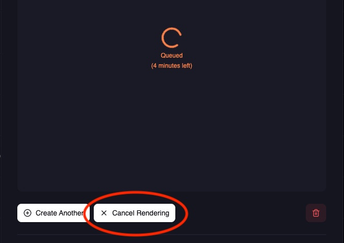
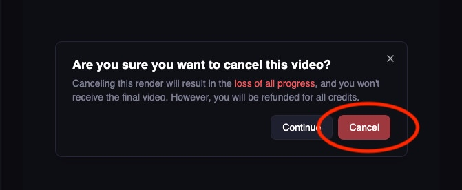
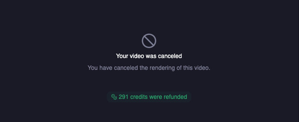

This guide walks you through integrating Magic Hour APIs into your production application. You'll learn the complete workflow from making API calls to handling responses, errors, and file management.

## What you'll accomplish

By the end of this guide, you'll have:

- ✅ Secure API integration setup
- ✅ Complete create → poll → download workflow
- ✅ Robust error handling
- ✅ Production-ready patterns

## Before you start

<Tip>
  Complete the [Quick Start Guide](/get-started/quick-start) first to get familiar with basic API
  calls.
</Tip>

**Prerequisites:**

- API key from [Developer Hub](https://magichour.ai/developer?tab=api-keys)
- Your preferred SDK installed or direct HTTP client ready

<Warning>
  **Security:** Never expose your API key in client-side code. Always keep it secure on your server
  to prevent unauthorized usage.
</Warning>

## Integration overview

Magic Hour APIs follow a simple 3-step pattern:

1. **Create** - Submit your job (image/video generation)
2. **Poll or webhook** - Check status
3. **Download** - Retrieve your generated content

## Complete integration example

Here's a full end-to-end example that demonstrates the complete workflow:

<Note>
  This example uses the `create` function to better demonstrate the full workflow. You can also use
  the `generate` function in Python and Node SDKs if you want a simpler workflow.
</Note>

<CodeGroup>

```python Python SDK
from magic_hour import Client
import time

client = Client(token="YOUR_API_KEY")

# 1. Create job
print("Creating face swap job...")
create_res = client.v1.face_swap.create(
    name="My face swap",
    assets={
        "image_file_path": "https://example.com/face.jpg",
        "video_file_path": "https://example.com/video.mp4",
        "video_source": "file"
    },
    start_seconds=0.0,
    end_seconds=10.0,
)

project_id = create_res.id
print(f"Job created: {project_id}")

# 2. Poll for completion
print("Waiting for completion...")
while True:
    status_res = client.v1.video_projects.get(id=project_id)
    print(f"Status: {status_res.status}")

    if status_res.status == "complete":
        print("✅ Render complete!")

        # 3. Download result
        download_url = status_res.downloads[0].url
        import requests
        with open("result.mp4", "wb") as file:
            response = requests.get(download_url)
            file.write(response.content)
        print("📁 File downloaded: result.mp4")
        break

    elif status_res.status == "error":
        print(f"❌ Error: {status_res.error}")
        break

    time.sleep(5)  # Wait 5 seconds before next check
```

```typescript Node SDK
import Client from "magic-hour";
import { writeFileSync } from "fs";

const client = new Client({ token: "YOUR_API_KEY" });

async function createAndDownload() {
  // 1. Create job
  console.log("Creating face swap job...");
  const createRes = await client.v1.faceSwap.create({
    name: "My face swap",
    assets: {
      imageFilePath: "https://example.com/face.jpg",
      videoFilePath: "https://example.com/video.mp4",
      videoSource: "file",
    },
    startSeconds: 0.0,
    endSeconds: 10.0,
  });

  const projectId = createRes.id;
  console.log(`Job created: ${projectId}`);

  // 2. Poll for completion
  console.log("Waiting for completion...");
  while (true) {
    const statusRes = await client.v1.videoProjects.get({ id: projectId });
    console.log(`Status: ${statusRes.status}`);

    if (statusRes.status === "complete") {
      console.log("✅ Render complete!");

      // 3. Download result
      const downloadUrl = statusRes.downloads[0].url;
      const response = await fetch(downloadUrl);
      const buffer = await response.arrayBuffer();
      writeFileSync("result.mp4", Buffer.from(buffer));
      console.log("📁 File downloaded: result.mp4");
      break;
    } else if (statusRes.status === "error") {
      console.log(`❌ Error: ${statusRes.error}`);
      break;
    }

    await new Promise((resolve) => setTimeout(resolve, 5000)); // Wait 5 seconds
  }
}

createAndDownload();
```

</CodeGroup>

## Working with input files

Magic Hour accepts input files in two ways:

### Option 1: URL references (Recommended)

The simplest approach is to pass file URLs:

```json
{
  "assets": {
    "image_file_path": "https://cdn.yourwebsite.com/face.jpg",
    "video_file_path": "https://cdn.yourwebsite.com/video.mp4"
  }
}
```

**Supported formats:**

- **Images**: PNG, JPG, JPEG, WEBP, AVIF
- **Videos**: MP4, MOV, WEBM
- **Audio**: MP3, WAV, AAC, FLAC

### Option 2: Upload to Magic Hour

For secure or temporary files, upload directly to Magic Hour storage:

<Card title="Input Files Guide" icon="file" href="/integration/input-files">
  Complete guide to file uploads, formats, and storage options
</Card>

## Understanding job status

Every job goes through these states:

| Status      | Description                         | Action Required    |
| :---------- | :---------------------------------- | :----------------- |
| `queued`    | Job is waiting for available server | ⏳ Keep polling    |
| `rendering` | Job is being processed              | ⏳ Keep polling    |
| `complete`  | Job finished successfully           | ✅ Download result |
| `error`     | Job failed during processing        | ❌ Handle error    |
| `canceled`  | Job was manually canceled           | 🛑 Job stopped     |

Recommended polling intervals:

- **Images**: Check every 2-3 seconds (usually complete within 30-60 seconds)
- **Videos**: Check every 5-10 seconds (can take 2-5 minutes depending on length)

## Error handling

When a job fails (`status: "error"`), the response includes detailed error information:

```json
{
  "status": "error",
  "error": {
    "code": "no_source_face",
    "message": "Please use an image with a detectable face"
  }
}
```

### Error handling example

<CodeGroup>

```python Python SDK
try:
    create_res = client.v1.face_swap.create(...)

    # Poll with error handling
    while True:
        status_res = client.v1.video_projects.get(id=create_res.id)

        if status_res.status == "complete":
            # Success - download result
            break
        elif status_res.status == "error":
            error_code = status_res.error.get("code", "unknown")
            error_msg = status_res.error.get("message", "Unknown error")

            # Handle specific errors
            if error_code == "no_source_face":
                print("❌ No face detected. Please use a different image.")
            else:
                print(f"❌ Error ({error_code}): {error_msg}")
            break

        time.sleep(5)

except Exception as e:
    print(f"❌ Request failed: {e}")
```

```typescript Node SDK
try {
  const createRes = await client.v1.faceSwap.create({...});

  // Poll with error handling
  while (true) {
    const statusRes = await client.v1.videoProjects.get({ id: createRes.id });

    if (statusRes.status === "complete") {
      // Success - download result
      break;
    } else if (statusRes.status === "error") {
      const errorCode = statusRes.error?.code || "unknown";
      const errorMsg = statusRes.error?.message || "Unknown error";

      // Handle specific errors
      switch (errorCode) {
        case "no_source_face":
          console.log("❌ No face detected. Please use a different image.");
          break;
        default:
          console.log(`❌ Error (${errorCode}): ${errorMsg}`);
      }
      break;
    }

    await new Promise(resolve => setTimeout(resolve, 5000));
  }
} catch (error) {
  console.log(`❌ Request failed: ${error}`);
}
```

</CodeGroup>

<Note>
  For `unknown_error` codes, contact [support@magichour.ai](mailto:support@magichour.ai) with your
  project ID for investigation.
</Note>

## Status monitoring strategies

Choose the right approach based on your application's needs:

### Option 1: Webhooks (Recommended for production)

Get real-time notifications when jobs complete. Best for:

- ✅ Production applications
- ✅ Video processing (longer render times)
- ✅ Multiple concurrent jobs
- ✅ Better server resource usage

<Card title="Webhook Setup Guide" icon="webhook" href="/integration/webhook/overview">
  Complete webhook implementation guide with examples
</Card>

### Option 2: Polling (Good for simple use cases)

Periodically check job status. Best for:

- ✅ Simple integrations
- ✅ Single job processing
- ✅ Image generation (quick results)

**Smart polling example:**

<CodeGroup>

```python Python SDK
import time

def wait_for_completion(client, project_id, project_type="video"):
    """Smart polling with exponential backoff"""

    get_method = (client.v1.video_projects.get if project_type == "video"
                 else client.v1.image_projects.get)

    while True:
        try:
            res = get_method(id=project_id)
            print(f"Status: {res.status}")

            if res.status == "complete":
                return res  # Success!
            elif res.status == "error":
                raise Exception(f"Job failed: {res.error}")
            time.sleep(3)
        except Exception as e:
            print(f"Error checking status: {e}")

    raise TimeoutError("Job did not complete within timeout")
```

```typescript Node SDK
async function waitForCompletion(
  client: Client,
  projectId: string,
  projectType: "video" | "image" = "video"
) {
  const getMethod =
    projectType === "video" ? client.v1.videoProjects.get : client.v1.imageProjects.get;

  while (true) {
    try {
      const res = await getMethod({ id: projectId });
      console.log(`Status: ${res.status}`);

      if (res.status === "complete") {
        return res; // Success!
      } else if (res.status === "error") {
        throw new Error(`Job failed: ${res.error}`);
      }

      await new Promise((resolve) => setTimeout(resolve, 3000));
    } catch (error) {
      console.log(`Error checking status: ${error}`);
    }
  }

  throw new Error("Job did not complete within timeout");
}
```

</CodeGroup>

## Downloading results

When a job completes, the `downloads` array is populated with secure, time-limited URLs:

```json
{
  "status": "complete",
  "downloads": [
    {
      "url": "https://video.magichour.ai/id/output.mp4?auth-token=1234",
      "expires_at": "2024-10-19T05:16:19.027Z"
    }
  ]
}
```

<Warning>
  Download URLs expire after 24 hours. Download files immediately after job completion.
</Warning>

### Download outputs

<CodeGroup>

```python Python SDK
import requests
import os
from pathlib import Path

def download_result(download_info, output_dir="./downloads"):
    # Create output directory
    Path(output_dir).mkdir(exist_ok=True)

    # Generate filename from URL or use timestamp
    url = download_info["url"]
    filename = f"result_{int(time.time())}.mp4"  # or extract from URL
    filepath = Path(output_dir) / filename

    try:
        print(f"Downloading to {filepath}...")
        response = requests.get(url, stream=True, timeout=60)
        response.raise_for_status()

        # Stream download for large files
        with open(filepath, "wb") as file:
            for chunk in response.iter_content(chunk_size=8192):
                file.write(chunk)

        print(f"✅ Downloaded: {filepath} ({filepath.stat().st_size} bytes)")
        return str(filepath)

    except requests.exceptions.RequestException as e:
        print(f"❌ Download failed: {e}")
        return None
```

```typescript Node SDK
import fs from "fs";
import path from "path";

async function downloadResult(downloadInfo: any, outputDir = "./downloads") {
  // Create output directory
  if (!fs.existsSync(outputDir)) {
    fs.mkdirSync(outputDir, { recursive: true });
  }

  // Generate filename
  const filename = `result_${Date.now()}.mp4`;
  const filepath = path.join(outputDir, filename);

  try {
    console.log(`Downloading to ${filepath}...`);

    const response = await fetch(downloadInfo.url);
    if (!response.ok) {
      throw new Error(`HTTP ${response.status}: ${response.statusText}`);
    }

    // Stream download for large files
    const arrayBuffer = await response.arrayBuffer();
    fs.writeFileSync(filepath, Buffer.from(arrayBuffer));

    const stats = fs.statSync(filepath);
    console.log(`✅ Downloaded: ${filepath} (${stats.size} bytes)`);
    return filepath;
  } catch (error) {
    console.log(`❌ Download failed: ${error}`);
    return null;
  }
}
```

</CodeGroup>

### Multiple outputs handling

Some tools generate multiple files (e.g., multiple images):

<CodeGroup>
```python Python SDK
# Handle multiple downloads
for i, download in enumerate(status_res.downloads):
    filename = f"output_{i+1}.{'mp4' if 'video' in download.url else 'jpg'}"
    download_result(download, filename)
```

```typescript Node SDK
for (const [i, download] of statusRes.downloads.entries()) {
  const filename = `output_${i + 1}.${download.url.includes("video") ? "mp4" : "jpg"}`;
  downloadResult(download, filename);
}
```

</CodeGroup>

## File management

### Cleaning up storage

Generated files are stored indefinitely. Clean up completed jobs to manage storage:

<CodeGroup>
```python Python SDK
client.v1.video_projects.delete(id="cuid")
)
```

```typescript Node SDK
await client.v1.videoProjects.delete({ id: "cuid" });
```

</CodeGroup>

<Warning>
  Deletion is permanent and cannot be undone. Only delete after confirming successful download.
</Warning>

## Development and testing

### Free testing with mock server

Avoid credit charges during development by using the mock API server:

<Info>
  The mock server returns realistic sample data without processing jobs or charging credits.
</Info>

<CodeGroup>

```python Python SDK
from magic_hour import Client
from magic_hour.environment import Environment

# Use mock server for development
client = Client(
    token="API_TOKEN",
    environment=Environment.MOCK_SERVER
)

# All API calls will return mock data
result = client.v1.face_swap.create(...)  # No credits charged
```

```typescript Node SDK
import Client, { Environment } from "magic-hour";

// Use mock server for development
const client = new Client({
  token: "API_TOKEN",
  environment: Environment.MockServer,
});

// All API calls will return mock data
const result = await client.v1.faceSwap.create({...}); // No credits charged
```

</CodeGroup>

### Job cancellation

Cancel video jobs (with full refund) via the web dashboard:

<Steps>
  <Step title="Open video details">
    Visit: `https://magichour.ai/my-library?videoId={project_id}`
  </Step>
  <Step title="Click cancel render"></Step>
  <Step title="Confirm cancellation"></Step>
  <Step title="Cancellation complete"></Step>
</Steps>

Notes:

- Image jobs cannot be cancelled (they complete too quickly)
- API-based cancellation is not currently available
- Full credit refund is provided for cancelled video jobs

## Next steps

<CardGroup cols={2}>
  <Card title="Webhook Integration" icon="webhook" href="/integration/webhook/overview">
    Set up real-time notifications for production apps
  </Card>
  <Card title="API Reference" icon="code" href="/api-reference">
    Explore all available endpoints and parameters
  </Card>
  <Card title="Google Colab Cookbook" icon="code" href="https://colab.research.google.com/drive/1NTHL_lr_s-qBJ-mSecSXPzRLi9_V5JiU?usp=sharing" openInNewTab>
    Try all 22 APIs with ready-to-run examples
  </Card>
  <Card title="File Management" icon="file" href="/integration/input-files">
    Advanced file upload and management techniques
  </Card>
</CardGroup>

---

**Need help?** Join our [Discord community](https://discord.com/invite/JX5rgsZaJp) or email [support@magichour.ai](mailto:support@magichour.ai)
