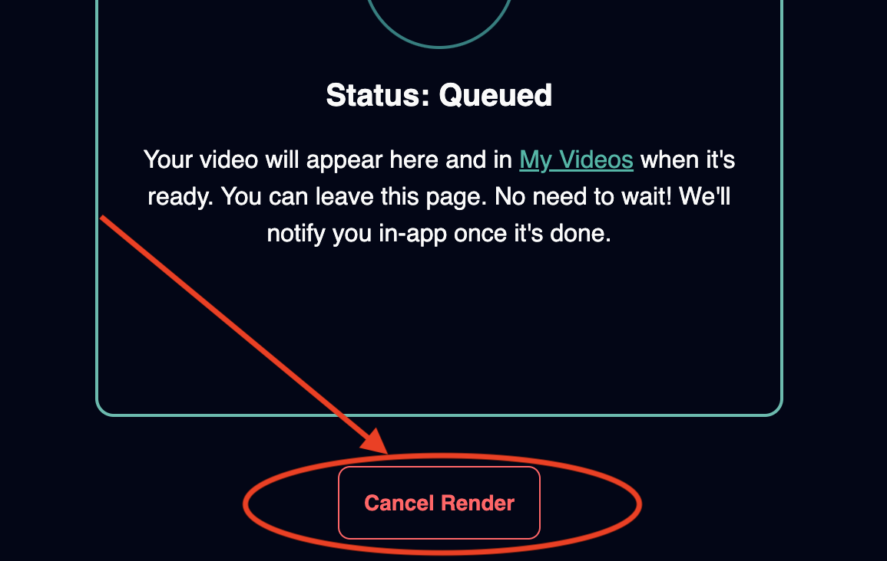
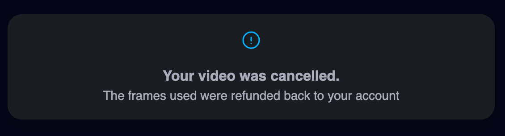

Following the [Quick Start Guide](/get-started/quick-start), you now can call any APIs to create an image or video.

## Quick start recap

1. Visit [Developer Hub](https://magichour.ai/developer) to create an API key.

<Warning>
  Do not expose your API key in client-side code. Keep it secure on your server to prevent
  unauthorized usage and potential abuse.
</Warning>

2. Install the SDK in your project

import SdkInstallation from "/snippets/code-groups/sdk-installation.mdx";

<SdkInstallation />

3. Using the methods built into the SDK to create a video or image.

## Input files

The easiest way to get started is passing a URL as the input.

When calling our APIs, you can simply pass the URL as the `video_file_path`, `image_file_path`, or `audio_file_path`.

```json
{
  "assets": {
    "video_file_file": "https://cdn.yourwebsite.com/video.mp4"
  }
}
```

<Card title="Input Files" icon="file" href="/integration/input-files">
  Get more details about managing input files, uploading files to Magic Hour storage, and more.
</Card>

## Render status

Videos and images can be one of the following statuses:

| Status      | Description                                |
| :---------- | :----------------------------------------- |
| `draft`     | Not currently used                         |
| `queued`    | The job is queued and waiting for a server |
| `rendering` | Rendering is in progress                   |
| `complete`  | Rendering completed                        |
| `error`     | An error occurred during rendering         |
| `canceled`  | Video render is canceled                   |

### Error details

When `status` is `error`, you can get details on why the failure happened. For example,

```json
{
    ...
    "error": {
        "code": "no_source_face",
        "message": "Please use an image with a detectable face"
    }
}
```

Occasionally, you may see `"code": "unknown_error"`. Please reach to our team support@magichour.ai so we can investigate.

## Checking rendering status

The render time depends on a variety of factors. For images, you should have your result within one minute.

For videos, render time is generally longer, depending on the length of the output video, but most of the time, you should have your result within a few minutes.

There are two ways to check whether generation completed:

- Webhook notification
- Polling the details API

### Webhook notification

This is the recommended way to receive status change events for modes with longer rendering times (e.g. video modes); however, it does require extra effort to setup.

At a high level, to implement webhook notification:

1. configure a webhook in [Developer Hub](https://magichour.ai/developer), and pick the events you want to be notified.
1. create an API in your application to listen to events with logic for each event you're listening too.
1. add additional logic in your application when status changes.

<Tip>Polling is a valid solution if you mainly render images or very short videos.</Tip>

For videos with long render time, setting up an API to listen for event will be more efficient than constantly calling the video details API.

<Card title="Webhook Overview" icon="webhook" href="/integration/webhook/overview">
  Learn how to implement webhook with Magic Hour
</Card>

### Polling the details API

To check the status of the render, you can call the following APIs

- [GET /v1/video-projects/:id](/api-reference/video-projects/get-video-details)
- [GET /v1/image-projects/:id](/api-reference/image-projects/get-image-details)

Then check the `status` field in set intervals.

<CodeGroup>

```python Python SDK
create_res = client.v1.image_to_video.create(...)
project_id = create_res.id
while True:
    res = client.v1.video_projects.get(id=project_id)
    if res.status == 'complete':
        print("render complete")
        break
    elif res.status == "error":
        print("render failed")
        break
    else:
        print("render in progress")
        time.sleep(3)
```

```typescript Node SDK
const createRes = await client.v1.imageToVideo.create({});
const projectId = createRes.id;
while (true) {
  const res = await client.v1.videoProjects.get({ id: projectId });
  if (res.status === "complete") {
    console.log("render complete");
    break;
  } else if (res.status === "error") {
    console.log("render failed");
  } else {
    console.log("render in progress");
    await new Promise((resolve) => setTimeout(resolve, 3000));
  }
}
```

```go Go SDK
createRes, _ := client.V1.ImageToVideo.Create(context.Background(), sdk.ImageToVideoCreateRequest{})
projectId := createRes.ID

for {
    res, _ := client.V1.VideoProjects.Get(context.Background(), sdk.VideoProjectsGetRequest{ID: projectId})
    if res.Status == "complete" {
        println("render complete")
        break
    } else if res.Status == "error" {
        println("render failed")
        break
    } else {
        println("render in progress")
        time.Sleep(3 * time.Second)
    }
}
```

```rust Rust SDK
let create_res = client.v1().image_to_video().create().await.unwrap();
let project_id = create_res.id;

loop {
    let res = client.v1().video_projects().get(project_id).await.unwrap();
    if res.status == "complete" {
        println!("render complete");
        break;
    } else if res.status == "error" {
        println!("render failed");
        break;
    } else {
        println!("render in progress");
        std::thread::sleep(std::time::Duration::from_secs(3));
    }
}
```

</CodeGroup>

## Downloading result

Once `status` is `complete`, the response for the image/video details will populate the `downloads` key. Note this is an array since some modes may have more than one output.

```diff
- "downloads": [],
+ "downloads": [
+     {
+         "url": "https://video.magichour.ai/id/output.mp4?auth-token=1234",
+         "expires_at": "2024-10-19T05:16:19.027Z"
+     }
+ ],
```

Then, use any http package to download the file. Below are some sample code:

<CodeGroup>

```python Python
import requests

with open("output.mp4", "wb") as file:
  response = requests.get("https://video.magichour.ai/id/output.mp4?auth-token=1234")
  file.write(response.content)
```

```typescript Node
import { writeFileSync } from "fs";

fetch("https://video.magichour.ai/id/output.mp4?auth-token=1234")
  .then((res) => res.arrayBuffer())
  .then((buffer) => writeFileSync("output.mp4", Buffer.from(buffer)));
```

```go Go
import (
	"io"
	"net/http"
	"os"
)

resp, _ := http.Get("https://video.magichour.ai/id/output.mp4?auth-token=1234")
defer resp.Body.Close()
file, _ := os.Create("output.mp4")
defer file.Close()
io.Copy(file, resp.Body)
```

```rust Rust
use std::fs::write;
use reqwest::blocking::get;

let content = get("https://video.magichour.ai/id/output.mp4?auth-token=1234").unwrap().bytes().unwrap();
write("output.mp4", content).unwrap();
```

</CodeGroup>

## Deleting generated files

Currently, the generated content are kept in our storage without expiration.

If you want to remove the generated files, you can call the following endpoints:

- [`DELETE /v1/video-projects/:id`](/api-reference/video-projects/delete-video)
- [`DELETE /v1/image-projects/:id`](/api-reference/image-projects/delete-image)

<Warning>This action is not reversible, please be sure before deleting.</Warning>

<CodeGroup>
```python Python SDK
client.v1.video_projects.delete(
  id="cuid",
)
```

```typescript Node SDK
await client.v1.videoProjects.delete({
  id: "cuid",
});
```

```go Go SDK
err := client.V1.VideoProjects.Delete(video_projects.DeleteRequest{
  Id: "cuid"
})
```

```rust Rust SDK
let res = client.v1().video_projects().delete(
  magic_hour::resources::v1::video_projects::DeleteRequest { id: "cuid".to_string() }
).await;
```

</CodeGroup>
## Reducing credit usage during integration

While building out the integration, you'd want to avoid actually rendering the video/image since you will be charged on any completed render. There are a few ways to reduce your usage.

### Using mock API server

<Info>
  The mock server only responds with sample data and does not actually create any records.
</Info>

To use the mock server, simply pass the `environment` parameter when initializing the client.

<CodeGroup>

```py Python SDK
from magic_hour import Client
from magic_hour.environment import Environment

client = Client(
    token="API_TOKEN", environment=Environment.MOCK_SERVER,
)
```

```ts Node SDK
import Client, { Environment } from "magic-hour";

const client = new Client({
  token: "API_TOKEN",
  environment: Environment.MockServer,
});
```

```go Go SDK
import sdk "github.com/magichourhq/magic-hour-go/client"

client := sdk.NewClient(
    sdk.WithBearerAuth("API_TOKEN"),
    sdk.WithEnv(sdk.MockServer),
)
```

```rust Rust SDK
use magic_hour;

let client = magic_hour::Client::default()
    .with_bearer_auth("API_TOKEN")
    .with_environment(magic_hour::Environment::MockServer);

```

</CodeGroup>

<Tip>

If you are not using SDKs, simply replace the URL to use the mock server.

```diff
- https://api.magichour.ai/v1/image-to-video
+ https://api.sideko.dev/v1/mock/magichour/magic-hour/latest/v1/image-to-video
```

</Tip>

### Canceling render in the web app

You have the option to cancel a video render with a full credit refund.

<Note>Image rendering cannot be cancelled</Note>

<Steps>
  <Step title='Visit Video Details Page'>
  You can access the video details page using the URL

> https://magichour.ai/dashboard/videos/:id

  </Step>

  <Step title="Click Cancel Render">
    
  </Step>
  <Step title="Confirm cancel">
    
  </Step>
  <Step title="Cancel successful">
    
  </Step>
</Steps>

<Note>Cancelling is not currently supported via API</Note>
