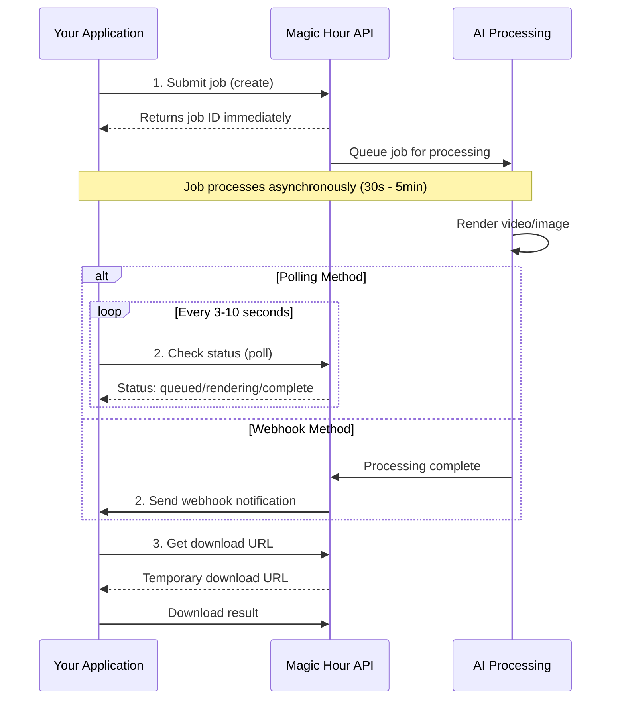

## What is the Magic Hour API?

Magic Hour API provides programmatic access to AI-powered video, image, and audio generation tools. Instead of using the web interface manually, you can build these capabilities directly into your applications, workflows, and products.

## Why Use the API?

The API enables you to:

- **Build AI features into your products** - Embed video and image generation in your applications
- **Automate content workflows** - Process large batches of media without manual intervention
- **Scale your operations** - Handle high-volume generation with enterprise-grade infrastructure
- **Integrate with existing systems** - Connect AI generation to your current tech stack
- **Create custom experiences** - Build unique user interfaces and workflows on top of our AI models

**Example use cases:**
- Social media apps that auto-generate content for users
- Marketing platforms with automated video creation
- E-commerce sites with AI product visualization
- Gaming platforms with dynamic avatar generation
- Education apps with custom learning materials

## API vs Web App

Understanding the relationship between the API and web application:

**🌐 Web App ([magichour.ai](https://magichour.ai)):**
- Full suite of 100+ AI tools and features
- User-friendly interface with templates and presets  
- New features launch here first
- Perfect for creators and individual use

**⚡ API (docs.magichour.ai):**
- Core popular tools available programmatically
- Built for developers and applications
- Same underlying AI models as web app
- Features added after web app validation

<Info>
**Shared Dashboard:** All API-generated content automatically appears in your [magichour.ai dashboard](https://magichour.ai/my-library), where you can view, manage, and share your creations.
</Info>

## How the API Works

Magic Hour APIs use an **asynchronous processing model**. Unlike typical REST APIs that return results immediately, AI generation takes time, so the workflow follows these steps:



### The Three Steps

**1. Submit (Create)**
- Send a request to create a video, image, or audio
- Receive a job ID immediately (no waiting)
- Job enters the processing queue

**2. Monitor (Poll or Webhook)**
- **Polling**: Periodically check job status using the job ID
- **Webhooks**: Receive automatic notifications when job completes
- Track progress through status updates

**3. Download**
- Retrieve the generated file using a secure download URL
- URLs are temporary (expire after 24 hours)
- Save the result to your storage

<Warning>
**Asynchronous Processing:** Jobs don't complete instantly. Always implement status monitoring (polling or webhooks) before attempting to download results.
</Warning>

## Create vs Generate

The SDKs provide two ways to interact with the API:

### `create()` - Full Control

The `create()` function gives you complete control over the workflow:

```python
# Step 1: Create job
result = client.v1.ai_image_generator.create(
    image_count=1,
    orientation="landscape",
    style={"prompt": "A sunset over mountains", "tool": "ai-anime-generator"},
    name="My image"
)
job_id = result.id

# Step 2: Poll for completion (you handle this)
while True:
    status = client.v1.image_projects.get(id=job_id)
    if status.status == "complete":
        break
    time.sleep(3)

# Step 3: Download (you handle this)
download_url = status.downloads[0].url
# ... download the file yourself
```

**Best for:**
- Fine-grained control over polling intervals
- Custom status monitoring logic
- Integration with existing job management systems
- Advanced error handling and retry logic

### `generate()` - Simplified Workflow

The `generate()` function handles everything automatically:

```python
# All three steps handled automatically
result = client.v1.ai_image_generator.generate(
    image_count=1,
    orientation="landscape",
    style={"prompt": "A sunset over mountains", "tool": "ai-anime-generator"},
    name="My image"
)
# Returns when complete with file automatically downloaded
```

**Best for:**
- Quick integrations and prototyping
- Simple use cases with single job processing
- Applications that can wait synchronously
- Minimal boilerplate code

<Note>
**SDK Requirement:** The `generate()` function requires Python SDK v0.36.0+ or Node SDK v0.26.0+.
</Note>

**When to use each:**
- **Use `create()`** for production apps with webhook integration, concurrent job processing, or custom monitoring needs
- **Use `generate()`** for scripts, simple integrations, or when you want minimal code

## Integration Approaches

### Approach 1: Synchronous (Simple)

Good for:
- Scripts and command-line tools
- Single job processing
- Testing and development

```python
# Using generate() - blocks until complete
result = client.v1.ai_image_generator.generate(
    image_count=1,
    orientation="landscape",
    style={"prompt": "Test image", "tool": "ai-anime-generator"}
)
print(f"Image ready: {result.downloads[0].url}")
```

**Pros:** Simple code, easy to understand  
**Cons:** Application blocks while waiting, not scalable

### Approach 2: Polling (Moderate)

Good for:
- Background job processing
- Applications that can handle wait times
- Simple queue-based systems

```python
# Using create() with polling
job = client.v1.ai_image_generator.create(
    image_count=1,
    orientation="landscape",
    style={"prompt": "Test image", "tool": "ai-anime-generator"}
)

# Check periodically in a background task
def check_status():
    status = client.v1.image_projects.get(id=job.id)
    if status.status == "complete":
        download_result(status.downloads[0].url)
```

**Pros:** More control, works without webhooks  
**Cons:** Requires periodic polling, uses resources while waiting

### Approach 3: Webhooks (Production)

Good for:
- Production applications
- High-volume processing
- Real-time user notifications
- Efficient resource usage

```python
# Create job
job = client.v1.ai_image_generator.create(
    image_count=1,
    orientation="landscape",
    style={"prompt": "Test image", "tool": "ai-anime-generator"}
)

# Your webhook endpoint receives notification when complete
# (See webhook integration guide for setup)
```

**Pros:** Real-time notifications, efficient, scalable  
**Cons:** Requires webhook endpoint setup

<Card title="Webhook Integration Guide" icon="webhook" href="/integration/webhook/overview">
  Complete guide to setting up webhooks for production use
</Card>

## Development Workflow

### Step 1: Start Simple

Begin with the `generate()` function to prototype:

```python
result = client.v1.ai_image_generator.generate(
    image_count=1,
    orientation="square",
    style={"prompt": "Test image", "tool": "ai-anime-generator"}
)
```

### Step 2: Add Error Handling

Handle failures gracefully:

```python
try:
    result = client.v1.ai_image_generator.generate(...)
    print("Success!")
except Exception as e:
    print(f"Error: {e}")
```

### Step 3: Move to Production

Switch to `create()` + webhooks for production:

```python
# Create job
job = client.v1.ai_image_generator.create(...)

# Webhook handles completion notification
# (no polling needed)
```

## Testing Without Credits

Use the mock server to develop and test without consuming credits:

<CodeGroup>

```python Python SDK
from magic_hour import Client
from magic_hour.environment import Environment

# Use mock server - no credits charged
client = Client(
    token="YOUR_API_KEY",
    environment=Environment.MOCK_SERVER
)

# Returns realistic sample data instantly
result = client.v1.ai_image_generator.create(...)
```

```typescript Node SDK
import Client, { Environment } from "magic-hour";

// Use mock server - no credits charged
const client = new Client({
  token: "YOUR_API_KEY",
  environment: Environment.MockServer,
});

// Returns realistic sample data instantly
const result = await client.v1.aiImageGenerator.create({...});
```

</CodeGroup>

<Info>
**Mock Server:** Returns realistic sample data without processing jobs or charging credits. Perfect for development and testing.
</Info>

## Processing Times

Typical processing times based on actual usage data (median times):

| Content Type | Median Processing Time | Recommended Polling Interval | Example Tools |
|:-------------|:----------------------|:-----------------------------|:--------------|
| Fast Image | 2-15 seconds | Every 2-3 seconds | Face Editor, Photo Colorizer, Face Swap Photo, AI Image Generator, Background Remover, Clothes Changer, AI Meme, QR Code, AI Headshot |
| Medium Image | 15-30 seconds | Every 3-5 seconds | Photo Editor, AI Image Editor, AI Selfie, Image Upscaler, AI GIF |
| Simple Video | 30 seconds - 2 minutes | Every 5 seconds | Text to Video (v1), Image to Video (v1), Auto Subtitle Generator |
| Standard Video | 2-4 minutes | Every 5-10 seconds | Face Swap Video (v2), Lip Sync, Talking Photo (v3), Image to Video, Animation, Text to Video (v2) |
| Complex Video | 8-11 minutes | Every 10-15 seconds | Video to Video (v2, v3), Talking Photo (v2) |
| Long Video | 60+ minutes | Every 30 seconds | Video to Video (v1) — very long videos |
| Audio | 3-12 seconds | Every 2-3 seconds | Voice Changer (3s), Voice Generator (10s), Voice Cloner (12s) |

<Note>
**Processing times are median values** and can vary based on:
- Video/image length and resolution
- Current server load
- Complexity of the requested operation
- Input file size and format

Always implement timeout handling and appropriate polling intervals based on your specific use case.
</Note>

## Next Steps

Choose your path based on your needs:

<CardGroup cols={2}>
  <Card title="Quick Start" icon="rocket" href="/get-started/quick-start">
    Make your first API call in 3 minutes
  </Card>
  <Card title="Complete Integration Guide" icon="code" href="/integration/adding-api-to-your-app">
    Production-ready integration patterns
  </Card>
  <Card title="Webhook Setup" icon="webhook" href="/integration/webhook/overview">
    Real-time notifications for production apps
  </Card>
  <Card title="API Reference" icon="book" href="/api-reference">
    Complete endpoint documentation
  </Card>
</CardGroup>

---

**Questions?** Join our [Discord community](https://discord.com/invite/JX5rgsZaJp) or email [support@magichour.ai](mailto:support@magichour.ai)

