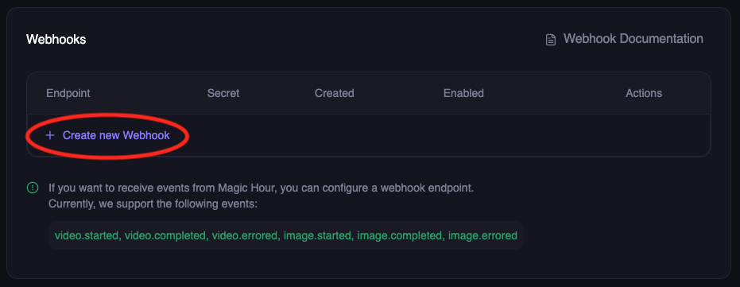

By the end of this guide, you'll have:
- ✅ Created a webhook endpoint in your application
- ✅ Registered it with Magic Hour
- ✅ Tested it with a real API call
- ✅ Verified webhook delivery works

## What Are Webhooks?

Webhooks let you receive real-time notifications when your API requests complete, eliminating the need for polling. Instead of repeatedly checking job status, Magic Hour automatically notifies your application when jobs finish.


**Benefits:**
- ✅ Real-time notifications (no polling delays)
- ✅ Efficient resource usage (no constant polling)
- ✅ Better user experience (instant updates)
- ✅ Scalable for high-volume operations

## Step 1: Create Your Webhook Endpoint

First, create a simple webhook handler that can receive and process events.

<Note>
**Using Jupyter/Colab?** See the "Colab/Jupyter" tab below for notebook-compatible code, or use [webhook.site](https://webhook.site) for instant testing without any code.
</Note>

<CodeGroup>

```python Python (FastAPI)
from fastapi import FastAPI, Request
import json

app = FastAPI()

@app.post("/webhook")
async def webhook_handler(request: Request):
    # Get the event data
    event = await request.json()
    
    # Log the event for testing
    print(f"Received event: {event['type']}")
    print(f"Payload: {json.dumps(event['payload'], indent=2)}")
    
    # Handle different event types
    match event['type']:
        case 'video.started':
            print('🎬 Video processing started')
        case 'video.completed':
            print('✅ Video processing completed')
            # Download URL available in event['payload']['downloads']
        case 'video.errored':
            print('❌ Video processing failed')
        case 'image.completed':
            print('🖼️ Image processing completed')
        case 'image.errored':
            print('❌ Image processing failed')
    
    # Always return success
    return {"success": True}

if __name__ == "__main__":
    import uvicorn
    uvicorn.run(app, host="0.0.0.0", port=8000)
```

```javascript Node.js (Express)
const express = require("express");
const app = express();

app.use(express.json());

app.post("/webhook", (req, res) => {
  const { type, payload } = req.body;
  
  // Log the event for testing
  console.log(`Received event: ${type}`);
  console.log(`Payload:`, JSON.stringify(payload, null, 2));
  
  // Handle different event types
  switch (type) {
    case "video.started":
      console.log("🎬 Video processing started");
      break;
    case "video.completed":
      console.log("✅ Video processing completed");
      // Download URL available in payload.downloads
      break;
    case "video.errored":
      console.log("❌ Video processing failed");
      break;
    case "image.completed":
      console.log("🖼️ Image processing completed");
      break;
    case "image.errored":
      console.log("❌ Image processing failed");
      break;
  }
  
  // Always return success
  res.status(200).json({ success: true });
});

const port = 8000;
app.listen(port, () => {
  console.log(`🚀 Webhook server running on http://localhost:${port}`);
});
```

```python Colab/Jupyter
# Notebook-friendly webhook server
from fastapi import FastAPI, Request
import json
import nest_asyncio
import threading
import uvicorn
import time

# Install required packages first:
# !pip install fastapi uvicorn nest-asyncio pyngrok

# Allow nested event loops (required for notebooks)
nest_asyncio.apply()

app = FastAPI()

@app.post("/webhook")
async def webhook_handler(request: Request):
    # Get the event data
    event = await request.json()
    
    # Log the event for testing
    print(f"Received event: {event['type']}")
    print(f"Payload: {json.dumps(event['payload'], indent=2)}")
    
    # Handle different event types
    match event['type']:
        case 'video.completed':
            print('✅ Video processing completed')
        case 'image.completed':
            print('🖼️ Image processing completed')
        case _:
            print(f'Event: {event["type"]}')
    
    return {"success": True}

# Notebook-friendly server startup
def run_server():
    uvicorn.run(app, host="0.0.0.0", port=8000, log_level="info")

# Start server in background thread
server_thread = threading.Thread(target=run_server, daemon=True)
server_thread.start()

# Wait for server to start
time.sleep(2)
print("🚀 Webhook server running on http://localhost:8000")

# For Colab: Use ngrok to make it public
try:
    from pyngrok import ngrok
    public_url = ngrok.connect(8000)
    print(f"📡 Public URL: {public_url}")
    print(f"Use this URL in Magic Hour: {public_url}/webhook")
except ImportError:
    print("💡 Install pyngrok for public URL: !pip install pyngrok")
    print("Or use webhook.site for easier testing")
```

</CodeGroup>

## Step 2: Make Your Endpoint Publicly Accessible

Your webhook endpoint needs to be accessible from the internet. Choose one of these options:

<Tabs>
<Tab title="ngrok (Recommended)">

**Perfect for local development and testing**

**Install ngrok:**
```bash
# macOS
brew install ngrok

# Windows/Linux - download from https://ngrok.com/download
```

**Start your server:**
<CodeGroup>
```bash Python
python webhook_server.py
# or
uvicorn main:app --host 0.0.0.0 --port 8000
```

```bash Node.js
node webhook_server.js
```
</CodeGroup>

**Expose it publicly:**
```bash
ngrok http 8000
```

**Copy the HTTPS URL** (e.g., `https://abc123.ngrok.io`)

</Tab>

<Tab title="webhook.site (Quick Testing)">

**Perfect for Colab/Jupyter users and quick testing!** No server setup required.

1. Go to [webhook.site](https://webhook.site)
2. Copy the unique URL provided (e.g., `https://webhook.site/abc-123-def`)
3. Use this URL directly in Magic Hour webhook setup
4. View received webhooks in real-time in your browser
5. Perfect for testing and debugging webhook payloads

**Pros**: Instant setup, no code needed, great for testing  
**Cons**: Public URL, not suitable for production

</Tab>

<Tab title="Production Server">

**For production deployments:**

Deploy your webhook handler to:
- **Cloud platforms**: AWS Lambda, Google Cloud Functions, Azure Functions
- **Server hosting**: DigitalOcean, Heroku, Railway
- **Container services**: Docker, Kubernetes

Ensure your production server:
- Has a valid SSL certificate (HTTPS required)
- Can handle incoming POST requests
- Returns responses within 10 seconds
- Has proper error handling and logging

</Tab>
</Tabs>

## Step 3: Register Your Webhook with Magic Hour

<Steps>
<Step title="Visit Developer Hub">
Go to Magic Hour [Developer Hub](https://magichour.ai/developer?tab=webhooks), and click **Create Webhook**


</Step>

<Step title="Configure webhook">
Enter your webhook details:

- **Endpoint URL**: Your public HTTPS URL (e.g., `https://abc123.ngrok.io/webhook`)
- **Events**: Select the events you want to receive:
  - `video.started` - When video processing begins
  - `video.completed` - When video is ready for download  
  - `video.errored` - When video processing fails
  - `image.completed` - When image is ready for download
  - `image.errored` - When image processing fails
  - `audio.completed` - When audio is ready for download
  - `audio.errored` - When audio processing fails


Click **Create Webhook**
</Step>

<Step title="Save webhook secret">
**Important**: Copy and save the webhook secret - you'll need this for security verification later.


<Warning>
Store this secret securely! It's used to verify that webhooks are actually from Magic Hour.
</Warning>
</Step>
</Steps>

## Step 4: Test Your Webhook End-to-End

Now let's verify everything works by making a real API call and watching for the webhook.

<Steps>
<Step title="Start monitoring your webhook">
**If using your own server**: Watch the console logs
```bash
# Your server should show:
🚀 Webhook server running on http://localhost:8000
```

**If using Colab/Jupyter**: Watch the cell output for webhook events

**If using webhook.site**: Keep the browser tab open to see incoming requests in real-time
</Step>

<Step title="Make a test API call">
Create a simple image to trigger webhook events:

<CodeGroup>

```python Python/Colab
import magic_hour

client = magic_hour.Client(api_key="your-api-key")

# Create a simple AI image - this will trigger webhooks
result = client.v1.ai_image_generator.generate(
    image_count=1,
    orientation="square",
    style={"prompt": "A cute cat wearing sunglasses", "tool": "ai-anime-generator"}
)

print(f"Job created! ID: {result.id}")
print("Watch your webhook endpoint for events...")

# In Colab, you'll see the webhook events appear in the cell output above
```

```bash cURL
curl -X POST "https://api.magichour.ai/v1/ai-image-generator" \
  -H "Authorization: Bearer your-api-key" \
  -H "Content-Type: application/json" \
  -d '{
    "image_count": 1,
    "orientation": "square",
    "style": {
      "prompt": "A cute cat wearing sunglasses",
      "tool": "ai-anime-generator"
    }
  }'
```

```python webhook.site Testing
# If using webhook.site, you don't need a server
# Just make the API call and watch the webhook.site browser tab

import magic_hour

client = magic_hour.Client(api_key="your-api-key")

result = client.v1.ai_image_generator.generate(
    image_count=1,
    orientation="square",
    style={"prompt": "A cute cat wearing sunglasses", "tool": "ai-anime-generator"}
)

print(f"Job created! ID: {result.id}")
print("Check your webhook.site browser tab for the webhook delivery!")
```

</CodeGroup>
</Step>

<Step title="Verify webhook delivery">
Within seconds, you should see webhook events in your console or webhook.site:

```json
{
  "type": "image.completed",
  "payload": {
    "id": "clx7uu86w0a5qp55yxz315r6r",
    "status": "complete",
    "downloads": [
      {
        "url": "https://images.magichour.ai/id/output.png",
        "expires_at": "2024-10-19T05:16:19.027Z"
      }
    ]
  }
}
```

**Success!** 🎉 Your webhook is working end-to-end.
</Step>
</Steps>

## Understanding Webhook Retries

If your endpoint doesn't respond with a 2xx status code, Magic Hour will retry delivery:

- **Duration**: Up to 24 hours
- **Pattern**: Exponential backoff (1s, 2s, 4s, 8s, ...)
- **After 24 hours**: Event marked as failed, no more retries

<Info>
**Disabled Webhooks**: If a webhook is disabled, pending events are skipped and marked as failed after 24 hours.
</Info>

### Best Practices for Reliable Webhooks

✅ **Do:**
- Return 2xx status codes within 10 seconds
- Process events asynchronously (respond fast, process later)
- Implement idempotent processing (handle duplicate events)
- Log all webhook events for debugging

❌ **Don't:**
- Perform long-running operations before responding
- Return non-2xx codes for successful receipt
- Assume events are delivered exactly once
- Block the response while processing

## Production Webhook Handler

For production, implement robust error handling and background processing:

<CodeGroup>

```python Python (Production)
from fastapi import FastAPI, Request, BackgroundTasks
import logging

app = FastAPI()
logger = logging.getLogger(__name__)

@app.post("/webhook")
async def webhook_handler(request: Request, background_tasks: BackgroundTasks):
    try:
        event = await request.json()
        
        # Log the event
        logger.info(f"Received webhook: {event['type']}", extra={
            'job_id': event['payload'].get('id'),
            'status': event['payload'].get('status')
        })
        
        # Respond immediately
        background_tasks.add_task(process_webhook_event, event)
        return {"success": True}
        
    except Exception as e:
        logger.error(f"Webhook error: {e}")
        return {"error": "Internal error"}, 500

async def process_webhook_event(event):
    """Process webhook in background"""
    try:
        event_type = event['type']
        payload = event['payload']
        
        if event_type == 'video.completed':
            # Update database
            await update_job_status(payload['id'], 'completed')
            # Notify user
            await notify_user_completion(payload)
            
        elif event_type == 'video.errored':
            # Handle error
            await update_job_status(payload['id'], 'failed')
            await notify_user_error(payload)
            
    except Exception as e:
        logger.error(f"Background processing failed: {e}")
```

```javascript Node.js (Production)
const express = require("express");
const { createLogger, format, transports } = require("winston");

const app = express();
const logger = createLogger({
  level: 'info',
  format: format.json(),
  transports: [
    new transports.File({ filename: 'webhook.log' }),
    new transports.Console()
  ]
});

app.use(express.json());

app.post("/webhook", async (req, res) => {
  try {
    const { type, payload } = req.body;
    
    // Log the event
    logger.info("Received webhook", {
      eventType: type,
      jobId: payload.id,
      status: payload.status
    });
    
    // Respond immediately
    res.status(200).json({ success: true });
    
    // Process asynchronously
    processWebhookEvent(type, payload);
    
  } catch (error) {
    logger.error("Webhook error", { error: error.message });
    res.status(500).json({ error: "Internal error" });
  }
});

async function processWebhookEvent(type, payload) {
  try {
    if (type === "video.completed") {
      // Update database
      await updateJobStatus(payload.id, 'completed');
      // Notify user
      await notifyUserCompletion(payload);
      
    } else if (type === "video.errored") {
      // Handle error
      await updateJobStatus(payload.id, 'failed');
      await notifyUserError(payload);
    }
    
  } catch (error) {
    logger.error("Background processing failed", { error: error.message });
  }
}

const port = process.env.PORT || 8000;
app.listen(port, () => {
  logger.info(`Webhook server running on port ${port}`);
});
```

</CodeGroup>

## Testing Locally

Before registering with Magic Hour, test your handler locally:

```bash
# Start your server
python webhook_server.py  # or node webhook_server.js

# In another terminal, send a test event
curl -X POST http://localhost:8000/webhook \
  -H "Content-Type: application/json" \
  -d '{
    "type": "video.completed",
    "payload": {
      "id": "test-job-123",
      "status": "complete",
      "downloads": [
        {
          "url": "https://videos.magichour.ai/test/output.mp4",
          "expires_at": "2024-12-01T12:00:00Z"
        }
      ]
    }
  }'
```

You should see the event logged in your server console.

## Webhook Handler Requirements

Your webhook endpoint must:

### 1. Accept POST Requests
```python
@app.post("/webhook")  # Must be POST
async def webhook_handler(request: Request):
    ...
```

### 2. Parse JSON Payload
```python
event = await request.json()
# event = { "type": "...", "payload": {...} }
```

### 3. Return 2xx Status Code
```python
return {"success": True}  # Returns 200
# Magic Hour interprets this as successful delivery
```

### 4. Respond Within 10 Seconds
```python
# ✅ Good: Respond fast, process later
background_tasks.add_task(process_event, event)
return {"success": True}

# ❌ Bad: Long processing blocks response
process_event_synchronously(event)  # This might timeout!
return {"success": True}
```

## Troubleshooting

**Webhook not receiving events?**
- ✅ Check your endpoint URL is publicly accessible
- ✅ Ensure your server returns HTTP 2xx status codes
- ✅ Verify the webhook is enabled in Developer Hub
- ✅ Check server logs for errors
- ✅ Test with ngrok or webhook.site first

**Colab/Jupyter specific issues:**
- ✅ Install required packages: `!pip install fastapi uvicorn nest-asyncio pyngrok`
- ✅ Make sure the server thread started successfully
- ✅ Check if ngrok tunnel is active and accessible
- ✅ Try webhook.site as an alternative for quick testing

**AsyncIO errors in notebooks?**
- ✅ Use the Colab/Jupyter code version with `nest_asyncio.apply()`
- ✅ Don't run `uvicorn.run()` directly in notebooks - use the threading approach

## Next Steps

Now that your webhook is working:

<CardGroup cols={2}>
  <Card title="Secure Your Webhook" icon="shield" href="/integration/webhook/secure-handler">
    Add signature verification to ensure webhooks are from Magic Hour
  </Card>
  <Card title="Event Types Reference" icon="book" href="/integration/webhook/event-types">
    Learn about all available webhook events and their payloads
  </Card>
  <Card title="Webhook API Reference" icon="webhook" href="/webhook-reference">
    Complete webhook API documentation
  </Card>
  <Card title="First Integration" icon="rocket" href="/integration/first-integration">
    Build a complete integration from scratch
  </Card>
</CardGroup>

---

**Need help?** Join our [Discord community](https://discord.com/invite/JX5rgsZaJp) or email [support@magichour.ai](mailto:support@magichour.ai)

