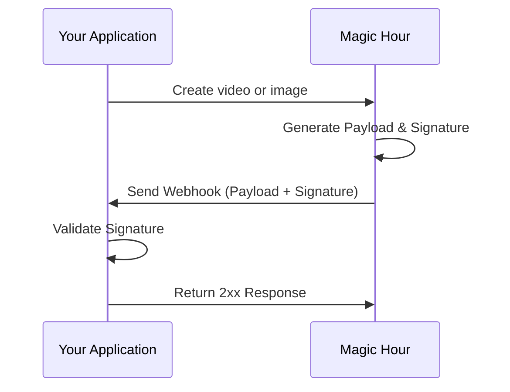
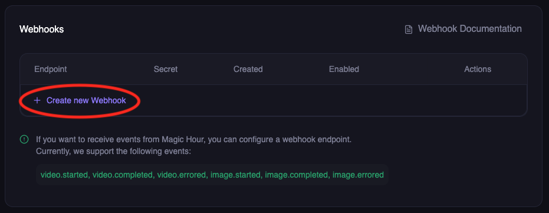
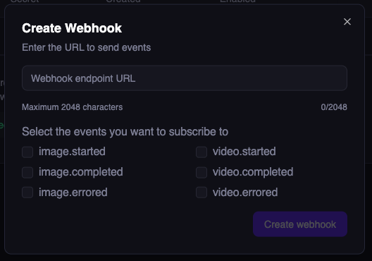
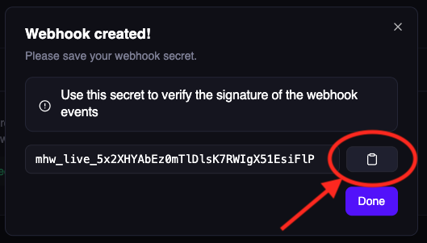

## High level diagram

The diagram shows a high level diagram of how webhook works.

## Setup webhook

<Steps>
<Step title="Visit Developer Hub">
Go to Magic Hour [Developer Hub](https://magichour.ai/developer?tab=webhooks), and click `Create Webhook`

</Step>
<Step title="Configure webhook">
  
On the modal, input

- Your API endpoint to receive events
- Select the events you're interested in receiving.

Then click `Create Webhook`

</Step>
<Step title="Save webhook secret">

Copy and save the webhook secret.

<Note>This secret can be retrieved later.</Note>

</Step>

</Steps>

## Next step

<CardGroup cols={2}>

<Card title="Create Your Webhook Handler" icon="webhook" href="/integration/webhook/create-handler">
  Now, we need to create a handler in your application to process the webhook events.
</Card>

<Card title="Webhook Reference" icon="book" href="/webhook-reference">
  Explore all available webhook events with sample events.
</Card>

</CardGroup>
