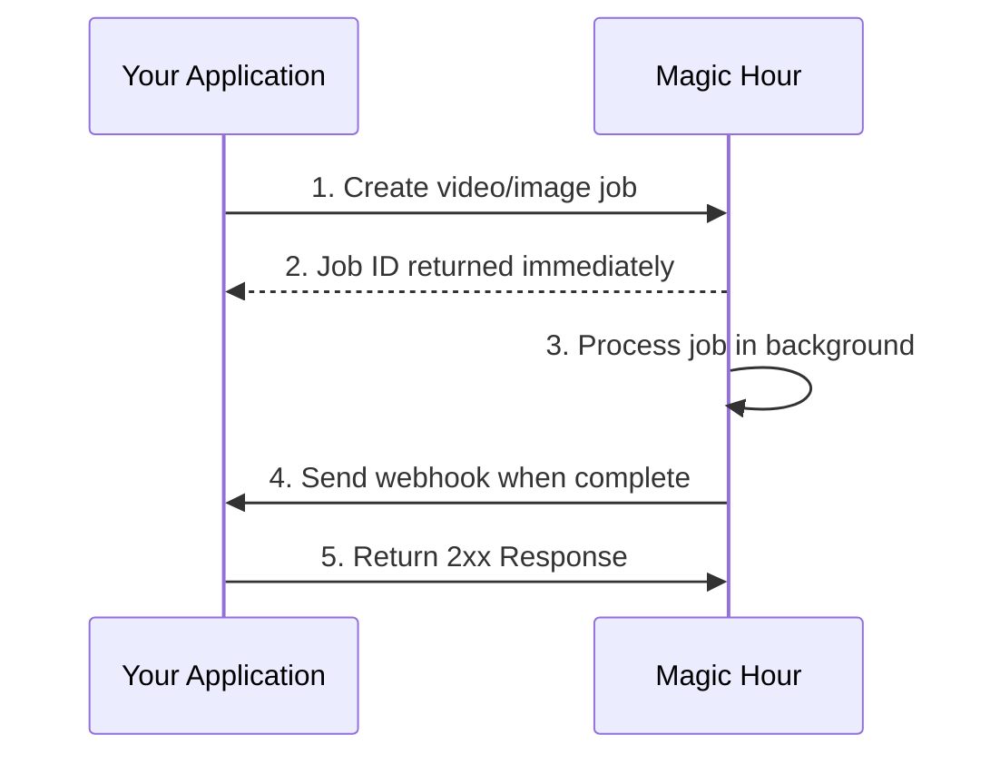

By the end of this guide, you'll have:

- ✅ Created a webhook endpoint in your application
- ✅ Registered it with Magic Hour
- ✅ Tested it with a real API call
- ✅ Verified webhook delivery works

## How Webhooks Work

Webhooks let you receive real-time notifications when your API requests complete, instead of polling for status updates.



## Step 1: Create Your Webhook Endpoint

First, let's create a simple webhook handler that can receive and process events.

<Note>

**Using Jupyter/Colab?** The server examples below are for standalone deployment. For notebook
testing:

1. Use [webhook.site](https://webhook.site) for instant webhook testing (no code needed). See the "webhook.site" tab in Step 2

2. Or use the notebook-friendly code in the "Colab/Jupyter"
   tab below

</Note>

<CodeGroup>

```python Python (FastAPI)
from fastapi import FastAPI, Request
import json

app = FastAPI()

@app.post("/webhook")
async def webhook_handler(request: Request):
    # Get the event data
    event = await request.json()

    # Log the event for testing
    print(f"Received event: {event['type']}")
    print(f"Payload: {json.dumps(event['payload'], indent=2)}")

    # Handle different event types
    match event['type']:
        case 'video.started':
            print('🎬 Video processing started')
        case 'video.completed':
            print('✅ Video processing completed')
            # Download URL available in event['payload']['downloads']
        case 'video.errored':
            print('❌ Video processing failed')
        case 'image.completed':
            print('🖼️ Image processing completed')
        case 'image.errored':
            print('❌ Image processing failed')

    # Always return success
    return {"success": True}

if __name__ == "__main__":
    import uvicorn
    uvicorn.run(app, host="0.0.0.0", port=8000)
```

```typescript Node.js (Express)
const express = require("express");
const app = express();

app.use(express.json());

app.post("/webhook", (req, res) => {
  const { type, payload } = req.body;

  // Log the event for testing
  console.log(`Received event: ${type}`);
  console.log(`Payload:`, JSON.stringify(payload, null, 2));

  // Handle different event types
  switch (type) {
    case "video.started":
      console.log("🎬 Video processing started");
      break;
    case "video.completed":
      console.log("✅ Video processing completed");
      // Download URL available in payload.downloads
      break;
    case "video.errored":
      console.log("❌ Video processing failed");
      break;
    case "image.completed":
      console.log("🖼️ Image processing completed");
      break;
    case "image.errored":
      console.log("❌ Image processing failed");
      break;
  }

  // Always return success
  res.status(200).json({ success: true });
});

const port = 8000;
app.listen(port, () => {
  console.log(`🚀 Webhook server running on http://localhost:${port}`);
});
```

```python Colab/Jupyter
# Notebook-friendly webhook server
from fastapi import FastAPI, Request
import json
import nest_asyncio
import threading
import uvicorn
import time

# Install required packages first:
# !pip install fastapi uvicorn nest-asyncio pyngrok

# Allow nested event loops (required for notebooks)
nest_asyncio.apply()

app = FastAPI()

@app.post("/webhook")
async def webhook_handler(request: Request):
    # Get the event data
    event = await request.json()

    # Log the event for testing
    print(f"Received event: {event['type']}")
    print(f"Payload: {json.dumps(event['payload'], indent=2)}")

    # Handle different event types
    match event['type']:
        case 'video.started':
            print('🎬 Video processing started')
        case 'video.completed':
            print('✅ Video processing completed')
        case 'video.errored':
            print('❌ Video processing failed')
        case 'image.completed':
            print('🖼️ Image processing completed')
        case 'image.errored':
            print('❌ Image processing failed')

    return {"success": True}

# Notebook-friendly server startup
def run_server():
    uvicorn.run(app, host="0.0.0.0", port=8000, log_level="info")

# Start server in background thread
server_thread = threading.Thread(target=run_server, daemon=True)
server_thread.start()

# Wait for server to start
time.sleep(2)
print("🚀 Webhook server running on http://localhost:8000")

# For Colab: Use ngrok to make it public
try:
    from pyngrok import ngrok
    public_url = ngrok.connect(8000)
    print(f"📡 Public URL: {public_url}")
    print(f"Use this URL in Magic Hour: {public_url}/webhook")
except ImportError:
    print("💡 Install pyngrok for public URL: !pip install pyngrok")
    print("Or use webhook.site for easier testing")
```

</CodeGroup>

## Step 2: Make Your Endpoint Publicly Accessible

Your webhook endpoint needs to be accessible from the internet. For testing, use one of these options:

<Tabs>
<Tab title="ngrok (Recommended)">

**Install ngrok:**

```bash
# macOS
brew install ngrok

# Windows/Linux - download from https://ngrok.com/download
```

**Start your server:**

<CodeGroup>
```bash Python
python webhook_server.py
# or
uvicorn main:app --host 0.0.0.0 --port 8000
```

```bash Node.js
node webhook_server.js
```

</CodeGroup>

**Expose it publicly:**

```bash
ngrok http 8000
```

**Copy the HTTPS URL** (e.g., `https://abc123.ngrok.io`)

</Tab>
<Tab title="webhook.site (Quick Testing)">

**Perfect for Colab/Jupyter users!** No server setup required.

1. Go to [webhook.site](https://webhook.site)
2. Copy the unique URL provided (e.g., `https://webhook.site/abc-123-def`)
3. Use this URL directly in Magic Hour webhook setup
4. View received webhooks in real-time in your browser
5. Perfect for testing and debugging webhook payloads

**Pros**: Instant setup, no code needed, great for testing  
**Cons**: Public URL, not suitable for production

</Tab>
<Tab title="Colab/Jupyter Setup">

**For notebook environments with the code above:**

1. **Install dependencies:**

```python
!pip install fastapi uvicorn nest-asyncio pyngrok
```

2. **Run the notebook-friendly code** from Step 1

3. **Get your public URL:**
   - The code will automatically create an ngrok tunnel
   - Copy the public URL shown (e.g., `https://abc123.ngrok.io/webhook`)

4. **Use the URL** in Magic Hour webhook setup

**Note**: Free ngrok URLs change each time you restart. For persistent URLs, sign up for a free ngrok account.

</Tab>
</Tabs>

## Step 3: Register Your Webhook

<Steps>
<Step title="Visit Developer Hub">
Go to Magic Hour [Developer Hub](https://magichour.ai/developer?tab=webhooks), and click **Create Webhook**


</Step>

<Step title="Configure webhook">
Enter your webhook details:

- **Endpoint URL**: Your public HTTPS URL (e.g., `https://abc123.ngrok.io/webhook`)
- **Events**: Select the events you want to receive:
  - `video.started` - When video processing begins
  - `video.completed` - When video is ready for download
  - `video.errored` - When video processing fails
  - `image.started` - When image processing begins
  - `image.completed` - When image is ready for download
  - `image.errored` - When image processing fails
  - `audio.started` - When audio processing begins
  - `audio.completed` - When audio is ready for download
  - `audio.errored` - When audio processing fails


Click **Create Webhook**

</Step>

<Step title="Save webhook secret">
**Important**: Copy and save the webhook secret - you'll need this for security verification.


<Warning>
Store this secret securely! It's used to verify that webhooks are actually from Magic Hour.
</Warning>
</Step>
</Steps>

## Step 4: Test Your Webhook End-to-End

Now let's verify everything works by making a real API call and watching for the webhook.

<Steps>
<Step title="Start monitoring your webhook">
**If using your own server**: Watch the console logs
```bash
# Your server should show:
🚀 Webhook server running on http://localhost:8000
```

**If using Colab/Jupyter**: Watch the cell output for webhook events

**If using webhook.site**: Keep the browser tab open to see incoming requests in real-time

</Step>

<Step title="Make a test API call">
Create a simple image to trigger webhook events:

<CodeGroup>

```python Python/Colab
import magic_hour

client = magic_hour.Client(api_key="your-api-key")

# Create a simple AI image - this will trigger webhooks
result = client.v1.ai_image_generator.generate(
    prompt="A cute cat wearing sunglasses",
    width=512,
    height=512
)

print(f"Job created! ID: {result.id}")
print("Watch your webhook endpoint for events...")

# In Colab, you'll see the webhook events appear in the cell output above
```

```bash cURL
curl -X POST "https://api.magichour.ai/v1/ai-image-generator" \
  -H "Authorization: Bearer your-api-key" \
  -H "Content-Type: application/json" \
  -d '{
    "prompt": "A cute cat wearing sunglasses",
    "width": 512,
    "height": 512
  }'
```

```python webhook.site Testing
# If using webhook.site, you don't need a server
# Just make the API call and watch the webhook.site browser tab

import magic_hour

client = magic_hour.Client(api_key="your-api-key")

result = client.v1.ai_image_generator.generate(
    prompt="A cute cat wearing sunglasses",
    width=512,
    height=512
)

print(f"Job created! ID: {result.id}")
print("Check your webhook.site browser tab for the webhook delivery!")
```

</CodeGroup>
</Step>

<Step title="Verify webhook delivery">
Within seconds, you should see webhook events in your console:

```
Received event: image.completed
🖼️ Image processing completed
Payload: {
  "id": "clx7uu86w0a5qp55yxz315r6r",
  "status": "complete",
  "downloads": [
    {
      "url": "https://images.magichour.ai/id/output.png",
      "expires_at": "2024-10-19T05:16:19.027Z"
    }
  ]
}
```

**Success!** 🎉 Your webhook is working end-to-end.

</Step>
</Steps>

## Step 5: Download Your Result

Your webhook received the download URL. Let's grab the generated image:

<CodeGroup>

```python Python
import requests

# Extract download URL from webhook payload
download_url = "https://images.magichour.ai/id/output.png"

# Download the image
response = requests.get(download_url)
with open("generated_image.png", "wb") as f:
    f.write(response.content)

print("✅ Image downloaded as generated_image.png")
```

```bash cURL
# Use the URL from your webhook payload
curl -o generated_image.png "https://images.magichour.ai/id/output.png"
echo "✅ Image downloaded as generated_image.png"
```

</CodeGroup>

## 🎉 Congratulations!

You've successfully:

- ✅ Created a webhook endpoint
- ✅ Registered it with Magic Hour
- ✅ Tested it with a real API call
- ✅ Received webhook notifications
- ✅ Downloaded the generated content

## Next Steps

<CardGroup cols={2}>

<Card title="Secure Your Webhook" icon="shield" href="/integration/webhook/secure-handler">
  Add signature verification to ensure webhooks are from Magic Hour
</Card>

<Card title="Event Types Reference" icon="book" href="/integration/webhook/event-types">
  See all available webhook events and their payloads
</Card>

<Card title="Production Deployment" icon="server" href="/integration/webhook/create-handler">
  Deploy your webhook handler to production
</Card>

<Card title="Webhook Reference" icon="webhook" href="/webhook-reference">
  Explore the complete webhook API reference
</Card>

</CardGroup>

## Troubleshooting

**Webhook not receiving events?**

- ✅ Check your endpoint URL is publicly accessible
- ✅ Ensure your server returns HTTP 2xx status codes
- ✅ Verify the webhook is enabled in Developer Hub
- ✅ Check server logs for errors

**Colab/Jupyter specific issues:**

- ✅ Install required packages: `!pip install fastapi uvicorn nest-asyncio pyngrok`
- ✅ Make sure the server thread started successfully
- ✅ Check if ngrok tunnel is active and accessible
- ✅ Try webhook.site as an alternative for quick testing

**AsyncIO errors in notebooks?**

- ✅ Make sure you're using the Colab/Jupyter code version with `nest_asyncio.apply()`
- ✅ Don't run `uvicorn.run()` directly in notebooks - use the threading approach shown above

**Need help?** Contact support at [support@magichour.ai](mailto:support@magichour.ai)
