## Why Webhook Security Matters

Without signature verification, anyone who discovers your webhook URL could send fake events to your application. This could lead to:

- ❌ **Fake completion events** triggering incorrect business logic
- ❌ **Malicious payloads** attempting to exploit your system
- ❌ **Spam requests** overwhelming your servers
- ❌ **Data corruption** from processing invalid events

**✅ Solution**: Verify that webhooks are actually from Magic Hour using cryptographic signatures.

<Warning>
  **Production Requirement**: Always verify webhook signatures in production environments. This is
  critical for security.
</Warning>

## How Signature Verification Works

Magic Hour signs every webhook with your secret key using HMAC-SHA256:

```mermaid
sequenceDiagram
    participant MH as Magic Hour
    participant App as Your App

    MH->>MH: 1. Create event payload
    MH->>MH: 2. Generate timestamp
    MH->>MH: 3. Create signed_payload = timestamp + "." + payload
    MH->>MH: 4. Compute HMAC-SHA256(secret, signed_payload)
    MH->>App: 5. Send webhook with signature & timestamp headers
    App->>App: 6. Recreate signed_payload
    App->>App: 7. Compute HMAC-SHA256(secret, signed_payload)
    App->>App: 8. Compare signatures → Accept/Reject
```



## Signature Headers

Every webhook includes two security headers:

### `magic-hour-event-signature`

The HMAC-SHA256 signature of the payload using your webhook secret:

```http
magic-hour-event-signature: d1747eb9491aadeac6173f1c9fd5f4aff87c8981ac53d87b0830199221ff50af
```

### `magic-hour-event-timestamp`

Unix timestamp (seconds since epoch) when the webhook was sent:

```http
magic-hour-event-timestamp: 1729314984
```

<Info>
  **Header Case**: HTTP headers are case-insensitive, so `Magic-Hour-Event-Signature` and
  `magic-hour-event-signature` are equivalent.
</Info>

## Step-by-Step Verification

<Steps>
<Step title="Extract Headers and Payload">
Get the signature, timestamp, and raw JSON payload from the incoming request:

```python
signature = request.headers.get('magic-hour-event-signature')
timestamp = request.headers.get('magic-hour-event-timestamp')
raw_payload = await request.body()  # Raw JSON bytes, not parsed
```

</Step>

<Step title="Create the Signed Payload">
Concatenate the timestamp, a dot, and the raw JSON payload:

**Format**: `{timestamp}.{raw_json_payload}`

**Example**:

```
1729314984.{"type":"video.completed","payload":{"id":"clx123","status":"complete","downloads":[{"url":"https://videos.magichour.ai/output.mp4"}]}}
```

<Warning>
**Critical**: Use the raw JSON payload exactly as received. Don't parse and re-stringify it, as this can change formatting and break signature verification.
</Warning>
</Step>

<Step title="Compute Your Signature">
Generate HMAC-SHA256 using your webhook secret and the signed payload:

<CodeGroup>

```python Python
import hmac
import hashlib
import os

def compute_signature(signed_payload: str, webhook_secret: str) -> str:
    """Compute HMAC-SHA256 signature for webhook verification"""
    return hmac.new(
        webhook_secret.encode('utf-8'),
        signed_payload.encode('utf-8'),
        hashlib.sha256
    ).hexdigest()

# Usage
webhook_secret = os.getenv("MAGIC_HOUR_WEBHOOK_SECRET")
signature = compute_signature(signed_payload, webhook_secret)
```

```typescript Node.js
const crypto = require("crypto");

function computeSignature(signedPayload: string, webhookSecret: string): string {
  return crypto.createHmac("sha256", webhookSecret).update(signedPayload, "utf8").digest("hex");
}

// Usage
const webhookSecret = process.env.MAGIC_HOUR_WEBHOOK_SECRET;
const signature = computeSignature(signedPayload, webhookSecret);
```

```go Go
package main

import (
    "crypto/hmac"
    "crypto/sha256"
    "encoding/hex"
    "os"
)

func computeSignature(signedPayload, webhookSecret string) string {
    mac := hmac.New(sha256.New, []byte(webhookSecret))
    mac.Write([]byte(signedPayload))
    return hex.EncodeToString(mac.Sum(nil))
}

// Usage
func main() {
    webhookSecret := os.Getenv("MAGIC_HOUR_WEBHOOK_SECRET")
    signature := computeSignature(signedPayload, webhookSecret)
}
```

```rust Rust
use hmac::{Hmac, Mac};
use sha2::Sha256;
use std::env;

type HmacSha256 = Hmac<Sha256>;

fn compute_signature(signed_payload: &str, webhook_secret: &str) -> String {
    let mut mac = HmacSha256::new_from_slice(webhook_secret.as_bytes())
        .expect("HMAC can take key of any size");
    mac.update(signed_payload.as_bytes());
    hex::encode(mac.finalize().into_bytes())
}

// Usage
fn main() {
    let webhook_secret = env::var("MAGIC_HOUR_WEBHOOK_SECRET")
        .expect("MAGIC_HOUR_WEBHOOK_SECRET must be set");
    let signature = compute_signature(&signed_payload, &webhook_secret);
}
```

</CodeGroup>

</Step>

<Step title="Verify Signature and Timestamp">
Compare your computed signature with the received signature and check the timestamp:

```python
import time

# Compare signatures (constant-time comparison for security)
if not hmac.compare_digest(signature, computed_signature):
    raise HTTPException(status_code=401, detail="Invalid signature")

# Verify timestamp is recent (within 5 minutes)
current_time = int(time.time())
if abs(current_time - int(timestamp)) > 300:
    raise HTTPException(status_code=401, detail="Timestamp too old")
```

<Info>
**Security Tip**: Use `hmac.compare_digest()` for signature comparison to prevent timing attacks.
</Info>
</Step>

</Steps>

## Complete Implementation Examples

<CodeGroup>

```python Python (FastAPI)
from fastapi import FastAPI, Request, HTTPException
import hmac
import hashlib
import time
import os
import json

app = FastAPI()

def verify_webhook_signature(
    signature: str,
    timestamp: str,
    raw_payload: bytes,
    webhook_secret: str
) -> bool:
    """Verify webhook signature and timestamp"""

    # Check timestamp is recent (within 5 minutes)
    current_time = int(time.time())
    if abs(current_time - int(timestamp)) > 300:
        return False

    # Create signed payload
    signed_payload = f"{timestamp}.{raw_payload.decode('utf-8')}"

    # Compute expected signature
    expected_signature = hmac.new(
        webhook_secret.encode('utf-8'),
        signed_payload.encode('utf-8'),
        hashlib.sha256
    ).hexdigest()

    # Compare signatures (constant-time comparison)
    return hmac.compare_digest(signature, expected_signature)

@app.post("/webhook")
async def secure_webhook_handler(request: Request):
    # Get headers
    signature = request.headers.get('magic-hour-event-signature')
    timestamp = request.headers.get('magic-hour-event-timestamp')

    if not signature or not timestamp:
        raise HTTPException(status_code=401, detail="Missing signature headers")

    # Get raw payload (important: don't parse JSON yet)
    raw_payload = await request.body()
    webhook_secret = os.getenv("MAGIC_HOUR_WEBHOOK_SECRET")

    if not webhook_secret:
        raise HTTPException(status_code=500, detail="Webhook secret not configured")

    # Verify signature
    if not verify_webhook_signature(signature, timestamp, raw_payload, webhook_secret):
        raise HTTPException(status_code=401, detail="Invalid signature or timestamp")

    # Now it's safe to parse the JSON
    event = json.loads(raw_payload)

    # Process the verified webhook
    print(f"✅ Verified webhook: {event['type']}")

    # Your business logic here
    match event['type']:
        case 'video.completed':
            print("Video processing completed!")
        case 'image.completed':
            print("Image processing completed!")
        case _:
            print(f"Received event: {event['type']}")

    return {"success": True}
```

```typescript Node.js (Express)
const express = require("express");
const crypto = require("crypto");

const app = express();

// Custom middleware to capture raw body
app.use("/webhook", express.raw({ type: "application/json" }));

function verifyWebhookSignature(signature, timestamp, rawPayload, webhookSecret) {
  // Check timestamp is recent (within 5 minutes)
  const currentTime = Math.floor(Date.now() / 1000);
  if (Math.abs(currentTime - parseInt(timestamp)) > 300) {
    return false;
  }

  // Create signed payload
  const signedPayload = `${timestamp}.${rawPayload.toString("utf8")}`;

  // Compute expected signature
  const expectedSignature = crypto
    .createHmac("sha256", webhookSecret)
    .update(signedPayload, "utf8")
    .digest("hex");

  // Compare signatures (constant-time comparison)
  return crypto.timingSafeEqual(
    Buffer.from(signature, "hex"),
    Buffer.from(expectedSignature, "hex")
  );
}

app.post("/webhook", (req, res) => {
  // Get headers
  const signature = req.headers["magic-hour-event-signature"];
  const timestamp = req.headers["magic-hour-event-timestamp"];

  if (!signature || !timestamp) {
    return res.status(401).json({ error: "Missing signature headers" });
  }

  const webhookSecret = process.env.MAGIC_HOUR_WEBHOOK_SECRET;
  if (!webhookSecret) {
    return res.status(500).json({ error: "Webhook secret not configured" });
  }

  // Verify signature using raw body
  if (!verifyWebhookSignature(signature, timestamp, req.body, webhookSecret)) {
    return res.status(401).json({ error: "Invalid signature or timestamp" });
  }

  // Now it's safe to parse the JSON
  const event = JSON.parse(req.body.toString("utf8"));

  // Process the verified webhook
  console.log(`✅ Verified webhook: ${event.type}`);

  // Your business logic here
  switch (event.type) {
    case "video.completed":
      console.log("Video processing completed!");
      break;
    case "image.completed":
      console.log("Image processing completed!");
      break;
    default:
      console.log(`Received event: ${event.type}`);
  }

  res.status(200).json({ success: true });
});

const port = process.env.PORT || 8000;
app.listen(port, () => {
  console.log(`🔒 Secure webhook server running on port ${port}`);
});
```

```python Colab/Jupyter
# Secure webhook handler for notebooks
from fastapi import FastAPI, Request, HTTPException
import hmac
import hashlib
import time
import json
import nest_asyncio
import threading
import uvicorn

# Install: !pip install fastapi uvicorn nest-asyncio
nest_asyncio.apply()

app = FastAPI()

# Your webhook secret (get this from Magic Hour Developer Hub)
WEBHOOK_SECRET = "your-webhook-secret-here"  # Replace with actual secret

def verify_signature(signature: str, timestamp: str, raw_payload: bytes) -> bool:
    # Check timestamp (within 5 minutes)
    if abs(int(time.time()) - int(timestamp)) > 300:
        print("❌ Timestamp too old")
        return False

    # Create signed payload
    signed_payload = f"{timestamp}.{raw_payload.decode('utf-8')}"

    # Compute expected signature
    expected = hmac.new(
        WEBHOOK_SECRET.encode('utf-8'),
        signed_payload.encode('utf-8'),
        hashlib.sha256
    ).hexdigest()

    # Compare
    if not hmac.compare_digest(signature, expected):
        print("❌ Invalid signature")
        return False

    return True

@app.post("/webhook")
async def secure_webhook(request: Request):
    signature = request.headers.get('magic-hour-event-signature')
    timestamp = request.headers.get('magic-hour-event-timestamp')

    if not signature or not timestamp:
        print("❌ Missing headers")
        raise HTTPException(status_code=401, detail="Missing headers")

    raw_payload = await request.body()

    # Verify signature
    if not verify_signature(signature, timestamp, raw_payload):
        raise HTTPException(status_code=401, detail="Invalid signature")

    # Parse verified payload
    event = json.loads(raw_payload)
    print(f"✅ Verified webhook: {event['type']}")
    print(f"📦 Payload: {json.dumps(event['payload'], indent=2)}")

    return {"success": True}

# Start server
def run_server():
    uvicorn.run(app, host="0.0.0.0", port=8000, log_level="info")

server_thread = threading.Thread(target=run_server, daemon=True)
server_thread.start()

print("🔒 Secure webhook server started!")
print("📝 Remember to set your WEBHOOK_SECRET variable above")
```

</CodeGroup>

## Testing Your Secure Handler

Test signature verification with a sample webhook:

<CodeGroup>

```bash cURL Test
# Test with valid signature
curl -X POST http://localhost:8000/webhook \
  -H "Content-Type: application/json" \
  -H "magic-hour-event-signature: abc123..." \
  -H "magic-hour-event-timestamp: $(date +%s)" \
  -d '{"type":"test.event","payload":{"test":true}}'
```

```python Python Test Script
import requests
import hmac
import hashlib
import time
import json

def create_test_webhook():
    webhook_secret = "your-webhook-secret"
    timestamp = str(int(time.time()))
    payload = {"type": "test.event", "payload": {"test": True}}
    payload_json = json.dumps(payload, separators=(',', ':'))

    # Create signature
    signed_payload = f"{timestamp}.{payload_json}"
    signature = hmac.new(
        webhook_secret.encode('utf-8'),
        signed_payload.encode('utf-8'),
        hashlib.sha256
    ).hexdigest()

    # Send test webhook
    response = requests.post(
        "http://localhost:8000/webhook",
        json=payload,
        headers={
            "magic-hour-event-signature": signature,
            "magic-hour-event-timestamp": timestamp
        }
    )

    print(f"Status: {response.status_code}")
    print(f"Response: {response.json()}")

create_test_webhook()
```

</CodeGroup>

## Best Practices

### 1. Environment Variables

Store your webhook secret securely:

```bash
# .env file
MAGIC_HOUR_WEBHOOK_SECRET=whsec_abc123def456...
```

### 2. Error Handling

Handle verification failures gracefully:

```python
try:
    if not verify_webhook_signature(...):
        logger.warning("Invalid webhook signature", extra={
            'ip': request.client.host,
            'user_agent': request.headers.get('user-agent')
        })
        raise HTTPException(status_code=401, detail="Invalid signature")
except Exception as e:
    logger.error(f"Webhook verification failed: {e}")
    raise HTTPException(status_code=500, detail="Verification error")
```

### 3. Logging

Log security events for monitoring:

```python
# Log successful verifications
logger.info("Webhook verified successfully", extra={
    'event_type': event['type'],
    'timestamp': timestamp,
    'signature_valid': True
})

# Log failed verifications
logger.warning("Webhook verification failed", extra={
    'reason': 'invalid_signature',
    'timestamp': timestamp,
    'ip_address': request.client.host
})
```

### 4. Rate Limiting

Protect against abuse:

```python
from slowapi import Limiter, _rate_limit_exceeded_handler
from slowapi.util import get_remote_address

limiter = Limiter(key_func=get_remote_address)

@app.post("/webhook")
@limiter.limit("100/minute")  # Max 100 webhooks per minute per IP
async def webhook_handler(request: Request):
    # ... verification logic
```

## Troubleshooting

### Common Issues

**"Invalid signature" errors:**

- ✅ Ensure you're using the raw JSON payload, not parsed/re-stringified
- ✅ Check that your webhook secret is correct
- ✅ Verify timestamp format (Unix seconds, not milliseconds)
- ✅ Make sure you're concatenating `timestamp.payload` correctly

**"Timestamp too old" errors:**

- ✅ Check server clock synchronization
- ✅ Increase tolerance window if needed (but keep it reasonable)
- ✅ Ensure timestamp is in seconds, not milliseconds

**Missing headers:**

- ✅ Verify webhook is registered correctly in Magic Hour
- ✅ Check that your endpoint URL is correct
- ✅ Ensure headers are being received (log all headers for debugging)

### Debug Mode

Add debug logging to troubleshoot signature issues:

```python
def debug_signature_verification(signature, timestamp, raw_payload, secret):
    signed_payload = f"{timestamp}.{raw_payload.decode('utf-8')}"
    expected = hmac.new(secret.encode(), signed_payload.encode(), hashlib.sha256).hexdigest()

    print(f"🔍 Debug Info:")
    print(f"   Received signature: {signature}")
    print(f"   Expected signature: {expected}")
    print(f"   Timestamp: {timestamp}")
    print(f"   Signed payload: {signed_payload[:100]}...")
    print(f"   Match: {hmac.compare_digest(signature, expected)}")

    return hmac.compare_digest(signature, expected)
```

## Next Steps

<CardGroup cols={2}>

<Card title="Event Types Reference" icon="book" href="/integration/webhook/event-types">
  Learn about all available webhook events and their payloads
</Card>

<Card title="Production Deployment" icon="server" href="/integration/webhook/create-handler">
  Deploy secure webhook handlers to production
</Card>

<Card title="Webhook Quickstart" icon="rocket" href="/integration/webhook/overview">
  Start with basic webhook setup and testing
</Card>

<Card title="API Reference" icon="webhook" href="/webhook-reference">
  Complete webhook API documentation
</Card>

</CardGroup>

Need help with webhook security? Contact [support@magichour.ai](mailto:support@magichour.ai)
